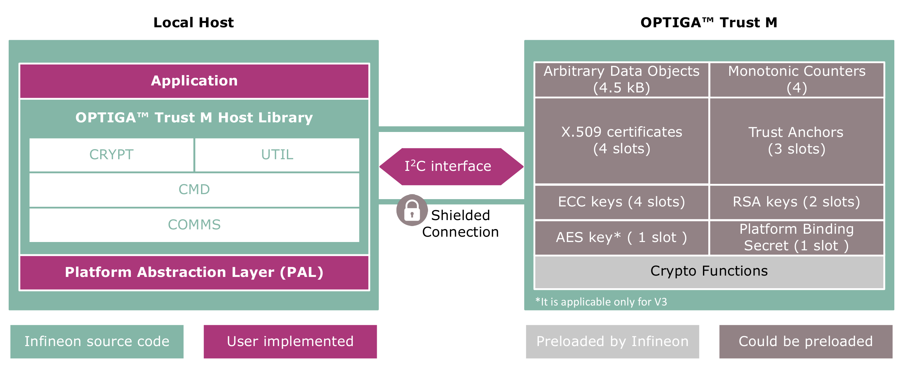

# Infineon OPTIGA™ Trust M Host Library for C

This is the [OPTIGA™ Trust M](https://www.infineon.com/optiga-trust) Host Library for C. It is a reference implementation that allows the use of the [OPTIGA™ Trust M](https://www.infineon.com/optiga-trust) via a high-level API and serves as a basis of our example host applications.

## Quick navigation

- [Infineon OPTIGA™ Trust M Host Library for C](#infineon-optiga-trust-m-host-library-for-c)
  - [Quick navigation](#quick-navigation)
  - [Getting started](#getting-started)
    - [Getting the Host Library](#getting-the-host-library)
    - [Building and testing the Host Library](#building-and-testing-the-host-library)
    - [Porting the Host library](#porting-the-host-library)
    - [Examples using Host Library](#examples-using-host-library)
    - [Configuring Mbed TLS library](#configuring-mbed-tls-library)
  - [Host library overview](#host-library-overview)
  - [Host Applications](#host-applications)
  - [Contributing](#contributing)
  - [Licensing](#licensing)

## Getting started

Information on the Product including Documentation, GetStarted Guides or Application Notes can be found in OPTIGA&trade; Trust M Overview Repository [here](https://github.com/Infineon/optiga-trust-m-overview)

### Getting the Host Library

Below are the instructions to get the OPTIGA&trade; Trust M Host Library for C.

The OPTIGA&trade; Trust M Host Library for C can be cloned using git command :

    git clone --recurse-submodules https://github.com/Infineon/optiga-trust-m.git

### Building and testing the Host Library

Instructions on how to build and test the host library can be found [here](tests/README.md)

### Porting the Host library 

Instructions on how to port the host library to a specific platform can be found [here](extras/pal/README.md)

### Examples using Host Library

Examples to demonstrate basic functionality of the security chip can be found [here](examples/README.md)

### Configuring Mbed TLS library

The OPTIGA&trade; Trust M Host Library for C relies on Mbed TLS. This library is cloned from a submodule under [external/mbedtls](external/mbedtls/) folder. It comes with a default configuration that needs to be modified to the application purpose. Under [config/mbedtls_default_config.h](config/mbedtls_default_config.h) a default configuration is provided and should be changed depending on need.

During compilation, the following define needs to be added:

> During compilation, the following define needs to be added :
```
MBEDTLS_USER_CONFIG_FILE="config/mbedtls_default_config.h"
```

for Makefile :

```
-DMBEDTLS_USER_CONFIG_FILE="config/mbedtls_default_config.h"
```

for CMake :

```
target_compile_definitions(app PRIVATE MBEDTLS_USER_CONFIG_FILE="${CMAKE_CURRENT_SOURCE_DIR}/config/mbedtls_user_config.h")
```

## Host library overview



The following documentation is available for the host library.

| Topic | Link to documentation                                                                                                                                              |
| ----- | ---------------------------------------------------------------------------------------------------------------------------------------------------------------------- |
| API Documentation (High Level) | [OPTIGA™ Trust M API - High Level](https://github.com/Infineon/optiga-trust-m-overview/blob/main/docs/pdf/OPTIGA_Trust_M_Solution_Reference_Manual_v3.60.pdf)                           |
| API Documentation (Code)  | [OPTIGA™ Trust M API - Code](https://infineon.github.io/optiga-trust-m/index.html)                                |
| I2C Interface Documenation   | [I2C Interface Documenation](https://github.com/Infineon/optiga-trust-m-overview/blob/main/docs/pdf/Infineon_I2C_Protocol_v2.03.pdf) |


For more information please refer to the [Wiki page](https://github.com/Infineon/optiga-trust-m/wiki) of this project

## Host Applications

| Host application                                                                                                                                                       | Operating System | Status |
| ---------------------------------------------------------------------------------------------------------------------------------------------------------------------- | ---------------- | ------ |
| [OPTIGA™ Trust M Cryptography](https://github.com/Infineon/mtb-example-optiga-crypto)                                                                                  | Native           | Active |
| [OPTIGA™ Trust M MQTT Client](https://github.com/Infineon/mtb-example-optiga-mqtt-client)                                                                              | FreeRTOS         | Active |
| [OPTIGA™ Trust M Power management](https://github.com/Infineon/mtb-example-optiga-power-management)                                                                    | Native           | Active |
| [OPTIGA™ Trust M Data management](https://github.com/Infineon/mtb-example-optiga-data-management)                                                                      | Native           | Active |
| [OPTIGA™ Trust M TLS with mbedTLS](https://github.com/Infineon/mbedtls-optiga-trust-m)                                                                                 | Native           | Active |
| [OPTIGA™ Trust M AWS FreeRTOS](https://github.com/Infineon/amazon-freertos-optiga-trust)                                                                               | FreeRTOS         | Active |
| [OPTIGA™ Trust M Microsoft Azure IoT](https://github.com/Infineon/azure-esp32-optiga-trust/)                                                                           | FreeRTOS         | Active |
| [OPTIGA™ Trust M PKCS#11 interface](https://github.com/Infineon/pkcs11-optiga-trust-m)                                                                                 | Linux            | Active |
| [OPTIGA™ Trust M Matter integration](https://github.com/project-chip/connectedhomeip/tree/master/examples/lock-app/infineon/psoc6#building-with-optiga-trust-m-as-hsm) | Linux            | Active |
| [OPTIGA™ Trust M Zephyr PAL & Application](https://github.com/Infineon/optiga-trust-m-zephyr)                                                                          | Zephyr           | Active |


## Contributing

Please read [CONTRIBUTING.md](CONTRIBUTING.md) for details on our code of conduct, and the process for submitting pull requests to us.

## Licensing
   
Please see our [LICENSE](LICENSE) for copyright and license information.
   
This project follows the REUSE approach, so copyright and licensing information is available for every file (including third party components) either in the file header, an individual *.license file or the .reuse/dep5 file. All licenses can be found in the [LICENSES](LICENSES) folder.
