# OPTIGA™ Trust M Solution Reference Manual v3.30 ([pdf](srm_files/media/OPTIGA%E2%84%A2_Trust_M_Solution_Reference_Manual_v3.30.pdf))

**About this document**

Scope and purpose

The scope of this document is the OPTIGA™ Trust M\[1\] solution spanning
from the device with its external interface to the enabler components
used for integrating the device with a bigger system. Throughout this
document the term OPTIGA™ is interchangable used for the particular
OPTIGA™ Trust family member OPTIGA™ Trust M, which is subject of this
document.

Intended audience

This document addresses the audience: development teams as well as
customers, solution providers or system integrators who are interested
in solution details.

# Table of Contents

[Table of Contents](#table-of-contents)

- [1 Introduction](#introduction)
  - [1.1 Abbreviations](#abbreviations)
  - [1.2 Naming Conventions](#naming-conventions)
  - [1.3 References](#references)
  - [1.4 Overview](#overview)
- [2 Supported use cases](#supported-use-cases)
  - [2.1 Architecture Decomposition](#architecture-decomposition)
    - [2.1.1 Host code size](#host-code-size)
  - [2.2 Sequence Diagrams utilizing basic functionality](#sequence-diagrams-utilizing-basic-functionality)
    - [2.2.1 Use Case: Read General Purpose Data - data object](#use-case-read-general-purpose-data---data-object)
    - [2.2.2 Use Case: Read General Purpose Data - metadata](#use-case-read-general-purpose-data---metadata)
    - [2.2.3 Use Case: Write General Purpose Data - data object](#use-case-write-general-purpose-data---data-object)
    - [2.2.4 Use Case: Write General Purpose Data - metadata](#use-case-write-general-purpose-data---metadata)
    - [2.2.5 Use Case: Integrity Protected Update of a data object](#use-case-integrity-protected-update-of-a-data-object)
    - [2.2.6 Use Case: Confidentiality Protected Update of key or a data object](#use-case-confidentiality-protected-update-of-key-or-a-data-object)
  - [2.3 Sequence Diagrams utilizing cryptographic toolbox functionality](#sequence-diagrams-utilizing-cryptographic-toolbox-functionality)
    - [2.3.1 Use Case: Mutual Authentication establish session -toolbox-(TLS-Client)](#use-case-mutual-authentication-establish-session--toolbox--tls-client)
    - [2.3.2 Use Case: Abbreviated Handshake -toolbox- (TLS-Client)](#use-case-abbreviated-handshake--toolbox--tls-client)
    - [2.3.3 Use Case: Host Firmware Update](#use-case-host-firmware-update)
    - [2.3.4 Use Case: Pair OPTIGA™ with Host (Pre-Shared Secret based)](#use-case-pair-optiga-with-host-pre-shared-secret-based)
    - [2.3.5 Use Case: Verified Boot -toolbox-](#use-case-verified-boot--toolbox-)
    - [2.3.6 Use Case: Update Platform Binding Secret during runtime(Pre-Shared Secret based)](#use-case-update-platform-binding-secret-during-runtime-pre-shared-secret-based)
    - [2.3.7 Use Case: Local "data-at-rest" protection](#use-case-local-data-at-rest-protection)
    - [2.3.8 Use Case: Local "data-at-rest" and "data-in-transit" protection](#use-case-local-data-at-rest-and-data-in-transit-protection)
    - [2.3.9 Use Case: Host "data-at-rest" and "data-in-transit" protection](#use-case-host-data-at-rest-and-data-in-transit-protection)
    - [2.3.10 Use Case: Generate MAC (HMAC with SHA2)](#use-case-generate-mac-hmac-with-sha2)
    - [2.3.11 Use Case: Verify Authorization (HMAC with SHA2)](#use-case-verify-authorization-hmac-with-sha2)
    - [2.3.12 Use Case: Generate Hash 36](#use-case-generate-hash)
- [3 Enabler APIs](#enabler-apis)
  - [3.1 Service Layer Decomposition](#service-layer-decomposition)
    - [3.1.1 optiga\_crypt](#optiga_crypt)
      - [3.1.1.1 Basic (e.g. initialization, shielded connection settings) operations](#basic-eg-initialization-shielded-connection-settings-operations)
      - [3.1.1.2 Random generation operations](#random-generation-operations)
      - [3.1.1.3 Hash operations](#hash-operations)
      - [3.1.1.4 ECC based operations](#ecc-based-operations)
      - [3.1.1.5 RSA based operations](#rsa-based-operations)
      - [3.1.1.6 Symmetric based operations](#symmetric-based-operations)
      - [3.1.1.7 Hmac, key derivation based operations](#hmac-key-derivation-based-operations)
    - [3.1.2 optiga\_util](#optiga_util)
      - [3.1.2.1 Basic (e.g. initialization, shielded connection settings)operations](#basic-eg-initialization-shielded-connection-settings-operations-1)
      - [3.1.2.2 Open and Close operations](#open-and-close-operations)
      - [3.1.2.3 Read and Write operations](#read-and-write-operations)
      - [3.1.2.4 Protected update operations](#protected-update-operations)
  - [3.2 Abstraction Layer Decomposition](#abstraction-layer-decomposition)
    - [3.2.1 pal](#pal)
    - [3.2.2 pal\_crypt](#pal_crypt)
    - [3.2.3 pal\_gpio](#pal_gpio)
    - [3.2.4 pal\_i2c](#pal_i2c)
    - [3.2.5 pal\_os](#pal_os)
  - [3.3 Data Types](#data-types)
    - [3.3.1 Enumerations](#enumerations)
- [4 OPTIGA™ Trust M External Interface](#optiga-trust-m-external-interface)
  - [4.1 Warm Reset](#warm-reset)
  - [4.2 Power Consumption](#power-consumption)
    - [4.2.1 Sleep Mode](#sleep-mode)
  - [4.3 Protocol Stack](#protocol-stack)
  - [4.4 Commands](#commands)
    - [4.4.1 Command definitions](#command-definitions)
      - [4.4.1.1 OpenApplication](#openapplication)
      - [4.4.1.2 CloseApplication](#closeapplication)
      - [4.4.1.3 GetDataObject](#getdataobject)
      - [4.4.1.4 SetDataObject](#setdataobject)
      - [4.4.1.5 SetObjectProtected](#setobjectprotected)
      - [4.4.1.6 GetRandom](#getrandom)
      - [4.4.1.7 EncryptSym](#encryptsym)
      - [4.4.1.8 DecryptSym](#decryptsym)
      - [4.4.1.9 EncryptAsym](#encryptasym)
      - [4.4.1.10 DecryptAsym](#decryptasym)
      - [4.4.1.11 CalcHash](#calchash)
      - [4.4.1.12 CalcSign](#calcsign)
      - [4.4.1.13 VerifySign](#verifysign)
      - [4.4.1.14 GenKeyPair](#genkeypair)
      - [4.4.1.15 GenSymKey](#gensymkey)
      - [4.4.1.16 CalcSSec](#calcssec)
      - [4.4.1.17 DeriveKey](#derivekey)
    - [4.4.2 Command Parameter Identifier](#command-parameter-identifier)
    - [4.4.3 Command Performance](#command-performance)
  - [4.5 Security Policy](#security-policy)
    - [4.5.1 Overview](#overview-1)
    - [4.5.2 Policy Attributes](#policy-attributes)
    - [4.5.3 Policy Enforcement Point](#policy-enforcement-point)
  - [4.6 Security Monitor](#security-monitor)
    - [4.6.1 Security Events](#security-events)
    - [4.6.2 Security Monitor Policy](#security-monitor-policy)
    - [4.6.3 Security Monitor Configurations](#security-monitor-configurations)
    - [4.6.4 Security Monitor Characteristics](#security-monitor-characteristics)
- [5 OPTIGA™ Trust M Data Structures](#optiga-trust-m-data-structures)
  - [5.1 Overview Data and Key Store](#overview-data-and-key-store)
  - [5.2 Access Conditions (ACs)](#access-conditions-acs)
  - [5.3 Life Cycle State](#life-cycle-state)
  - [5.4 Common and application specific objects and ACs](#common-and-application-specific-objects-and-acs)
  - [5.5 Metadata expression](#metadata-expression)
  - [5.6 Common data structures](#common-data-structures)
  - [5.7 Application-specific data structures](#application-specific-data-structures)
- [6 Appendix](#appendix)
  - [6.1 Command Coding Examples](#command-coding-examples)
  - [6.2 Data encoding format examples](#data-encoding-format-examples)
    - [6.2.1 ECC Private Key](#ecc-private-key)
    - [6.2.2 ECC Public Key](#ecc-public-key)
    - [6.2.3 ECDSA Signature](#ecdsa-signature)
    - [6.2.4 RSA Private Key](#rsa-private-key)
    - [6.2.5 RSA Public Key](#rsa-public-key)
    - [6.2.6 RSA Signature](#rsa-signature)
  - [6.3 Limitations](#limitations)
    - [6.3.1 Memory Constraints](#memory-constraints)
  - [6.4 Certificate Parser Details](#certificate-parser-details)
    - [6.4.1 Parameter Validation](#parameter-validation)
  - [6.5 Security Guidance](#security-guidance)
    - [6.5.1 Use Case: Mutual Authentication -toolbox-](#use-case-mutual-authentication--toolbox-)
    - [6.5.2 Use Case: Host Firmware Update -toolbox-](#use-case-host-firmware-update--toolbox-)
    - [6.5.3 Key usage associated to toolbox functionality](#key-usage-associated-to-toolbox-functionality)
    - [6.5.4 Key pair generation associated to toolbox functionality](#key-pair-generation-associated-to-toolbox-functionality)
    - [6.5.5 Static key generation associated to toolbox functionality](#static-key-generation-associated-to-toolbox-functionality)
    - [6.5.6 Shared secret for key derivation or MAC generation associated to toolbox and protected update functionalities](#shared-secret-for-key-derivation-or-mac-generation-associated-to-toolbox-and-protected-update-functionalities)
    - [6.5.7 Auto states](#auto-states)
    - [6.5.8 Shielded Connection](#shielded-connection)
    - [6.5.9 Algorithm usage](#algorithm-usage)
  - [6.6 Shielded Connection V1 Guidance](#shielded-connection-v1-guidance)
    - [6.6.1 Setup](#setup)
    - [6.6.2 Usage](#usage)
    - [6.6.3 Host authenticates OPTIGA™](#host-authenticates-optiga)
      - [6.6.3.1 Write and read nonce to/from a data object](#write-and-read-nonce-tofrom-a-data-object)
      - [6.6.3.2 Derive keys using nonce during run time](#derive-keys-using-nonce-during-run-time)
      - [6.6.3.3 Derive keys using nonce and a static (additional) pre-shared secret](#derive-keys-using-nonce-and-a-static-additional-pre-shared-secret)
  - [6.7 Protected Update](#protected-update)
    - [6.7.1 Payload Confidentiality](#payload-confidentiality)
    - [6.7.2 Format of keys in Payload](#format-of-keys-in-payload)
      - [6.7.2.1 ECC](#ecc)
      - [6.7.2.2 RSA](#rsa)
      - [6.7.2.3 AES](#aes)
    - [6.7.3 Metadata update](#metadata-update)
    - [6.7.4 CDDL Tool](#cddl-tool)
  - [6.8 Glossary](#glossary)
- [Revision history](#revision-history)

# Introduction

This chapter provides beyond others abbreviations, naming conventions
and references to maintain a common language throughout the document.

## Abbreviations

1.  Abbreviations

| Abbreviation | Term                                  |
| ------------ | ------------------------------------- |
| AC           | Access Condition                      |
| AES          | Advanced Encryption Standard          |
| APDU         | Application Data Unit                 |
| API          | Application Programming Interface     |
| BDD          | Block Definition Diagram              |
| CA           | Certification Authority               |
| CERT         | Certificate                           |
| CRL          | Certificate Revocation List           |
| DDK          | Device Driver Kit                     |
| DO           | Data Object                           |
| DoS          | Denial of Service                     |
| DRNG         | Deterministic Random Number Generator |
| DTLS         | Datagram Transport Layer Security     |
| EAL          | Evaluation Assurance Level            |
| ESW          | Embedded Software                     |
| NVM          | Non-Volatile Memory                   |
| NW           | Network                               |
| OID          | Object Identifier                     |
| PKI          | Public Key Infrastructure             |
| PP           | Protection Profile                    |
| RAM          | Random-Access Memory                  |
| SecMC        | Secure Microcontroller                |
| SW           | Software                              |
| TBD          | To Be Defined                         |
| TBS          | To Be Specified                       |
| TLS          | Transport Layer Security              |
| TRNG         | True Random Number Generator          |
| UID          | Unique Identifier                     |
| µC / MCU     | Microcontroller                       |

## Naming Conventions

Throughout this document the naming of cryptographic material (e.g.
keys) are constructed by concatenating abbreviations (in "camel
notation") given in this section (e.g. SmcPriAUT → OPTIGA™ Private Key
for Authentication).

2.  Naming Conventions

| Abbreviation | Term                                    |
| ------------ | --------------------------------------- |
| AUT          | Authentication (Key)                    |
| CERT         | Certificate                             |
| ECC          | Elliptic Curve Crypto (Key)             |
| ENC          | Encryption (Key, confidentiality)       |
| MAC          | Message Authentication (Key, integrity) |
| PKI          | Public Key Infrastructure               |
| PRI          | Private (Key)                           |
| PUB          | Public (Key)                            |
| RND          | Random Value                            |
| RSA          | RSA (Key)                               |
| SEC          | Secret (Key)                            |
| SES          | Symmetric Session (Key)                 |
| SYM          | Symmetric (Key)                         |

## References

The shown references are either direct used throughout this document or
worth to read for a better understanding of the eco-systems with which
the OPTIGA™ interacts.

3.  References

<table>
<thead>
<tr class="header">
<th>Name</th>
<th>Description</th>
</tr>
</thead>
<tbody>
<tr class="odd">
<td>[AIS-31]</td>
<td>
<a href="https://www.bsi.bund.de/SharedDocs/Downloads/DE/BSI/Zertifizierung/Interpretationen/AIS_31_Functionality_classes_for_random_number_generators_e.pdf?__blob=publicationFile" class="uri">https://www.bsi.bund.de/SharedDocs/Downloads/DE/BSI/Zertifizierung/Interpretationen/AIS_31_Functionality_classes_for_random_number_generators_e.pdf?__blob=publicationFile</a>

A proposal for: Functionality classes for random number generators
</td>
</tr>
<tr class="even">
<td>[CBOR]</td>
<td>
<a href="https://tools.ietf.org/html/rfc7049" class="uri">https://tools.ietf.org/html/rfc7049</a>

Concise Binary Object Representation(CBOR)
</td>
</tr>
<tr class="odd">
<td>[CDDL]</td>
<td>
<a href="https://tools.ietf.org/html/draft-ietf-cbor-cddl-05" class="uri">https://tools.ietf.org/html/draft-ietf-cbor-cddl-05</a>

Concise data definition language (CDDL): a notational convention to express CBOR and JSON data structures [Draft version]
</td>
</tr>
<tr class="even">
<td>[COSE RSA]</td>
<td>
<a href="https://tools.ietf.org/html/rfc8230" class="uri">https://tools.ietf.org/html/rfc8230</a>

Using RSA Algorithms with CBOR Object Signing and Encryption messages
</td>
</tr>
<tr class="odd">
<td>[COSE]</td>
<td>
<a href="https://tools.ietf.org/html/rfc8152" class="uri">https://tools.ietf.org/html/rfc8152</a>

CBOR Object Signing and Encryption
</td>
</tr>
<tr class="even">
<td>[Data Sheet M]</td>
<td>OPTIGA™ Trust M - Data Sheet</td>
</tr>
<tr class="odd">
<td>[DAVE]</td>
<td><a href="https://infineoncommunity.com/dave-download_ID645" class="uri">https://infineoncommunity.com/dave-download_ID645</a></td>
</tr>
<tr class="even">
<td>[FIPS PUB 140-2]</td>
<td>
FIPS140-2 &lt;<a href="http://csrc.nist.gov/publications/fips/fips140-2/fips1402.pdf" class="uri">http://csrc.nist.gov/publications/fips/fips140-2/fips1402.pdf</a>&gt;

FIPS 140-2, Security Requirements for Cryptographic Modules (May 25, 2001; Change Notice 2, 12/3/2002)
</td>
</tr>
<tr class="odd">
<td>[FIPS PUB 186-3]</td>
<td>
<a href="https://www.nist.gov/publications/updated-digital-signature-standard-approved-federal-information-processing-standard" class="uri">https://www.nist.gov/publications/updated-digital-signature-standard-approved-federal-information-processing-standard</a>

Updated Digital Signature Standard Approved as Federal Information Processing Standard (FIPS)186-3
</td>
</tr>
<tr class="even">
<td>[IANA]</td>
<td>
<a href="http://www.iana.org/assignments/tls-parameters/tls-parameters.xhtml" class="uri">http://www.iana.org/assignments/tls-parameters/tls-parameters.xhtml</a>

Transport Layer Security (TLS) Parameters
</td>
</tr>
<tr class="odd">
<td>[IFX_I2C]</td>
<td>Infineon Technologies AG; IFX I2C Protocol Specification</td>
</tr>
<tr class="even">
<td>[ISO 9797-1]</td>
<td>
ISO/IEC 9797-1:2011

Information technology - Security techniques - Message Authentication Codes (MACs) Part 1

<a href="https://www.iso.org/standard/50375.html" class="uri">https://www.iso.org/standard/50375.html</a>

Information technology—Security techniques—Message Authentication Codes (MACs) -- Part 1: Mechanisms using a block cipher
</td>
</tr>
<tr class="odd">
<td>[I²C]</td>
<td>
<a href="http://www.nxp.com/documents/user_manual/UM10204.pdf" class="uri">http://www.nxp.com/documents/user_manual/UM10204.pdf</a>

<a href="http://www.nxp.com/documents/user_manual/UM10204.pdf">www.nxp.com/documents/user_manual/UM10204.pdf</a>

NXP; UM10204 I²C-bus specification and user manual
</td>
</tr>
<tr class="even">
<td>[RFC2104]</td>
<td>
<a href="https://tools.ietf.org/pdf/rfc2104.pdf" class="uri">https://tools.ietf.org/pdf/rfc2104.pdf</a>

HMAC: Keyed-Hashing for Message Authentication
</td>
</tr>
<tr class="odd">
<td>[RFC2631]</td>
<td>
<a href="https://tools.ietf.org/pdf/rfc2631.pdf" class="uri">https://tools.ietf.org/pdf/rfc2631.pdf</a>

Diffie-Hellman Key Agreement Method
</td>
</tr>
<tr class="even">
<td>[RFC2986]</td>
<td>
<a href="https://tools.ietf.org/html/rfc2986" class="uri">https://tools.ietf.org/html/rfc2986</a>

Certificate Request Syntax Specification Version 1.7
</td>
</tr>
<tr class="odd">
<td>[RFC5116]</td>
<td>
<a href="https://tools.ietf.org/html/rfc5116" class="uri">https://tools.ietf.org/html/rfc5116</a>

An Interface and Algorithms for Authenticated Encryption
</td>
</tr>
<tr class="even">
<td>[RFC5246]</td>
<td>
<a href="https://tools.ietf.org/html/rfc5246" class="uri">https://tools.ietf.org/html/rfc5246</a>

The Transport Layer Security (TLS) Protocol, Version 1.2, August 2008
</td>
</tr>
<tr class="odd">
<td>[RFC5280]</td>
<td>
<a href="https://tools.ietf.org/html/rfc5280" class="uri">https://tools.ietf.org/html/rfc5280</a>

Internet X.509 Public Key Infrastructure Certificate and Certificate Revocation List (CRL) Profile
</td>
</tr>
<tr class="even">
<td>[RFC5869]</td>
<td>
<a href="https://tools.ietf.org/html/rfc5869" class="uri">https://tools.ietf.org/html/rfc5869</a>

HMAC-based Extract-and-Expand Key Derivation Function (HKDF)
</td>
</tr>
<tr class="odd">
<td>[RFC6347]</td>
<td>
<a href="https://tools.ietf.org/html/rfc6347" class="uri">https://tools.ietf.org/html/rfc6347</a>

Datagram Transport Layer Security Version 1.2
</td>
</tr>
<tr class="even">
<td>[RFC6655]</td>
<td>
<a href="https://tools.ietf.org/html/rfc6655" class="uri">https://tools.ietf.org/html/rfc6655</a>

AES-CCM Cipher Suites for Transport Layer Security (TLS)
</td>
</tr>
<tr class="odd">
<td>[RFC7251]</td>
<td>
<a href="https://tools.ietf.org/html/rfc7251" class="uri">https://tools.ietf.org/html/rfc7251</a>

AES-CCM Elliptic Curve Cryptography (ECC) Cipher Suites for TLS
</td>
</tr>
<tr class="even">
<td>[RFC7301]</td>
<td>
<a href="https://tools.ietf.org/html/rfc7301" class="uri">https://tools.ietf.org/html/rfc7301</a>

Transport Layer Security (TLS) - Application-Layer Protocol Negotiation Extension
</td>
</tr>
<tr class="odd">
<td>[RFC7925]</td>
<td>
<a href="https://tools.ietf.org/html/rfc7925" class="uri">https://tools.ietf.org/html/rfc7925</a>

Transport Layer Security (TLS)/ Datagram Transport Layer Security (DTLS) Profiles for the Internet of Things.
</td>
</tr>
<tr class="even">
<td>[RFC8017]</td>
<td>
<a href="https://tools.ietf.org/html/rfc8017" class="uri">https://tools.ietf.org/html/rfc8017</a>

PKCS #1: RSA Cryptography Specifications Version 2.2
</td>
</tr>
<tr class="odd">
<td>[SP 800-38A]</td>
<td>
<a href="https://nvlpubs.nist.gov/nistpubs/Legacy/SP/nistspecialpublication800-38a.pdf" class="uri">https://nvlpubs.nist.gov/nistpubs/Legacy/SP/nistspecialpublication800-38a.pdf</a>

Recommendation for Block cipher modes of operation.
</td>
</tr>
<tr class="even">
<td>[SP 800-38B]</td>
<td>
<a href="https://nvlpubs.nist.gov/nistpubs/SpecialPublications/NIST.SP.800-38b.pdf" class="uri">https://nvlpubs.nist.gov/nistpubs/SpecialPublications/NIST.SP.800-38b.pdf</a>

Recommendation for Block Cipher Modes of Operation: The CMAC Mode for Authentication
</td>
</tr>
<tr class="odd">
<td>[SP 800-38C]</td>
<td>
<a href="http://csrc.nist.gov/publications/nistpubs/800-38C/SP800-38C.pdf" class="uri">http://csrc.nist.gov/publications/nistpubs/800-38C/SP800-38C.pdf</a>

Recommendation for Block Cipher Modes of Operation: the CCM Mode for Authentication and Confidentiality.
</td>
</tr>
<tr class="even">
<td>[SP 800-56A]</td>
<td>
<a href="https://csrc.nist.gov/publications/detail/sp/800-56a/rev-3/final" class="uri">https://csrc.nist.gov/publications/detail/sp/800-56a/rev-3/final</a>

Recommendation for Pair-Wise Key Establishment Schemes Using Discrete Logarithm Cryptography
</td>
</tr>
<tr class="odd">
<td>[SP 800-90A]</td>
<td>
<a href="http://nvlpubs.nist.gov/nistpubs/SpecialPublications/NIST.SP.800-90Ar1.pdf" class="uri">http://nvlpubs.nist.gov/nistpubs/SpecialPublications/NIST.SP.800-90Ar1.pdf</a>

Recommendation for Random Number Generation Using Deterministic Random Bit Generators (SP 800-90A Rev1)
</td>
</tr>
<tr class="even">
<td>[SUIT_DRAFTv2]</td>
<td>
<a href="https://tools.ietf.org/html/draft-moran-suit-manifest-02" class="uri">https://tools.ietf.org/html/draft-moran-suit-manifest-02</a>

A CBOR-based Manifest Serialization Format [Draft version]
</td>
</tr>
<tr class="odd">
<td>[SysML]</td>
<td>
<a href="http://www.omg.org/spec/SysML/1.2/PDF/" class="uri">http://www.omg.org/spec/SysML/1.2/PDF/</a>

Object Management Group: “<strong>OMG Systems Modeling Language (OMG SysML™) - Version 1.2</strong>”, June 2010, formal/2010-06-01
</td>
</tr>
<tr class="even">
<td>[USB Auth]</td>
<td>
&lt;<a href="http://www.usb.org/developers/docs" class="uri">http://www.usb.org/developers/docs</a>&gt;

Universal Serial Bus Type-C Authentication Specification
</td>
</tr>
<tr class="odd">
<td>[UML]</td>
<td>
<a href="http://www.omg.org/spec/UML/2.4.1" class="uri">http://www.omg.org/spec/UML/2.4.1</a>

Object Management Group: “OMG Unified Modeling Language (OMG UML), <em><strong>Infrastructure</strong></em>

<em>Version 2.4.1</em>”, August 2011, formal/2011-08-05

Object Management Group: “OMG Unified Modeling Language (OMG UML), <em><strong>Superstructure</strong></em>

<em>Version 2.4.1</em>”, August 2011, formal/2011-08-06
</td>
</tr>
</tbody>
</table>

## Overview

The OPTIGA™ provides a cryptographic feature set which in particular
supporting IoT use cases and along with that it provides a number of key
and data objects which hold user/customer related keys and data.

The subsequent document is structured in the chapters [Supported Use
Cases](#_Supported_Use_Cases), [Enabler APIs](#enabler-apis), [OPTIGA™
Trust M External Interface](#_OPTIGA™_Trust_M), [OPTIGA™ Trust M Data
Structures](#optiga-trust-m-data-structures) and [Appendix](#_Appendix).

  - [Supported Use Cases](#_Supported_Use_Cases) provides the main use
    cases in a form of sequence diagrams which explains how the host
    side [Enabler APIs](#enabler-apis) are used in the respective use
    cases.

  - [Enabler APIs](#enabler-apis) provides the necessary details of the
    host side architectural APIs which are implemented based on the
    [OPTIGA™ Trust M External Interface](#_OPTIGA™_Trust_M).

  - [OPTIGA™ Trust M External Interface](#_OPTIGA™_Trust_M) provides the
    necessary details of the external interface to utilize the OPTIGA™
    functionality.

  - [OPTIGA™ Trust M Data Structures](#optiga-trust-m-data-structures)
    provides details of the key and data objects provided by the
    OPTIGA™.

  - [Appendix](#_Appendix) provides some useful information with regards
    to [Command Coding Examples](#command-coding-examples),
    [Limitations](#limitations), [Certificate Parser
    Details](#certificate-parser-details), [Security
    Guidance](#security-guidance), [Shielded Connection V1
    Guidance](#shielded-connection-v1-guidance), [Protected
    Update](#protected-update), [Glossary](#glossary), etc.

# Supported use cases

In the [Supported use cases](#_Supported_Use_Cases) chapter a collection
of use cases are provided which are expressed as UML sequence diagrams
to show how to utilize the OPTIGA™ enabler components ([Enabler
APIs](#enabler-apis)) to achieve the target functionality of the
solution. This chapter is intended to maintain a well understanding of
the OPTIGA™ eco system components particular for system integrators who
like to integrate the OPTIGA™ with their solution.

## Architecture Decomposition

The architecture components contained in the shown solution architecture
view (OPTIGA Trust Communication Protection - toolbox - View) are listed
and briefly described in the table below.

4.  Architecture components

<table>
<thead>
<tr class="header">
<th>Name</th>
<th>Description</th>
</tr>
</thead>
<tbody>
<tr class="odd">
<td>local_host_application</td>
<td>The local_host_application is the embedded application implementing the local host functionality. For implementing that functionality it utilizes the APIs exposed by the service layer, third_party_crypto libraries and optionally the Access Layer and the Abstraction Layer.</td>
</tr>
<tr class="even">
<td>optiga_cmd</td>
<td>
This module <em>optiga_cmd</em> exposes the main interface to interact with OPTIGA™. It is aware of the format of the command set provided by the OPTIGA™. The <em>optiga_cmd</em> converts API calls in the regarded (command / response) APDUs known by the OPTIGA™. The <em>optiga_cmd</em> APIs expose the same semantics provided by OPTIGA™.

The <em>optiga_cmd</em> provides multiple instances of the API. Beyond exposing the APIs it arbitrates as well concurrent invocations of the APIs. Its usage characteristic is asynchronous, where the caller of an instance has to take care of the correct sequence of calls for a dedicated use case. In case, an instance of the API requires multiple invocations to reliably implement a use case (strict sequence), the APIs allows locking out other instances from interacting with the OPTIGA™. As soon as those strict sequences are executed, the lock acquired must be released. The <em>optiga_cmd</em> interacts with optiga_comms_xxx (xxx stands for variants e.g. ifx_i2c, tc, ...) for reliable communication with OPTIGA™.
</td>
</tr>
<tr class="odd">
<td>optiga_comms_ifx_i2c</td>
<td>optiga_comms_ifx_i2c implements the protocol used to turn-in communication between Local Host and OPTIGA™. The invoking component, in the given architecture is the optiga_cmd block through the <a href="#pal">pal</a>. The <em>optiga_cmd</em> provides command APDUs to optiga_comms_ifx_i2c and receives response APDUs from the optiga_comms_ifx_i2c. The size of APDUs may vary between few bytes to kilobytes. The protocol implementation is done in multiple layers and seamlessly handles data transfer from Local Host to OPTIGA™ and OPTIGA™ to Local Host. More details of the implemented protocol can be found in <a href="#linkdc0f79b5_99c7_4adf_93f5_635fd8a124f4">[IFX_I2C]</a>. <a href="#link822d389c_4656_40b4_88e7_2bbe7860cbec">optiga_comms_ifx_i2c</a> usage characteristic is asynchronous, were the caller has to take care of the correct sequence of calls for a dedicated use case.</td>
</tr>
<tr class="even">
<td>optiga_crypt</td>
<td>
The <a href="#optiga_crypt">optiga_crypt</a> module provides cryptographic tool box functionality with the following characteristics:

<ul>
<li>
Multiple instances could be created using <a href="#link28c03883_dabd_429d_bd0e_318443c64ece">optiga_crypt_create</a> to allow concurrent access to the toolbox.
</li>
<li>
Uses <em>optiga_cmd</em> module to interact with the OPTIGA™<em>.</em>
</li>
<li>
The <em>optiga_cmd</em> module might get locked for some consecutive invocations, which need to be executed atomic (strict).
</li>
</ul></td>
</tr>
<tr class="odd">
<td>optiga_util</td>
<td>
The <a href="#optiga_util">optiga_util</a> module provides useful utilities to manage the OPTIGA™ (open/close) and data/key objects with the following characteristics:

<ul>
<li>
Multiple instances could be created to allow concurrent access to other services.
</li>
<li>
Uses <em>optiga_cmd</em> module to interact with the OPTIGA™<em>.</em>
</li>
</ul></td>
</tr>
<tr class="even">
<td>Pal</td>
<td>The <a href="#pal">pal</a> is a <strong>P</strong>latform <strong>A</strong>bstraction <strong>L</strong>ayer, abstracting HW and Operating System functionalities for the Infineon XMC family of µController or upon porting to any other µController. It abstracts away the low level device driver interface (platform_timer, platform_i2c, etc.) to allow the modules calling it being platform agnostic. The <a href="#pal">pal</a> is composed of hardware, software and an operating system abstraction part.</td>
</tr>
<tr class="odd">
<td>platform_crypto</td>
<td>
Cryptographic functionalities are implemented either in software or in hardware or as a mixture of both. The functionality is provided in platform_crypto. platform_crypto is supplied by the platform vendor or a third party. This module is used multifold but not limited to:

<ul>
<li>
Supporting Firmware decryption at the local host.
</li>
<li>
Performing the key negotiation part for the platform binding and the communication protection at the local host
</li>
</ul></td>
</tr>
<tr class="even">
<td>platform_i2c</td>
<td>The platform_i2c is the platform specific I2C device driver, which turns in communication with the OPTIGA™.</td>
</tr>
<tr class="odd">
<td>platform_timer</td>
<td>The platform_timer is the platform specific timer device driver.</td>
</tr>
<tr class="even">
<td>third_party_crypto</td>
<td>
Cryptographic functionalities are implemented in software and provided in third_party_crypto. The main cryptographic operations of interest for the local host are certificate parsing, signature verification, signature generation key negotiation and certificate verification. third_party_crypto is supplied by third party. This module is used multifold but not limited to:

<ul>
<li>
Supporting TLS/DTLS protocol either for client or server side.
</li>
<li>
Supporting bulk encryption in case the record protocol is performed at the local host.
</li>
<li>
Supporting cloud service specific adaptation
</li>
</ul></td>
</tr>
</tbody>
</table>

The class diagram OPTIGA Trust Communication Protection - toolbox - View
shows the Communication Protection Solution Architecture in case the
local host is invoking a third\_party\_crypto library (e.g. WolfSSL,
OpenSSL, mbedTLS, ...) containing its main functional blocks. The
OPTIGA™ is integrated via its toolbox functionality. The entities
communicating across a protected channel are the Server and the Client
(Host) and optionally the Client and the OPTIGA™ (Shielded Connection).
This view is applied for toolbox based solution kind of use cases, where
the involved blocks are represented as dedicated lifelines.

The color coding provides information of whether the functional block
is:

  - yellow: platform agnostic and provided by IFX or

  - green: platform ported (subject of porting to a target platform) and
    provided by IFX as an example ported to the evaluation board or

  - blue: platform specific provided by a third party.

|                                      |
| ------------------------------------ |
| 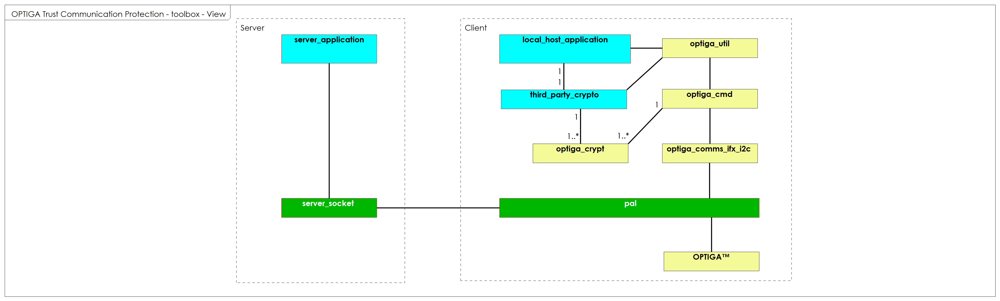 |

Figure 1 - OPTIGA Trust Communication Protection - toolbox - View

**  
**

### Host code size

The below table shows the footprint of the various host side
configurations. The "Note" column specifies the components contained in
the footprint calculation. All other components even shown by the
architecture diagram are heavily project specific and provided by the
system integrator. The values specified in the table are based on Keil
ARM MDK v5.25 targeting Cortex M (32 bit) controller. These values are
subjected to vary based on the target controller architecture (8/16/32
bit), compiler and optimization level chosen.

5.  Host library – Code and RAM size details

<table>
<thead>
<tr class="header">
<th>Configuration</th>
<th>OPTIGA™ Trust M V1</th>
<th>OPTIGA™ Trust M V3</th>
<th></th>
<th></th>
</tr>
</thead>
<tbody>
<tr class="odd">
<td></td>
<td><strong>CODE</strong></td>
<td><strong>RAM</strong></td>
<td><strong>CODE</strong></td>
<td><strong>RAM</strong></td>
</tr>
<tr class="even">
<td>
<strong>[without the Shielded Connection]</strong>

The components <a href="#optiga_crypt">optiga_crypt</a>, <a href="#optiga_util">optiga_util</a>, optiga_cmd, optiga_comms_ifx_i2c, and <a href="#pal">pal</a> are covered.
</td>
<td>15 KBytes</td>
<td>5 KBytes</td>
<td>18 KBytes</td>
<td>5 KBytes</td>
</tr>
<tr class="odd">
<td>
<strong>[with Shielded Connection]</strong>

The components <a href="#optiga_crypt">optiga_crypt</a>, <a href="#optiga_util">optiga_util</a>, optiga_cmd, optiga_comms_ifx_i2c, <a href="#pal">pal</a>, and platform_crypto are covered.

Here mbed TLS v2.16.0 is used as a reference for platform_crypto to perform the shielded connection cryptographic operations (e.g. key derivation, encryption and decryption).
</td>
<td>28 KBytes</td>
<td>15 KBytes</td>
<td>31 KBytes</td>
<td>15 KBytes</td>
</tr>
</tbody>
</table>

In addition, the *optiga\_lib\_config.h* file (in the host side library)
can be updated to enable or disable the features based on the target
usage to reduce the code consumption if compiler is not optimizing
automatically.

## Sequence Diagrams utilizing basic functionality

### Use Case: Read General Purpose Data - data object

The local\_host\_application intends to read the content of a data
object maintained by the OPTIGA™.

This sequence diagram is provided to show the functions involved in
reading a data object. The function is performed atomic (no other
invocation of the *optiga\_cmd* module will interrupt the execution).

**Pre-condition:**

  - The OPTIGA™ application is already launched.

  - The necessary access conditions for reading the target data object
    are satisfied.

|                                      |
| ------------------------------------ |
| 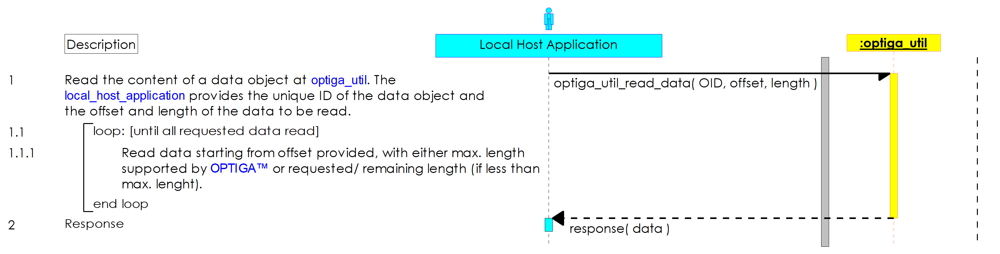 |

Figure 2 - Use Case: Read General Purpose Data - data object

### Use Case: Read General Purpose Data - metadata

The local\_host\_application intends to read the metadata of a data/key
object maintained by the OPTIGA™.

This sequence diagram is provided to show the functions involved in
reading the metadata of a data/key object. The function is performed
atomic (no other invocation of the *optiga\_cmd* module will interrupt
the execution).

**Pre-condition:**

  - The OPTIGA™ application is already launched

|                                      |
| ------------------------------------ |
| 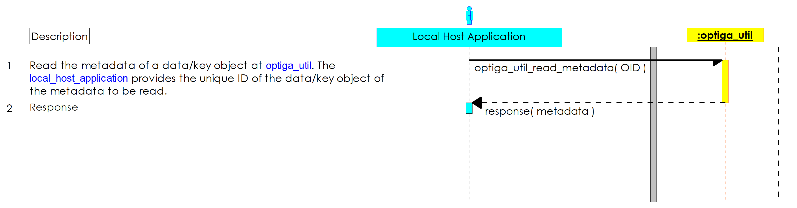 |

Figure 3 - Use Case: Read General Purpose Data - metadata

### Use Case: Write General Purpose Data - data object

The local\_host\_application intends to update a data object maintained
by the OPTIGA™.

This sequence diagram is provided to show the functions involved in
performing updating an data object by a single invocation of the
*optiga\_cmd* module. The function is performed atomic (no other
invocation of the *optiga\_cmd* module will interrupt the execution).

**Pre-condition:**

  - The OPTIGA™ application is already launched

  - The necessary access conditions for writing the target data object
    are satisfied

**Post-condition:**

  - The target data object is updated

|                                      |
| ------------------------------------ |
| 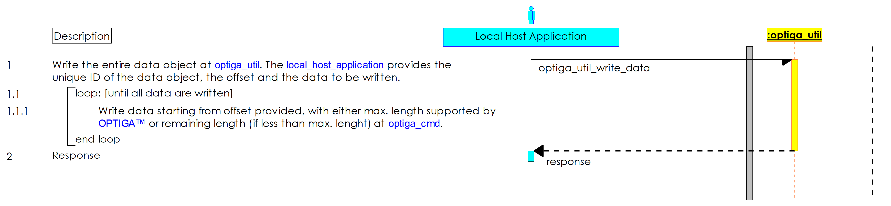 |

Figure 4 - Use Case: Write General Purpose Data - data object

### Use Case: Write General Purpose Data - metadata

The local\_host\_application intends to update the metadata associated
to a data object, which is maintained by OPTIGA™.

This sequence diagram is provided to show the functions involved in
updating metadata associated to a data object.

**Pre-condition:**

  - The OPTIGA™ application is already launched

  - The necessary access conditions for writing the metadata associated
    with a data/key object are satisfied.

**Post-condition:**

  - The metadata associated to the target data/key object is updated

|                                      |
| ------------------------------------ |
| 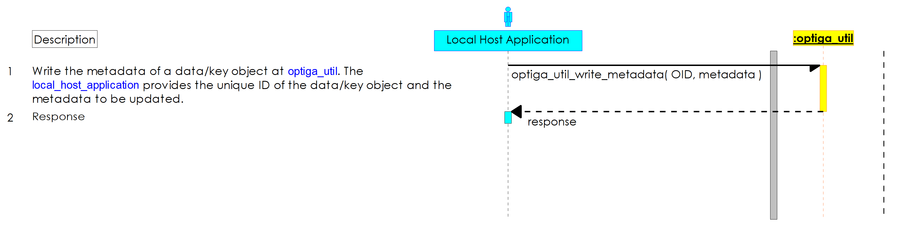 |

Figure 5 - Use Case: Write General Purpose Data - metadata

### Use Case: Integrity Protected Update of a data object

The Management Server intends to update a data object (e.g. a Trust
Anchor) with integrity protected. The Management Server provides an
update data set, which is forwarded to the OPTIGA™. The OPTIGA™ checks
and removes the protection and upon success updates the target data
object.

**Pre-condition(s):**

  - The OPTIGA™ application is already launched

  - The Trust Anchor for management purpose is well formatted and
    available at the OPTIGA™.

  - The access conditions of the target data object allow protected
    update.

**Post-condition:**

  - The target data object is updated.

|                                      |
| ------------------------------------ |
| 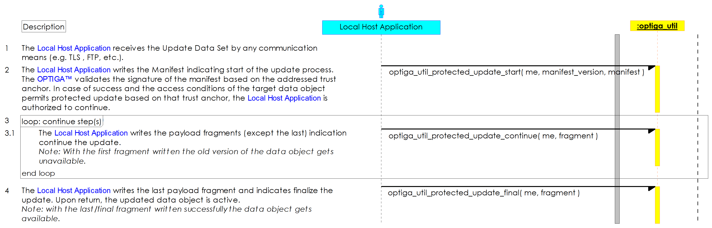 |

Figure 6 - Use Case: Integrity Protected Update of a data object

### Use Case: Confidentiality Protected Update of key or a data object

The Management Server intends to update a key or a data object (e.g.
Pre-shared Secret) with integrity and confidentiality protected. The
Management Server provides an update data set, which is forwarded to the
OPTIGA™. The OPTIGA™ checks and removes the protection and upon success
updates the target data/key object.

1.  OPTIGA™ Trust M V1 doesn’t support confidentiality and update of
    keys & metadata as part of protected update.

**Pre-condition(s):**

  - The OPTIGA™ application is already launched.

  - The Trust Anchor for management purpose is well formatted and
    available at the OPTIGA™.

  - The protected update secret for management purpose (to enable
    confidentiality) is available at OPTIGA™.

  - The access conditions of the target data/key object allow protected
    updating.

**Post-condition:**

  - The target data / key object is updated.

|                                       |
| ------------------------------------- |
|  |

Figure 7 - Use Case: Confidentiality Protected Update of key or a data
object

## Sequence Diagrams utilizing cryptographic toolbox functionality

### Use Case: Mutual Authentication establish session -toolbox- (TLS-Client)

The Server and the Client (on behalf of the User), which incorporates
the OPTIGA™, intend to proof the authenticity of each other. Both the
Server and OPTIGA™ providing challenges (random value) and both entities
return one or multiple cryptograms (depending on the applied
authentication protocol) as response by which both parties proof their
authenticity. The Server and Client executing ECDHE for key agreement
and ECDSA FIPS 186-3 sign SHA256 hash for authentication, and the Client
is authenticated as well.

2.  The hashing of the handshake messages by the Client is not shown.
    This could be performed by SW at the Client or via
    [CalcHash](#calchash) command by the OPTIGA™. In the latter case,
    the intermediate results shall be returned by OPTIGA™ and provided
    for continuing the hashing with further commands.

**Pre-conditions:**

  - The OPTIGA™ application is already launched.

  - The public key pairs for authentication purpose and public key
    certificates are properly installed at the OPTIGA™.

  - The Trust Anchor for verifying the Public Key Certificates of the
    authentication partner (Server) is properly installed.

**Post-condition:**

  - The Client knows the session keys (write\_key) to run the
    application protocol without the help of the OPTIGA™.

|                                       |
| ------------------------------------- |
| 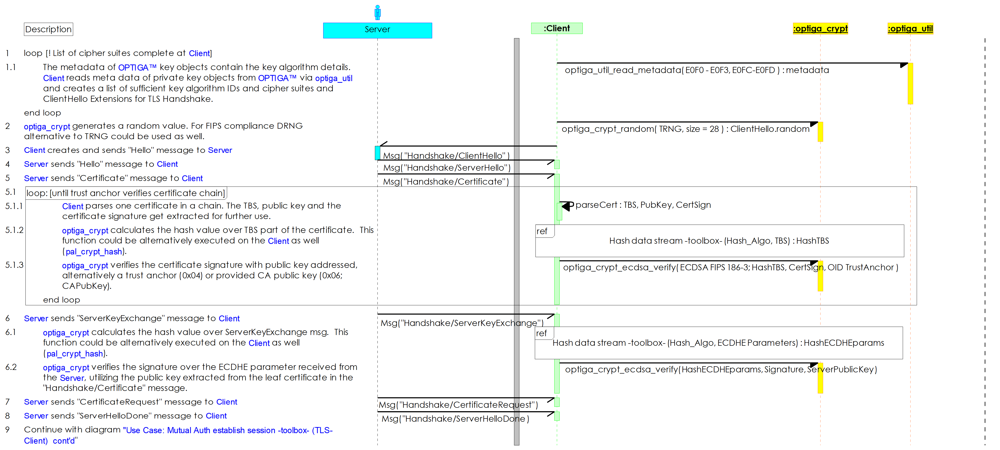 |

Figure 8 - Use Case: Mutual Authentication establish session -toolbox-
(TLS-Client)

|                                       |
| ------------------------------------- |
| 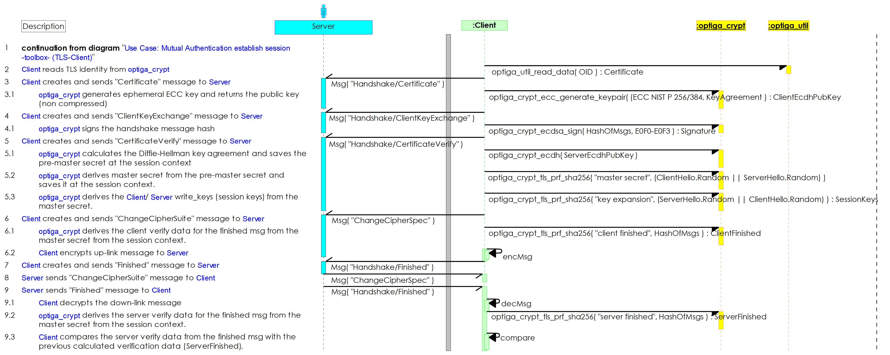 |

Figure 9 - Use Case: Mutual Auth establish session -toolbox-
(TLS-Client) cont'd

### Use Case: Abbreviated Handshake -toolbox- (TLS-Client)

The Server and the Client (on behalf of the User), which incorporates
the OPTIGA™, intend to resume an established session. Both the Server
and OPTIGA™ providing challenges (random value via "Hello" msg) and both
entities providing verification data to prove the possession of the
cryptographic parameters (master secret) previously negotiated.

*Note: the hashing of the handshake messages by the* Client *is not
shown. This could be performed by SW at the* Client *or via CalcHash
command by the* OPTIGA™*. In the latter case, the intermediate results
shall be returned by* OPTIGA™ *and provided for continuing the hashing
with further commands.*

**Pre-conditions:**

  - The OPTIGA™ session master secret, which was calculated by the
    previous handshake - is available at the regarded session context
    and gets used as input by DeriveKey for the new session key(s).

  - The Client is able to hash all handshake messages without the help
    of OPTIGA™.

**Post-condition:**

  - The Client knows the session keys (write\_key) to run the
    application protocol without the help of the OPTIGA™.

|                                       |
| ------------------------------------- |
| 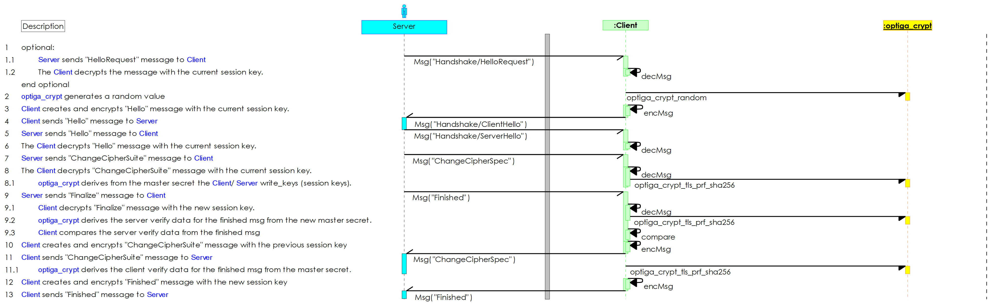 |

Figure 10 - Use Case: Abbreviated Handshake -toolbox- (TLS-Client)

### Use Case: Host Firmware Update

The Host intends to update its FW in a protected way, which prevents
from installation and execution of unauthorized code. This sequence
diagram is provided to show the functions involved in performing.

**Pre-condition:**

  - The FW-image shared secret is loaded to an arbitrary data object
    (e.g. 0xF1D0-0xF1DF), which should be locked for read = NEV and in
    operational mode at least.

  - The Trust Anchor (signer's certificate) is loaded to a data object
    at OPTIGA™.

  - Host receives the firmware update manifest (e.g. image version,
    signer, hash & sign algorithms, firmware image hash, firmware image
    decryption key derivation information, manifest signature, etc. )
    and encrypted firmware image. The details to be signed (TBS) in the
    manifest are signed by signer and Host verifies the signature
    generated over TBS using the Trust Anchor installed at OPTIGA™.

**Post-condition:**

  - The metadata signature is verified

  - The FW-image decryption secret is returned to the Host

|                                       |
| ------------------------------------- |
|  |

Figure 11 - Use Case: Host Firmware Update

### Use Case: Pair OPTIGA™ with Host (Pre-Shared Secret based)

The OPTIGA™ and Host establishing a protected communication channel,
which provides integrity and confidentiality for data exchanged between
both entities. This sequence diagram is about generation and exchange of
those assets during production of the customer solution. The solution
comprises at least of the Host and the OPTIGA™.

**Pre-condition(s):**

  - The Platform Binding Secret data object is not locked. The LcsO
    (Life Cycle Status of the Object) must be less than operational.

**Post-conditions(s):**

  - The pre-shared secret is available and locked (read/write = NEV or
    read = NEV).

|                                       |
| ------------------------------------- |
|  |

Figure 12 - Use Case: Pair OPTIGA™ with Host (Pre-Shared Secret based)

### Use Case: Verified Boot -toolbox-

The Host system intends to verify the integrity of the host software
image. The verification shall be done based on a public key signature
scheme. The components involved are the immutable\_boot\_block, the
primary\_boot\_loader, some further platform specific components
integrated in the boot process and the OPTIGA™.

**Pre-conditions:**

  - The OPTIGA™ application is already launched.

  - The Trust Anchor for verifying the image hash is properly installed
    at the OPTIGA™.

**Post-condition:**

  - The Host software image is proven being integrity correct.

|                                       |
| ------------------------------------- |
| 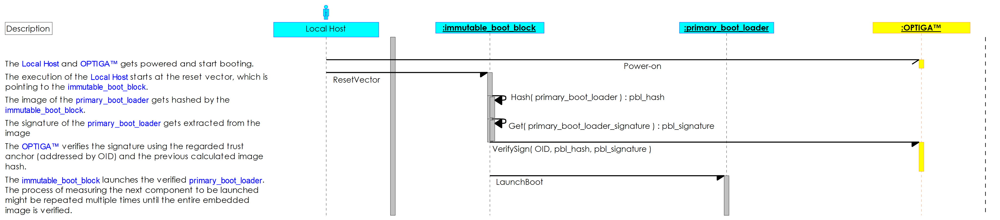 |

Figure 13 - Use Case: Verified Boot
-toolbox-

### Use Case: Update Platform Binding Secret during runtime (Pre-Shared Secret based)

This sequence diagram is about generation and exchange of Platform
Binding Secret using Shielded Connection during runtime. The solution
comprises the Host and the OPTIGA™.

**Pre-condition(s):**

  - The Pairing of OPTIGA™ and Host (Pre-Shared secret based) is
    performed.

  - The change access condition of Platform Binding Secret is enabled
    for the runtime protected update using Shielded Connection (e.g.
    CONF (E140)).

**Post-conditions(s):**

  - The pre-shared secret is updated with the new secret.

|                                       |
| ------------------------------------- |
| 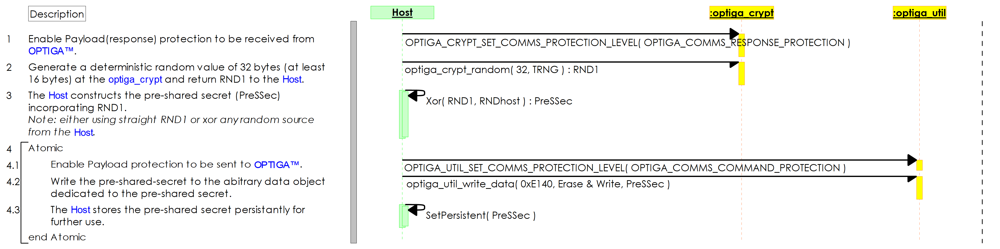 |

Figure 14 - Use Case: Update Platform Binding Secret during runtime
(Pre-Shared Secret based)

### Use Case: Local "data-at-rest" protection

A Host needs to protect data against access by any third party. This
sequence diagram is about high volume data encryption at the Host. For
that purpose, Host and OPTIGA™ establish a unique key for local data
encryption/ decryption. Host generates a random secret once and uses it
for lifetime to derive the actual secret used for encrypt/decrypt of
local data by the Host.

**Pre-condition:**

  - Either there is at least one arbitrary data object ([Data Structure
    Arbitrary data object](#linkad7de86b_f284_4143_b60c_f98d9ba42353))
    of type 3 (in this example OID = 0xF1D1) available at the OPTIGA™ to
    save the unique secret for local encryption.

  - Or the unique secret for local encryption is already saved and
    locked.

  - The OPTIGA™ Shielded connection is activated (presentation layer of
    the I2C protocol
    [\[IFX\_I2C\]](#linkdc0f79b5_99c7_4adf_93f5_635fd8a124f4) is
    present) and is recommended to be used for all commands and
    responses carrying secret data.

**Post-condition:**

  - The local secret for encryption is known by the Host

|                                       |
| ------------------------------------- |
| 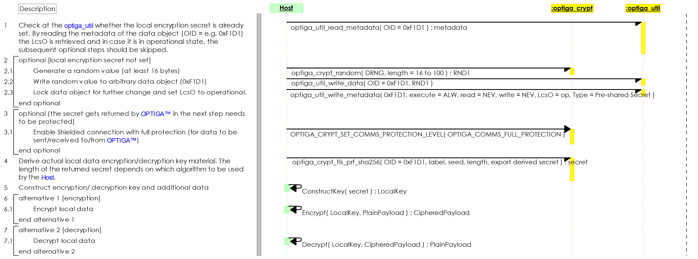 |

Figure 15 - Use Case: Local "data-at-rest" protection

### Use Case: Local "data-at-rest" and "data-in-transit" protection

A Host needs to protect data against access by any third party. This
sequence diagram is about protecting low volume of data at the Host. For
that purpose OPTIGA™ stores the data at its embedded data store. The
data store needs to be configured in a way the protection (OPTIGA™
Shielded Connection) of data being transferred between data object and
host is enforced by the respective access conditions defined as part of
the metadata associated with the target data objects.

**Pre-condition:**

  - Each data object to protect data at rest are configured in a way
    writing (AC CHA = Conf(0xE140)) or reading (AC RD = Conf(0xE140)) it
    must apply protection by OPTIGA™ Shielded Connection.

**Post-condition:**

  - The plain payload read or written was traveling on the I2C bus
    confidentiality protected.

|                                       |
| ------------------------------------- |
| 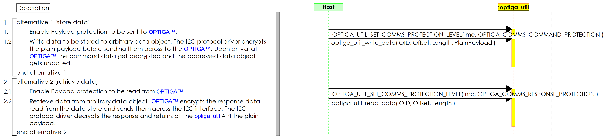 |

Figure 16 - Use Case: Local "data-at-rest" and "data-in-transit"
protection

### Use Case: Host "data-at-rest" and "data-in-transit" protection

A host needs to protect data against access by any third party. This
sequence diagram is about protecting higher volume of data at the Host
persistent storage. For that purpose OPTIGA™ encrypts (writing) or
decrypts (reading) the data to be store at the host. The host has to
persistently store the encrypted data objects at its NVM.

Note: OPTIGA™ Trust M V1 doesn’t support symmetric algorithms.

**Pre-condition:**

  - The symmetric key for local data protection is randomly generated
    and available at the OPTIGA™.

  - The OPTIGA™ Shielded Connection is enabled.

**Post-condition:**

  - The plain payload read or written was traveling on the I2C bus
    confidentiality protected.

|                                       |
| ------------------------------------- |
|  |

Figure 17 - Use Case: Host "data-at-rest" and "data-in-transit"
protection

### Use Case: Generate MAC (HMAC with SHA2)

This use case diagram shows the way of generating the MAC for the given
input data using the secret installed at OPTIGA™.

Note: OPTIGA™ Trust M V1 doesn’t support HMAC based operations.

**Pre-condition:**

  - The input secret required for the hmac operation is available at
    OPTIGA™.

**Post-condition:**

  - The generated MAC is available for Local Host Application for
    further usage.

|                                       |
| ------------------------------------- |
| 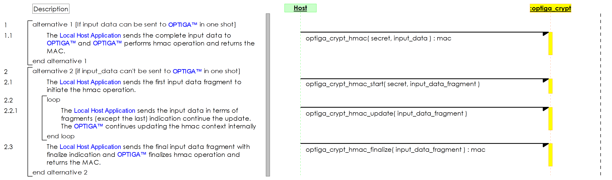 |

Figure 18 - Use Case: Generate MAC (HMAC with SHA2)

### Use Case: Verify Authorization (HMAC with SHA2)

This use case diagram shows the way of verifying the MAC for the given
input data using the secret installed at OPTIGA™.

3.  OPTIGA™ Trust M V1 doesn’t support HMAC based operations.

**Pre-condition:**

  - The input secret required for the HMAC operation is available at
    OPTIGA™ and its OID is known by the application.

**Post-condition:**

  - The satisfied access condition is available at Local Host
    Application for further usage.

|                                       |
| ------------------------------------- |
| 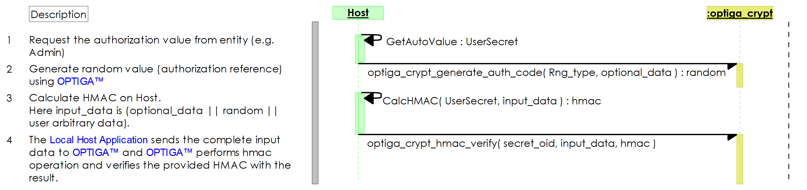 |

Figure 19 - Use Case: Verify Authorization (HMAC with SHA2)

### Use Case: Generate Hash

This use case diagram shows the way of generating the Hash for the given
input data using OPTIGA™.

**Pre-condition:**

  - The OPTIGA™ is initialized.

**Post-condition:**

  - The generated Hash is available for Local Host Application for
    further usage.

|                                       |
| ------------------------------------- |
| 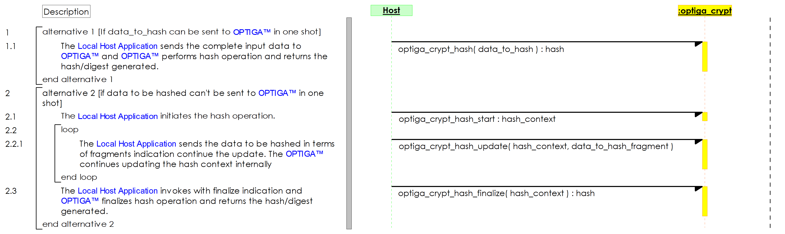 |

Figure 20 - Use Case: Generate Hash

# Enabler APIs

This chapter provides the specification of the host side APIs of the
enabler components, which gets provided by the OPTIGA™ solution. The
target platforms for those enabler components are embedded systems,
Linux and Windows.

The class diagram OPTIGA Trust Enabler Software Overview shows host side
library architecture and it’s main functional blocks.

The color coding provides information of whether the function blocks are
*platform agnostic*, *platform specific*, *platform ported* or *third
party*.

  - *Platform agnostic* components (yellow) could be reused on any
    target platform with just compiling the source code for a specific
    platform. The code is endian aware.

  - *Platform specific* components (dark blue) are available for a
    specific platform. The component could be provided as source or in
    binary format.

  - *Platform ported* components (green) are used to connect platform
    specific and platform agnostic components. Those components exposing
    a platform agnostic API and calling platform specific APIs.

  - *Third Party* components (light blue) need to be ported to platform
    agnostic APIs.

|                                        |
| -------------------------------------- |
| 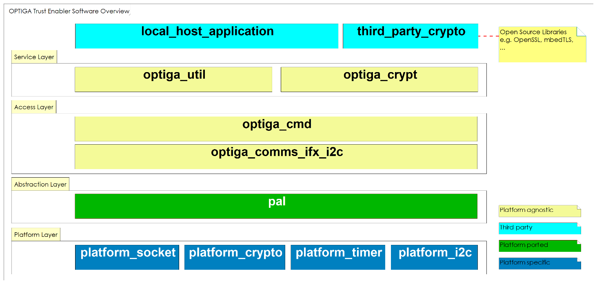 |

Figure 21 – OPTIGA™ Trust Enabler Software Overview

## Service Layer Decomposition

The [Service Layer Decomposition](#service-layer-decomposition) diagram
shows the components providing the services at the main application
interface.

|                                        |
| -------------------------------------- |
| 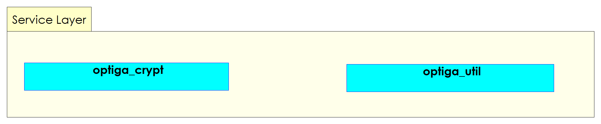 |

Figure 22 - Service Layer Decomposition

### optiga\_crypt

The [optiga\_crypt](#optiga_crypt) module provides cryptographic tool
box functionality with the following characteristics:

  - Multiple instances could be created using
    [optiga\_crypt\_create](#link28c03883_dabd_429d_bd0e_318443c64ece)
    to allow concurrent access to the toolbox.

  - Uses *optiga\_cmd* module to interact with the OPTIGA™*.*

  - The *optiga\_cmd* module might get locked for some consecutive
    invocations, which need to be executed atomic
(strict).

#### Basic (e.g. initialization, shielded connection settings) operations

6.  optiga\_crypt - Basic (e.g. initialization, shielded connection
    settings) APIs

<table>
<thead>
<tr class="header">
<th>API Name</th>
<th>Description</th>
</tr>
</thead>
<tbody>
<tr class="odd">
<td>optiga_crypt_create</td>
<td>
This operation creates an instance of <a href="#optiga_crypt">optiga_crypt</a>. The volatile memory gets allocated and initialized. This operation inherently creates an instance of <em>optiga_cmd</em> if available due to solution constraints (the number of <em>optiga_cmd</em> instances might be limited).

Some of the optiga_crypt operations needs session context in OPTIGA™. In such a case, the instance of <em>optiga_cmd</em> of the respective optiga_crypt instances acquires one of the OPTIGA™ sessions before invoking the actual operation.
</td>
</tr>
<tr class="even">
<td>optiga_crypt_destroy</td>
<td>This operation destructs an instance of <a href="#optiga_crypt">optiga_crypt</a>. The volatile memory is freed. This operation inherently destructs the instance of <em>optiga_cmd</em> and releases the session(if acquired) which was owned by the destructed instance of optiga_crypt.</td>
</tr>
<tr class="odd">
<td>optiga_crypt_set_comms_params</td>
<td>
This operation sets the shielded connection(Encrypted communication between Host and OPTIGA™) parameters like version, protection level, etc.

The possible shielded connection parameter types that can be set are version (e.g. pre-shared secret based) and protection level (e.g. command protection, response protection, both or none).

There are macros defined based on this API to ease the usage of shielded connection to set parameters and levels of protection.

<ul>
<li>
OPTIGA_CRYPT_SET_COMMS_PROTOCOL_VERSION
</li>
</ul>
<ul>
<li>
OPTIGA_CRYPT_SET_COMMS_PROTECTION_ LEVEL
</li>
</ul></td>
</tr>
</tbody>
</table>

#### Random generation operations 

7.  optiga\_crypt – Random generation
APIs

| API Name              | Description                                         |
| --------------------- | --------------------------------------------------- |
| optiga\_crypt\_random | This operation generates random data using OPTIGA™. |

#### Hash operations 

8.  optiga\_crypt - Hash APIs

<table>
<thead>
<tr class="header">
<th>API Name</th>
<th>Description</th>
</tr>
</thead>
<tbody>
<tr class="odd">
<td>optiga_crypt_hash</td>
<td>
This operation performs the hash operation using OPTIGA™ for the provided data and returns the digest.

If the data to be hashed (from external interface e.g. host) is not possible to be sent to OPTIGA™ in a single transaction, then <em>optiga_cmd</em> sends the data to OPTIGA™ automatically in fragments.
</td>
</tr>
<tr class="even">
<td>optiga_crypt_hash_start</td>
<td>This operation initializes OPTIGA™ to hash the data further using optiga_crypt_hash_update.</td>
</tr>
<tr class="odd">
<td>optiga_crypt_hash_update</td>
<td>This operation performs the hashing for the given data (could be either host or referring to a readable data object from OPTIGA™) and updates the hash context using OPTIGA™.</td>
</tr>
<tr class="even">
<td>optiga_crypt_hash_finalize</td>
<td>This operation finalizes the hash.</td>
</tr>
</tbody>
</table>

#### ECC based operations 

9.  optiga\_crypt - ECC based APIs

<table>
<thead>
<tr class="header">
<th>API Name</th>
<th>Description</th>
</tr>
</thead>
<tbody>
<tr class="odd">
<td>optiga_crypt_ecc_generate_keypair</td>
<td>
This operation generates ECC key pair using OPTIGA™. The generated private key could be either stored in OPTIGA™ (static private key from key store or volatile session based) or exported to host.

In case of session based, the instance internally acquires one of the OPTIGA™ sessions before invoking the actual operation.
</td>
</tr>
<tr class="even">
<td>optiga_crypt_ecdsa_sign</td>
<td>This operation generates signature (ECDSA) using a private key from OPTIGA™. The private key could be either from a static key store or acquired session.</td>
</tr>
<tr class="odd">
<td>optiga_crypt_ecdsa_verify</td>
<td>
This operation verifies the signature (ECDSA) using OPTIGA™. The public key could be

<ul>
<li>
Either the public key is from host, the format of public key (from host) is provided in <a href="#ecc-public-key">ECC Public Key</a>.
</li>
<li>
Or the public key is from a data object at OPTIGA™,
</li>
<li><blockquote>

The data object type of OID must be set to either Trust Anchor or Device Identity.

</blockquote></li>
<li><blockquote>

The data object must contain only single X.509 certificate (ASN.1 DER encoded) and maxium size of certificate allowed is 1300 bytes. More details about certificate parameters are specified in <a href="#parameter-validation">Parameter Validation</a> section.

</blockquote></li>
</ul></td>
</tr>
<tr class="even">
<td>optiga_crypt_ecdh</td>
<td>
This operation generates shared secret. OPTIGA™ performs ECDH operation using the referred private key and provided public key.

<ul>
<li>
Here the private key is from OPTIGA™ referring to a static key store OID or session based. In case of session based, the private key is used from the session already acquired.
</li>
<li>
The public key has to be sourced from host.
</li>
</ul>

The generated shared secret can be either exported to the host or stored in OPTIGA™'s session acquired by the respective <a href="#optiga_crypt">optiga_crypt</a> instance.
</td>
</tr>
</tbody>
</table>

#### RSA based operations

10. optiga\_crypt - RSA based APIs

<table>
<thead>
<tr class="header">
<th>API Name</th>
<th>Description</th>
</tr>
</thead>
<tbody>
<tr class="odd">
<td>optiga_crypt_rsa_generate_keypair</td>
<td>This operation generates RSA key pair using OPTIGA™. The generated private key could be either stored in OPTIGA™ (static private key from key store) or exported to host.</td>
</tr>
<tr class="even">
<td>optiga_crypt_rsa_sign</td>
<td>This operation generates signature using RSA based static private key from key store (<a href="#link5d081d58_ad49_4d0e_827c_e9ac545a2f9d">optiga_key_id_t</a>) in OPTIGA™.</td>
</tr>
<tr class="odd">
<td>optiga_crypt_rsa_verify</td>
<td>
This operation verifies the signature using OPTIGA™. The RSA public key could be either sourced from host or referring to OID (data object which holds a certificate) in OPTIGA™.

<ul>
<li>
If the public key is from host, the format of public key (from host) is provided in <a href="#rsa-public-key">RSA Public Key</a>.
</li>
<li>
If the public key is from a data object at OPTIGA™,
</li>
<li><blockquote>

The data object type of OID must be set to either Trust Anchor or Device Identity.

</blockquote></li>
<li><blockquote>

The data object must contain only single X.509 certificate (ASN.1 DER encoded) and maxium size of certificate allowed is 1300 bytes. More details about certificate parameters are specified in <a href="#parameter-validation">Parameter Validation</a> section.

</blockquote></li>
</ul></td>
</tr>
<tr class="even">
<td>optiga_crypt_rsa_encrypt_message</td>
<td>
This operation encrypts the message or data provided using OPTIGA™. The RSA public key could be either sourced from host or referring to a OID (data object which holds a certificate) in OPTIGA™.

The <a href="#linkaaa480c6_cc6f_4577_bb13_69c702b6352e">message length</a> that can be encrypted is limited as per <a href="#linkbdc9c86d_a9c7_41e4_801e_33afb581ee51">[RFC8017]</a>. The caller of this operation has to take care of chaining of message if message length is more than supported in a single operation.

For example, in case of <a href="#linka933b89a_9a3e_42e2_bdde_f1d36912760f">OPTIGA_RSAES_PKCS1_V15</a> and RSA 1024 bit key length, the maximum allowed <a href="#linkaaa480c6_cc6f_4577_bb13_69c702b6352e">message length</a> is [128 (key length) – 11] = 117 bytes.

The examples for the format of public key (from host) are provided in <a href="#rsa-public-key">RSA Public Key</a>.
</td>
</tr>
<tr class="odd">
<td>optiga_crypt_rsa_encrypt_session</td>
<td>
This operation encrypts the data from acquired session in OPTIGA™. The RSA public key could be either sourced from host or referring to OID (data object which holds a certificate) in OPTIGA™.

If the shielded connection (OPTIGA_COMMS_SHIELDED_CONNECTION) is enabled, By default the optiga_cmd sends the command to OPTIGA™ with confidentiality protection.
</td>
</tr>
<tr class="even">
<td>optiga_crypt_rsa_decrypt_and_export</td>
<td>
This operation decrypts the provided encrypted message using a RSA private key from OPTIGA™ and exports the decrypted message to the host.

The encrypted message length must be the size of the key used to decrypt the message.

For example, In case of RSA 2048 (Key size = 256 bytes), the encrypted message length is 256 bytes. The caller of this operation has to take care of chaining of encrypted message if length is more than supported in a single operation.

If the shielded connection is enabled, the decrypted data/message is received with confidentiality protection from OPTIGA™.
</td>
</tr>
<tr class="odd">
<td>optiga_crypt_rsa_decrypt_and_store</td>
<td>
This operation decrypts the provided encrypted message using the referred RSA static private key from OPTIGA™ and stores message in the acquired session.

The encrypted message length must be the size of the key used to decrypt the message. For example, In case of RSA 2048 (Key size = 256 bytes), the encrypted message length is 256 bytes.
</td>
</tr>
<tr class="even">
<td>optiga_crypt_rsa_generate_pre_master_secret</td>
<td>
This operation generates pre-master secret (optional data || random stream) for RSA key exchange and stores in the acquired session.

<ul>
<li>
This operation acquires a session if not already acquired.
</li>
<li>
The minimum size of random stream is 8 bytes.
</li>
</ul>

The maximum size of pre-master secret allowed to store in the acquired session is 66 bytes (<em>in case of OPTIGA™ Trust M V1, 48 bytes only</em>).

For example, in case of RSA key exchange based TLS communication, the client generates 48 bytes of pre-master secret (version info [2] bytes || random [46] bytes).
</td>
</tr>
</tbody>
</table>

#### Symmetric based operations

11. optiga\_crypt - Symmetric based APIs

<table>
<thead>
<tr class="header">
<th>API Name</th>
<th>Description</th>
</tr>
</thead>
<tbody>
<tr class="odd">
<td><em>Note: OPTIGA™ Trust M V1 doesn’t support symmetric operations</em></td>
<td></td>
</tr>
<tr class="even">
<td>optiga_crypt_symmetric_generate_key</td>
<td>This operation generates symmetric key (e.g. AES) using OPTIGA™. The generated key could be either stored at OPTIGA™ (static key from key store) or exported to host.</td>
</tr>
<tr class="odd">
<td>optiga_crypt_symmetric_encrypt_ecb</td>
<td>
This operation encrypts (<a href="#linkfa0cf4f2_9ef3_4a17_9e22_3479f7b1d576">OPTIGA_SYMMETRIC_ECB</a> mode) the data provided using OPTIGA™.

<ul>
<li>
No internal padding is performed by OPTIGA™.
</li>
<li>
If the length of plain data to be encrypted can't be sent to OPTIGA™ in one transaction, then plain data will be sent to OPTIGA™ in multiple fragments (each fragment is block length aligned) internally.
</li>
</ul>

Note: The shielded connection protection level with command protection is implicitly enabled if the Shielded connection is enabled.
</td>
</tr>
<tr class="even">
<td>optiga_crypt_symmetric_encrypt</td>
<td>
This operation encrypts (symmetric) MAC for the data provided using OPTIGA™. In case of MAC only based operations (for example, CBC-MAC, CMAC), only the MAC is returned.

<ul>
<li>
Internal padding is performed by OPTIGA™ in case of <a href="#linka10d8f24_997b_4527_a899_3a8ff6232392">OPTIGA_SYMMETRIC_CMAC</a>, if the data provided is not block aligned while finalizing the operation.
</li>
<li>
If the length of plain data to be encrypted can't be sent to OPTIGA™ in one transaction, then plain data will be sent to OPTIGA™ in multiple fragments internally.
</li>
</ul>

Note: The shielded connection protection level with command protection is implicitly enabled if the Shielded connection is enabled.
</td>
</tr>
<tr class="odd">
<td>optiga_crypt_symmetric_encrypt_start</td>
<td>
This operation initiates encryption (symmetric) sequence for the provided data using OPTIGA™. The encrypted data gets returned to the host in terms of blocks (block length is based on the encryption mdoe chosen).

<ul>
<li>
In case of generating MAC, the generated MAC gets returned with the successful optiga_crypt_symmetric_encrypt_final operation.
</li>
<li>
If the length of plain data can't be sent to OPTIGA™ in one transaction, then plain data will be sent to OPTIGA™ in multiple fragments (each fragment must be block length aligned) internally.
</li>
</ul>

Note: The shielded connection protection level with command protection is implicitly enabled if the Shielded connection is enabled.
</td>
</tr>
<tr class="even">
<td>optiga_crypt_symmetric_encrypt_continue</td>
<td>
This operation encrypts (symmetric) the data provided using OPTIGA™.

<ul>
<li>
In case of generating MAC, the generated MAC gets returned with the successful optiga_crypt_symmetric_encrypt_final operation.
</li>
<li>
No internal padding is performed by OPTIGA™.
</li>
<li>
If the length of plain data to be encrypted can't be sent to OPTIGA™ in one transaction, then plain data will be sent to OPTIGA™ in multiple fragments (each fragment must be block length aligned) internally.
</li>
</ul>

Note: The shielded connection protection level with command protection is implicitly enabled if the Shielded connection is enabled.
</td>
</tr>
<tr class="odd">
<td>optiga_crypt_symmetric_encrypt_final</td>
<td>
This operation encrypts (symmetric) the data provided using OPTIGA™.

<ul>
<li>
In case of generating MAC, the generated MAC only gets returned upon successful completion of this operation.
</li>
<li>
Internal padding is performed by OPTIGA™ in case of <a href="#linka10d8f24_997b_4527_a899_3a8ff6232392">OPTIGA_SYMMETRIC_CMAC</a>, if the data provided is not block aligned while finalizing the operation.
</li>
<li>
If the length of plain_data to be encrypted can't be sent to OPTIGA™ in one transaction, then plain_data will be sent to OPTIGA™ in multiple fragments (each fragment must be block length aligned except the last) internally.
</li>
</ul>

Note: The shielded connection protection level with command protection is implicitly enabled if the Shielded connection is enabled.
</td>
</tr>
<tr class="even">
<td>optiga_crypt_symmetric_decrypt_ecb</td>
<td>
This operation encrypts (ECB mode as specified by <a href="#link9ac0151a_a12c_476d_89d2_84a062596867">[SP 800-38A]</a>) the data provided using OPTIGA™.

<ul>
<li>
No internal padding is performed by OPTIGA™.
</li>
<li>
If the length of encrypted data can't be sent to OPTIGA™ in one transaction, then encrypted data will be sent to OPTIGA™ in multiple fragments (each fragment is block length aligned) internally.
</li>
</ul>

Note: The shielded connection protection level with command protection is implicitly enabled if the Shielded connection is enabled.
</td>
</tr>
<tr class="odd">
<td>optiga_crypt_symmetric_decrypt</td>
<td>
This operation decrypts the provided encrypted data using OPTIGA™ and returns the plain data to the host.

<ul>
<li>
No internal padding is performed by OPTIGA™.
</li>
<li>
If the length of encrypted data to be decrypted can't be sent to OPTIGA™ in one transaction, then encrypted data will be sent to OPTIGA™ in multiple fragments (each fragment must be block length aligned except the last) internally.
</li>
</ul>

Note: The shielded connection protection level with response protection is implicitly enabled if the shielded connection is enabled.
</td>
</tr>
<tr class="even">
<td>optiga_crypt_symmetric_decrypt_start</td>
<td>
This operation initiates the decrypt (symmetric) sequence for the provided encrypted data using OPTIGA™. The plain data gets exported to the host in terms of blocks (block length is based on the encrypted data chosen)

<ul>
<li>
No internal padding is performed by OPTIGA™.
</li>
<li>
If the length of encrypted data can't be sent to OPTIGA™ in one transaction, then encrypted data will be sent to OPTIGA™ in multiple fragments (each fragment must be block length aligned).
</li>
</ul>

Note: The shielded connection protection level with response protection is implicitly enabled if the Shielded connection is enabled.
</td>
</tr>
<tr class="odd">
<td>optiga_crypt_symmetric_decrypt_continue</td>
<td>
This operation decrypts the provided encrypted data using OPTIGA™ and returns the decrypted data to the host.

<ul>
<li>
No internal padding is performed by OPTIGA™.
</li>
<li>
If the length of encrypted data can't be sent to OPTIGA™ in one transaction, then encrypted data will be sent to OPTIGA™ in multiple fragments (each fragment must be block length aligned) internally.
</li>
</ul>

Note: The shielded connection protection level with response protection is implicitly enabled if the Shielded connection is enabled.
</td>
</tr>
<tr class="even">
<td>optiga_crypt_symmetric_decrypt_final</td>
<td>
This operation decrypts the provided encrypted data using OPTIGA™ and returns the decrypted data to the host.

<ul>
<li>
No internal padding is performed by OPTIGA™.
</li>
<li>
If the length of encrypted data can't be sent to OPTIGA™ in one transaction, then encrypted data will be sent to OPTIGA™ in multiple fragments (each fragment must be block length aligned except the last) internally.
</li>
</ul>

Note: The shielded connection protection level with response protection is implicitly enabled if the Shielded connection is enabled.
</td>
</tr>
</tbody>
</table>

#### Hmac, key derivation based operations

12. optiga\_crypt – HMAC generation APIs

<table>
<thead>
<tr class="header">
<th>API Name</th>
<th>Description</th>
</tr>
</thead>
<tbody>
<tr class="odd">
<td><em>Note: OPTIGA™ Trust M V1 doesn’t support hmac based operations</em></td>
<td></td>
</tr>
<tr class="even">
<td>optiga_crypt_hmac</td>
<td>
This operation performs hmac operation using a shared secret at OPTIGA™.

If the length of input data can't be sent to OPTIGA™ in one transaction, then input data will be sent to OPTIGA™ in multiple fragments internally.

Note: The shielded connection protection level with command protection is implicitly enabled if the Shielded connection is enabled.
</td>
</tr>
<tr class="odd">
<td>optiga_crypt_hmac_start</td>
<td>
This operation initiates hmac operation.

<ul>
<li>
If the length of input data can't be sent to OPTIGA™ in one transaction, then input data will be sent to OPTIGA™ in multiple fragments internally.
</li>
</ul>

Note: The shielded connection protection level with command protection is implicitly enabled if the Shielded connection is enabled.
</td>
</tr>
<tr class="even">
<td>optiga_crypt_hmac_update</td>
<td>
This operation performs hmac operation for the data provided using OPTIGA™.

<ul>
<li>
If the length input data can't be sent to OPTIGA™ in one transaction, then input data will be sent to OPTIGA™ in multiple fragments internally.
</li>
</ul>

Note: The shielded connection protection level with command protection is implicitly enabled if the Shielded connection is enabled.
</td>
</tr>
<tr class="odd">
<td>optiga_crypt_hmac_finalize</td>
<td>
This operation performs hmac operation for the data provided using OPTIGA™.

<ul>
<li>
If the length of input data can't be sent to OPTIGA™ in one transaction, then input data will be sent to OPTIGA™ in multiple fragments internally.
</li>
</ul>

Note: The shielded connection protection level with command protection is implicitly enabled if the Shielded connection is enabled.
</td>
</tr>
</tbody>
</table>

13. optiga\_crypt – HMAC based authorization APIs

<table>
<thead>
<tr class="header">
<th>API Name</th>
<th>Description</th>
</tr>
</thead>
<tbody>
<tr class="odd">
<td><em>Note: OPTIGA™ Trust M V1 doesn’t support hmac authorization operations</em></td>
<td></td>
</tr>
<tr class="even">
<td>optiga_crypt_generate_auth_code</td>
<td>This operation generates random data using OPTIGA™ which gets stored in the acquired session context at OPTIGA™. The random stored in the acquired session context gets used as authorization challenge for hmac verify (optiga_crypt_hmac_verify) kind of operations.</td>
</tr>
<tr class="odd">
<td>optiga_crypt_hmac_verify</td>
<td>
This operation performs hmac verification for the provided authorization value using OPTIGA™.

<ul>
<li>
This operation uses the session already acquired to store the authentication code (generated using optiga_crypt_generate_auth_code).
</li>
<li>
The size of input data is based on the respective hash algorithm used in the hmac scheme (630 bytes – <a href="#link79bb7fdc_58df_48a0_bba7_4d179937a515">hmac_length</a>).
</li>
</ul>

Upon successful verification of provided <a href="#link79bb7fdc_58df_48a0_bba7_4d179937a515">hmac</a>, the achieved AUTO state using the respective <a href="#link79bb7fdc_58df_48a0_bba7_4d179937a515">secret</a> is maintained by OPTIGA™. The achieved state can be cleared by invoking optiga_crypt_clear_auto_state operation.

Note: The shielded connection protection level with response protection is implicitly enabled if the shielded connection is enabled.
</td>
</tr>
<tr class="even">
<td>optiga_crypt_clear_auto_state</td>
<td>
This operation clears the achieved authorization (AUTO) state (using optiga_crypt_hmac_verify operation) at OPTIGA™.

The acquired session gets released after completion of this operation (irrespective of status of the operation once after the command is sent to OPTIGA™).

Note: The shielded connection protection level with response protection is implicitly enabled if the shielded connection is enabled.
</td>
</tr>
</tbody>
</table>

14. optiga\_crypt – Key derivation APIs

<table>
<thead>
<tr class="header">
<th>API Name</th>
<th>Description</th>
</tr>
</thead>
<tbody>
<tr class="odd">
<td>optiga_crypt_tls_prf</td>
<td>
This operation derives shared secret or key using OPTIGA™. OPTIGA™ performs PRF (as specified in TLS v1.2) operation as per type chosen using the referred data object ID or session ID holding a secret.

There are dedicated APIs (macro based) for the respective hash algorithm used as part of PRF.

<ul>
<li>
optiga_crypt_tls_prf_sha256
</li>
<li>
optiga_crypt_ tls_prf_sha384
</li>
<li>
optiga_crypt_ tls_prf_sha512
</li>
</ul>

<em>Note: OPTIGA™ Trust M V1 doesn’t support PRF (with SHA384/512) algorithms.</em>
</td>
</tr>
<tr class="even">
<td>optiga_crypt_hkdf</td>
<td>
This operation derives shared secret or key using OPTIGA™.

The OPTIGA™ performs HKDF (as specified in <a href="#linkcc687f29_3fc6_49c9_933d_0bf3aeeda86b">[RFC5869]</a>) operation using the referred data object ID or session ID, which holds a secret.

There are dedicated APIs (macro based) for the respective hash algorithm used as part of HKDF.

<ul>
<li>
optiga_crypt_hkdf_sha256
</li>
<li>
optiga_crypt_hkdf_sha384
</li>
<li>
optiga_crypt_hkdf_sha512
</li>
</ul>

<em>Note: OPTIGA™ Trust M V1 doesn’t support HKDF algorithm.</em>
</td>
</tr>
</tbody>
</table>

### optiga\_util

The [optiga\_util](#optiga_util) module provides useful utilities to
manage the OPTIGA™ (open/close) and data/key objects with the following
characteristics:

  - Multiple instances could be created to allow concurrent access to
    other services.

  - Uses *optiga\_cmd* module to interact with the
OPTIGA™*.*

#### Basic (e.g. initialization, shielded connection settings) operations

15. optiga\_util - Basic (e.g. initialization, shielded connection
    settings) APIs

<table>
<thead>
<tr class="header">
<th>API Name</th>
<th>Description</th>
</tr>
</thead>
<tbody>
<tr class="odd">
<td>optiga_util_create</td>
<td>This operation creates an instance of <a href="#optiga_util">optiga_util</a>. The volatile memory gets allocated and initialized. This operation inherently creates an instance of <em>optiga_cmd</em> if available due to solution constraints (the number of <em>optiga_cmd</em> instances might be limited).</td>
</tr>
<tr class="even">
<td>optiga_util_destroy</td>
<td>This operation destructs an instance of <a href="#optiga_util">optiga_util</a>. The volatile memory is freed. This operation inherently destructs the instance of <em>optiga_cmd</em> which was owned by the destructed instance of <a href="#optiga_util">optiga_util</a>.</td>
</tr>
<tr class="odd">
<td>optiga_crypt_set_comms_params</td>
<td>
This operation sets the shielded connection(Encrypted communication between Host and OPTIGA™) parameters like version, protection level, etc.

The possible shielded connection parameter types that can be set are version (e.g. pre-shared secret based) and protection level (e.g. command protection, response protection, both or none).

There are macros defined based on this API to ease the usage of shielded connection to set parameters and levels of protection.

<ul>
<li>
OPTIGA_UTIL_SET_COMMS_PROTOCOL_VERSION
</li>
<li>
OPTIGA_UTIL_SET_COMMS_PROTECTION_ LEVEL
</li>
</ul></td>
</tr>
</tbody>
</table>

#### Open and Close operations

16. optiga\_util - Open and close APIs

<table>
<thead>
<tr class="header">
<th>API Name</th>
<th>Description</th>
</tr>
</thead>
<tbody>
<tr class="odd">
<td>optiga_util_open_application</td>
<td>
This operation initializes or restores (from a hibernate state if performed) the application on OPTIGA™.

Since after cold or warm reset, all applications residing on the OPTIGA™ are closed, an application has to be opened before using it. This operation initializes the application context on OPTIGA™.

This operation must be issued once at least before invoking any other operations either from <a href="#optiga_util">optiga_util</a> or <a href="#optiga_crypt">optiga_crypt</a>.
</td>
</tr>
<tr class="even">
<td>optiga_util_close_application</td>
<td>
This operation closes the application or on OPTIGA™.

With the hibernate option, the OPTIGA™ stores the current context of application and restores with next optiga_util_open_application.

With this option, the host can power off the OPTIGA™ when not in use and restore with optiga_util_open_application when required to avoid the power consumption by OPTIGA™ during the unused period to keep the session context intact.

In this operation, after OPTIGA™ confirms the storing of state/context (command is successfully executed), the Access Layer switches off the OPTIGA™ (if GPIOs are configured during control the Vcc connected to OPTIGA™).

After successful completion of this operation, OPTIGA™ will not perform any other operations until the next successful optiga_util_open_application operation.

Note: In case of Security Event Counter (SEC) &gt; 0, OPTIGA™ doesn't allow the hibernate operation. Hence this operation leads to failure.
</td>
</tr>
</tbody>
</table>

#### Read and Write operations

17. optiga\_util - Read and write APIs

<table>
<thead>
<tr class="header">
<th>API Name</th>
<th>Description</th>
</tr>
</thead>
<tbody>
<tr class="odd">
<td>optiga_util_read_data</td>
<td>This operation reads the data from the specified data object in OPTIGA™.</td>
</tr>
<tr class="even">
<td>optiga_util_read_metadata</td>
<td>This operation reads the metadata from the specified data object in OPTIGA™.</td>
</tr>
<tr class="odd">
<td>optiga_util_write_data</td>
<td>
This operation writes data to the specified data object in OPTIGA™.

Type of write operation - (Erase &amp; Write) or Write.

OPTIGA_UTIL_ERASE_AND_WRITE (Erase &amp; Write) - Erases the complete data object and writes the given data starting from the specified offset

OPTIGA_UTIL_WRITE_ONLY (Write) - Writes the given data starting from the specified offset.
</td>
</tr>
<tr class="even">
<td>optiga_util_write_metadata</td>
<td>This operation writes metadata to the specified data object in OPTIGA™.</td>
</tr>
<tr class="odd">
<td>optiga_util_update_count</td>
<td>
This operation updates counter data object optiga_counter_oid with the provided count value in OPTIGA™.

The counter in counter data object optiga_counter_oid gets incremented/decremented up to the threshold value depending on the counter type set.

Any further attempts after reaching the threshold value, the OPTIGA™ returns an error.
</td>
</tr>
</tbody>
</table>

#### Protected update operations

18. optiga\_util - Protected update APIs

<table>
<thead>
<tr class="header">
<th>API Name</th>
<th>Description</th>
</tr>
</thead>
<tbody>
<tr class="odd">
<td>optiga_util_protected_update_start</td>
<td>
This operation initiates the protected update of data/key objects in OPTIGA™.

<em>Note: OPTIGA™ Trust M V1 doesn’t support confidentiality update and key &amp; metadata update.</em>

The manifest provided will be validated by OPTIGA™. Upon the successful completion of this operation, The fragments (which contain the data to be updated) are to be sent using optiga_util_protected_update_continue and/or optiga_util_protected_update_final.

The protected update needs to be performed in a strict sequence. The strict lock acquired gets released either by the successful completion of optiga_util_protected_update_final or any failure until the optiga_util_protected_update_final is completed.

Once the <a href="#optiga_util">optiga_util</a> instance is used with optiga_util_protected_update_start successfully,

<ul>
<li>
The same instance is not supposed to be used until the optiga_util_protected_update_final completed or the protected update sequence failed with other operations.
</li>
</ul>

The shielded connection protection level chosen for optiga_util_protected_update_start, will also be applied for optiga_util_protected_update_continue and optiga_util_protected_update_final implicitly.
</td>
</tr>
<tr class="even">
<td>optiga_util_protected_update_continue</td>
<td>
This operation sends the fragments to OPTIGA™.

If the protected update contains a single fragment, then the fragment has to be sent using the <a href="#link55eda337_42fa_4af6_adfe_523349bd15bf">optiga_util_protected_update_final</a> and the <a href="#link66dac1dc_1489_4582_94a3_18c1e712658c">optiga_util_protected_update_continue</a> is skipped.

E.g., The number of fragments are n,

n = 1, the fragment must be sent using optiga_util_protected_update_final and optiga_util_protected_update_continue is not used.

n &gt; 1, the first and up to (n-1) fragments must be sent using optiga_util_protected_update_continue and the last fragment must be sent using optiga_util_protected_update_final.

Notes:

<ul>
<li>
The local_host_application must take care of sending the fragments in the correct order to OPTIGA™ as each fragment contains the integrity of the next fragment. The fragment size must be 640 bytes.
</li>
</ul></td>
</tr>
<tr class="odd">
<td>optiga_util_protected_update_final</td>
<td>This operation sends the last fragment and finalizes the protected update of OPTIGA™ data object and releases the strict lock acquired. The size of the fragment can be up to 640 bytes.</td>
</tr>
</tbody>
</table>

## Abstraction Layer Decomposition

The [Abstraction Layer Decomposition](#abstraction-layer-decomposition)
diagram shows the components providing an agnostic interface to the
underlying HW and SW platform functionality used by the higher-level
components of the architecture.

|                                        |
| -------------------------------------- |
| 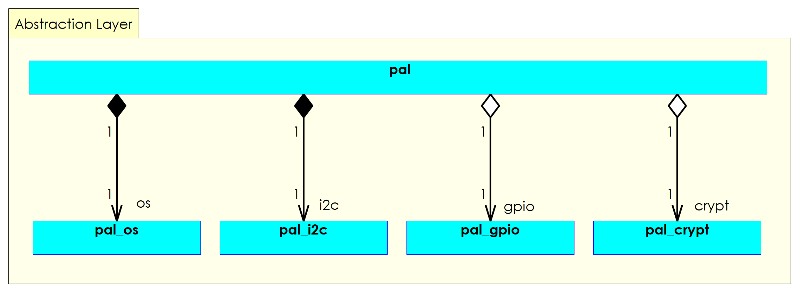 |

Figure 23 - Abstraction Layer Decomposition

### pal

The [pal](#pal) is a **P**latform **A**bstraction **L**ayer, abstracting
HW and Operating System functionalities for the Infineon XMC family of
µController or upon porting to any other µController. It abstracts away
the low level device driver interface (platform\_timer, platform\_i2c,
platform\_socket, ...) to allow the modules calling it being platform
agnostic. The [pal](#pal) is composed of hardware, software and an
operating system abstraction part.

19. pal
APIs

| API Name    | Description                                                                                                                                |
| ----------- | ------------------------------------------------------------------------------------------------------------------------------------------ |
| pal\_init   | This operation initializes the [pal](#pal) and aggregated pal modules (e.g. pal\_i2c\_init, pal\_gpio\_init, pal\_os\_init, etc.).         |
| pal\_deinit | This operation deinitializes the [pal](#pal) and aggregated pal modules (e.g. pal\_i2c\_deinit, pal\_gpio\_deinit, pal\_os\_deinit, etc.). |

### pal\_crypt

The pal\_crypt module provides the platform specific migration of
platform-specific cryptographic functionality (either SW libraries or
HW) and is exposing cryptographic primitives invoked by platform
agnostic modules.

20. pal\_crypt
APIs

| API Name                         | Description                                                                                                                                                                                          |
| -------------------------------- | ---------------------------------------------------------------------------------------------------------------------------------------------------------------------------------------------------- |
| pal\_crypt\_tls\_prf\_sha256     | This operation derives the secret using the TLSv1.2 PRF SHA256 for a given shared secret.                                                                                                            |
| pal\_crypt\_encrypt\_aes128\_ccm | This operation encrypts the given plain text using the provided encryption key and nonce.                                                                                                            |
| pal\_crypt\_decrypt\_aes128\_ccm | This operation decrypts the given cipher text using the provided decryption key and nonce. This operation validates the MAC internally and provides the plain text if MAC is successfully validated. |

### pal\_gpio

This Module provides APIs to set GPIO high/low to perform below
operations.

  - Power on/off

  - HW Reset on/off

<!-- end list -->

21. pal\_gpio
APIs

| API Name             | Description                                                   |
| -------------------- | ------------------------------------------------------------- |
| pal\_gpio\_init      | This operation initializes the lower level driver of gpio.    |
| pal\_gpio\_deinit    | This operation de-initializes the lower level driver of gpio. |
| pal\_gpio\_set\_high | This operation sets the gpio pin state to high.               |
| pal\_gpio\_set\_low  | This operation sets the gpio pin state to low.                |

### pal\_i2c

The pal\_i2c module is a platform ported module and provides the
platform specific migration of HW based I2C functionality. The pal\_i2c
is invoked as a platform agnostic security device communication API by
platform agnostic modules. It is assumed that multiple callers are
invoking its API concurrently. Therefore, the implementation of each API
function is atomic and stateless (except the initialization).

22. pal\_i2c
APIs

| API Name               | Description                                                  |
| ---------------------- | ------------------------------------------------------------ |
| pal\_i2c\_init         | This operation initializes the lower level driver of i2c.    |
| pal\_i2c\_deinit       | This operation de-initializes the lower level driver of i2c. |
| pal\_i2c\_read         | This operation reads the data from I2C bus.                  |
| pal\_i2c\_write        | This operation writes the data to I2C bus.                   |
| pal\_i2c\_set\_bitrate | This operation sets the bit rate (in kHz) of I2C master.     |

### pal\_os

The pal\_os module provides the platform specific migration of operating
system (e.g. RTOS) based functionality, which is invoked by platform
agnostic modules.

23. pal\_os
APIs

| API Name                                      | Description                                                                                                                                                                |
| --------------------------------------------- | -------------------------------------------------------------------------------------------------------------------------------------------------------------------------- |
| pal\_os\_datastore\_read                      | This operation abstracts the reading of data from the specified location in the host platform.                                                                             |
| pal\_os\_datastore\_write                     | This operation abstracts the writing of data to the specified location in the host platform.                                                                               |
| pal\_os\_event\_create                        | This operation initializes (creates optionally) returns context to the event for the later use.                                                                            |
| pal\_os\_event\_register\_callback\_oneshot   | This operation registers the callback and context. The callback will invoked pal\_os\_event\_trigger\_registered\_callback with the given context after the provided time. |
| pal\_os\_event\_trigger\_registered\_callback | This operation invokes the registered callback with the given context once the time out is triggered.                                                                      |
| pal\_os\_event\_start                         | This operation starts the event management operation.                                                                                                                      |
| pal\_os\_event\_stop                          | This operation stops the event management operation.                                                                                                                       |
| pal\_os\_event\_destroy                       | This operation destroys the event.                                                                                                                                         |
| pal\_os\_timer\_init                          | This operation initializes the timer on the host platform.                                                                                                                 |
| pal\_os\_timer\_get\_time\_in\_milliseconds   | This operation provides the current time stamp in milliseconds.                                                                                                            |
| pal\_os\_timer\_get\_time\_in\_microseconds   | This operation provides the current time stamp in microseconds.                                                                                                            |
| pal\_os\_timer\_delay\_in\_milliseconds       | This operation induces a delay of provided milliseconds.                                                                                                                   |
| pal\_os\_timer\_deinit                        | This operation de-initializes the timer on the host platform.                                                                                                              |
| pal\_os\_lock\_enter\_critical\_section       | This operation allows to enter critical section.                                                                                                                           |
| pal\_os\_lock\_exit\_critical\_section        | This operation allows to exit from critical section.                                                                                                                       |
| pal\_os\_malloc                               | This operation allocates memory.                                                                                                                                           |
| pal\_os\_calloc                               | This operation allocates a clean (set to all 0's) memory.                                                                                                                  |
| pal\_os\_free                                 | This operation frees the memory.                                                                                                                                           |
| pal\_os\_memcpy                               | This operation copies the number of bytes (size) from p\_source to p\_destination.                                                                                         |
| pal\_os\_memset                               | This operation copies the first number of bytes (size) of p\_buffer with the value (byte) specified.                                                                       |

## Data Types

This section defines the data types used by the service layer operations
specified in [Enabler
APIs](#enabler-apis).

### Enumerations

Types
of ECC Curves supported by
OPTIGA™

24. optiga\_ecc\_curve\_t

| Name                                      | Description                       |
| ----------------------------------------- | --------------------------------- |
| OPTIGA\_ECC\_CURVE\_NIST\_P\_256          | Curve type - ECC NIST P-256       |
| OPTIGA\_ECC\_CURVE\_NIST\_P\_384          | Curve type - ECC NIST P-384       |
| OPTIGA\_ECC\_CURVE\_NIST\_P\_521          | Curve type - ECC NIST P-521       |
| OPTIGA\_ECC\_CURVE\_BRAIN\_POOL\_P\_256R1 | Curve type - ECC Brainpool P256r1 |
| OPTIGA\_ECC\_CURVE\_BRAIN\_POOL\_P\_384R1 | Curve type - ECC Brainpool P384r1 |
| OPTIGA\_ECC\_CURVE\_BRAIN\_POOL\_P\_512R1 | Curve type - ECC Brainpool P512r1 |

Note*:* OPTIGA™ Trust M V1 doesn’t support Brainpool and ECC NIST P 521
curves.

Hash context length/size while using OPTIGA™ for digest
generation.

25. optiga\_hash\_context\_length\_t

| Name                                    | Description                                       |
| --------------------------------------- | ------------------------------------------------- |
| OPTIGA\_HASH\_CONTEXT\_LENGTH\_SHA\_256 | Hash context length (in bytes) in case of SHA256. |

Types of digest/hash generation supported by OPTIGA™

1.  > optiga\_hash\_type\_t

| Name                         | Description                  |
| ---------------------------- | ---------------------------- |
| OPTIGA\_HASH\_TYPE\_SHA\_256 | Generate digest using SHA256 |

Types of key derivation based on HKDF supported by
OPTIGA™.

2.  > optiga\_hkdf\_type\_t

| Name                   | Description                                                                                |
| ---------------------- | ------------------------------------------------------------------------------------------ |
| OPTIGA\_HKDF\_SHA\_256 | Key derivation using HKDF-SHA256 [\[RFC5869\]](#linkcc687f29_3fc6_49c9_933d_0bf3aeeda86b). |
| OPTIGA\_HKDF\_SHA\_384 | Key derivation using HKDF-SHA384 [\[RFC5869\]](#linkcc687f29_3fc6_49c9_933d_0bf3aeeda86b). |
| OPTIGA\_HKDF\_SHA\_512 | Key derivation using HKDF-SHA384 [\[RFC5869\]](#linkcc687f29_3fc6_49c9_933d_0bf3aeeda86b). |

Note: OPTIGA™ Trust M V1 doesn’t support HKDF.

Types of hmac generation supported by
OPTIGA™.

3.  > optiga\_hmac\_type\_t

| Name                   | Description                                                                              |
| ---------------------- | ---------------------------------------------------------------------------------------- |
| OPTIGA\_HMAC\_SHA\_256 | Generate MAC using HMAC-SHA256 [\[RFC2104\]](#linkaf930b47_97b9_41da_8ea9_cc37e4385bfe). |
| OPTIGA\_HMAC\_SHA\_384 | Generate MAC using HMAC-SHA384 [\[RFC2104\]](#linkaf930b47_97b9_41da_8ea9_cc37e4385bfe). |
| OPTIGA\_HMAC\_SHA\_512 | Generate MAC using HMAC-SHA512 [\[RFC2104\]](#linkaf930b47_97b9_41da_8ea9_cc37e4385bfe). |

Note: OPTIGA™ Trust M V1 doesn’t support
HMAC.

Key slot IDs in OPTIGA™

4.  > optiga\_key\_id\_t

<table>
<thead>
<tr class="header">
<th>Name</th>
<th>Description</th>
</tr>
</thead>
<tbody>
<tr class="odd">
<td>OPTIGA_KEY_ID_E0F0</td>
<td>
Key from key store (non-volatile).

Supports only ECC (<a href="#link5725d2d1_5681_4e2e_b893_247e07f1a504">optiga_ecc_curve_t</a>).
</td>
</tr>
<tr class="even">
<td>OPTIGA_KEY_ID_E0F1</td>
<td>
Key from key store (non-volatile).

Supports only ECC (<a href="#link5725d2d1_5681_4e2e_b893_247e07f1a504">optiga_ecc_curve_t</a>).
</td>
</tr>
<tr class="odd">
<td>OPTIGA_KEY_ID_E0F2</td>
<td>
Key from key store (non-volatile).

Supports only ECC (<a href="#link5725d2d1_5681_4e2e_b893_247e07f1a504">optiga_ecc_curve_t</a>).
</td>
</tr>
<tr class="even">
<td>OPTIGA_KEY_ID_E0F3</td>
<td>
Key from key store (non-volatile).

Supports only ECC (<a href="#link5725d2d1_5681_4e2e_b893_247e07f1a504">optiga_ecc_curve_t</a>).
</td>
</tr>
<tr class="odd">
<td>OPTIGA_KEY_ID_E0FC</td>
<td>
Key from key store (non-volatile).

Supports only RSA (<a href="#link4acbe84f_6f74_4997_89c1_a5cd21cc204a">optiga_rsa_key_type_t</a>).
</td>
</tr>
<tr class="even">
<td>OPTIGA_KEY_ID_E0FD</td>
<td>
Key from key store (non-volatile).

Supports only RSA (<a href="#link4acbe84f_6f74_4997_89c1_a5cd21cc204a">optiga_rsa_key_type_t</a>).
</td>
</tr>
<tr class="odd">
<td>
OPTIGA_KEY_ID_E200

Note: OPTIGA™ Trust M V1 doesn’t support Symmetric Key (OPTIGA_KEY_ID_E200).
</td>
<td>
Key from key store (non-volatile).

Supports AES 128/192/256 key types

(<a href="#linkbdd97804_3f75_44df_882d_fd1c8e60c327">optiga_symmetric_key_type_t</a>).
</td>
</tr>
<tr class="even">
<td>OPTIGA_KEY_ID_SESSION_BASED</td>
<td>Key from session context (volatile).</td>
</tr>
</tbody>
</table>

Types of Key usage.

The multiple key usage types can be selected based on the requirement
and key type.

For example, if the private key from OPTIGA™ to be used for key
agreement (Diffie-Hellmann) and signature generation purpose, then the
key usage can be chosen as
([OPTIGA\_KEY\_USAGE\_SIGN](#link6aa3bef1_c5a9_4ac0_9146_008ca1645b1a) |
[OPTIGA\_KEY\_USAGE\_KEY\_AGREEMENT](#linkd886b552_6ca0_41fb_a15a_98639d0267b5)).

5.  > optiga\_key\_usage\_t

| Name                                                                                                         | Description                                                                                                               |
| ------------------------------------------------------------------------------------------------------------ | ------------------------------------------------------------------------------------------------------------------------- |
| OPTIGA\_KEY\_USAGE\_AUTHENTICATION                                                                           | Allows to use the private key for the signature generation as part of authentication and sign commands                    |
| OPTIGA\_KEY\_USAGE\_ENCRYPTION                                                                               | Allows to use the (private) key for encrypt and decrypt operations. This type is applicable for RSA or AES key type only. |
| OPTIGA\_KEY\_USAGE\_SIGN           | Allows to use the private key for the signature generation as part of sign command                                        |
| OPTIGA\_KEY\_USAGE\_KEY\_AGREEMENT | Allows to use the private key for key agreement (for example, ECDH operations)                                            |

Types of random number generation supported by OPTIGA™

6.  > optiga\_rng\_type\_t

| Name                    | Description                       |
| ----------------------- | --------------------------------- |
| OPTIGA\_RNG\_TYPE\_TRNG | Generate Random number using TRNG |
| OPTIGA\_RNG\_TYPE\_DRNG | Generate Random number using DRNG |

RSA Encryption schemes supported by OPTIGA™ for encryption and
decryption.

7.  > optiga\_rsa\_encryption\_scheme\_t

| Name                                                                                                | Description                           |
| --------------------------------------------------------------------------------------------------- | ------------------------------------- |
| OPTIGA\_RSAES\_PKCS1\_V15 | Encryption scheme - RSAES PKCS1-v1\_5 |

Types
of RSA keys supported by
OPTIGA™

8.  > optiga\_rsa\_key\_type\_t

| Name                                     | Description                         |
| ---------------------------------------- | ----------------------------------- |
| OPTIGA\_RSA\_KEY\_1024\_BIT\_EXPONENTIAL | RSA Key type - 1024 Bit exponential |
| OPTIGA\_RSA\_KEY\_2048\_BIT\_EXPONENTIAL | RSA Key type - 2048 Bit exponential |

RSA Signature schemes supported by OPTIGA™ for sign and
verify

9.  > optiga\_rsa\_signature\_scheme\_t

| Name                               | Description                                                                      |
| ---------------------------------- | -------------------------------------------------------------------------------- |
| OPTIGA\_RSASSA\_PKCS1\_V15\_SHA256 | Signature scheme - RSA SSA PKCS1-v1\_5 with SHA256 digest \[w/o hash operation\] |
| OPTIGA\_RSASSA\_PKCS1\_V15\_SHA384 | Signature scheme - RSA SSA PKCS1-v1\_5 with SHA384 digest \[w/o hash operation\] |
| OPTIGA\_RSASSA\_PKCS1\_V15\_SHA512 | Signature scheme - RSA SSA PKCS1-v1\_5 with SHA512 digest \[w/o hash operation\] |

Note: OPTIGA™ Trust M V1 doesn’t support RSA SSA PKCS\#1 v1.5 SHA512.

Symmetric Encryption schemes supported by OPTIGA™ for encryption and
decryption.

10. > optiga\_symmetric\_encryption\_mode\_t

| Name                                                                                              | Description                                                                                                                                          |
| ------------------------------------------------------------------------------------------------- | ---------------------------------------------------------------------------------------------------------------------------------------------------- |
| OPTIGA\_SYMMETRIC\_ECB  | Symmetric Encryption mode - ECB mode as specified by [\[SP 800-38A\]](#link9ac0151a_a12c_476d_89d2_84a062596867).                                    |
| OPTIGA\_SYMMETRIC\_CBC                                                                            | Symmetric Encryption mode - CBC as specified by [\[SP 800-38A\]](#link9ac0151a_a12c_476d_89d2_84a062596867)                                          |
| OPTIGA\_SYMMETRIC\_CBC\_MAC                                                                       | Symmetric Encryption mode - CBC MAC (MAC generation) as specified by [\[ISO 9797-1\]](#link39a7932f_5d9b_4afb_a6f8_dadc8d048327) \[MAC Algorithm 1\] |
| OPTIGA\_SYMMETRIC\_CMAC | Symmetric Encryption mode - CMAC (MAC generation) as specified by [\[SP 800-38B\]](#linkf9f33cd2_7acf_4a0e_ba0b_012453a9bdea)                        |

Note: OPTIGA™ Trust M V1 doesn’t support above specified symmetric
encryption and MAC
algorithms.

Types of symmetric keys supported by OPTIGA™

11. > optiga\_symmetric\_key\_type\_t

| Name                        | Description |
| --------------------------- | ----------- |
| OPTIGA\_SYMMETRIC\_AES\_128 | AES 128     |
| OPTIGA\_SYMMETRIC\_AES\_192 | AES 192     |
| OPTIGA\_SYMMETRIC\_AES\_256 | AES 256     |

Note: OPTIGA™ Trust M V1 doesn’t support above specified symmetric keys.

Types of key derivation based on TLSv1.2 PRF supported by
OPTIGA™.

12. > optiga\_tls\_prf\_type\_t

| Name                         | Description                                                                                       |
| ---------------------------- | ------------------------------------------------------------------------------------------------- |
| OPTIGA\_TLS12\_PRF\_SHA\_256 | Key derivation using TLSv1.2 PRF-SHA256 [\[RFC5246\]](#link2e2d6bfb_005e_4a81_80e0_2084638773eb)  |
| OPTIGA\_TLS12\_PRF\_SHA\_384 | Key derivation using TLSv1.2 [\[RFC5246\]](#link2e2d6bfb_005e_4a81_80e0_2084638773eb) PRF-SHA384. |
| OPTIGA\_TLS12\_PRF\_SHA\_512 | Key derivation using TLSv1.2 [\[RFC5246\]](#link2e2d6bfb_005e_4a81_80e0_2084638773eb) PRF-SHA512. |

Note: OPTIGA™ Trust M V1 doesn’t support PRF with SHA384 and SHA512.

# OPTIGA™ Trust M External Interface

This chapter provides the detailed definition of the OPTIGA™ device
commands and responses available at its
[\[I²C\]](#linkf63291ff_afa9_4949_978d_384708069f41) interface.

## Warm Reset

The Warm Reset (reset w/o power off/on cycle) of the OPTIGA™ might be
triggered either by HW signal or by SW. In case of a HW triggered Warm
Reset the RST pin must be set to low (for more details refer to [\[Data
Sheet M\]](#linkd7d14db5_70f4_4f45_8b27_cdf8ac293321)). In case of a SW
triggered Warm Reset the I2C master must write to the SOFT\_RESET
register (for more details refer to
[\[IFX\_I2C\]](#linkdc0f79b5_99c7_4adf_93f5_635fd8a124f4)).

## Power Consumption

When operating, the power consumption of OPTIGA™ is limited to meet the
requirements regarding the power limitation set by the Host. The power
limitation is implemented by utilizing the current limitation feature of
the underlying HW device in steps of 1 mA from 6mA to 15 mA with a
precision of ±5% (refer to table [Common data objects with TAG’s and
AC‘s](#linkef83484d_6e78_4153_8941_0ab88a272734) OID '0xE0C4').

### Sleep Mode

The OPTIGA™ automatically enters a low-power mode after a configurable
delay. Once it has entered Sleep mode, the OPTIGA™ resumes normal
operation as soon as its address is detected on the I2C bus.

In case no command is sent to the OPTIGA™ it behaves as shown in Figure
"Go-to-Sleep diagram".

(1) As soon as the OPTIGA™ is idle it starts to count down the “delay to
sleep” time (tSDY).

(2) In case this time elapses the device enters the “go to sleep”
procedure.

(3) The “go to sleep” procedure waits until all idle tasks are finished
(e.g. counting down the SEC). In case all idle tasks are finished and no
command is pending, the OPTIGA™ enters sleep mode.

|                                       |
| ------------------------------------- |
|  |

Figure 24 - Go-to-Sleep diagram

## Protocol Stack

The OPTIGA™ is an I2C slave device. The protocol stack from the physical
up to the application layer is specified in
[\[IFX\_I2C\]](#linkdc0f79b5_99c7_4adf_93f5_635fd8a124f4). The protocol
is defined for point-to-point connection and a multi-layer approach with
low failure rate. It is optimized for minimum RAM usage and minimum
overhead to achieve maximum bandwidth, but also offers error handling,
flow control, chaining and optional communication protection.

The used ISO/OSI layers are Physical, Data Link, Network, Transport,
Presentation and Application layer as the figure below depicts.

|  |
|  |
|  |

Figure 25 - Overview protocol stack used

The **Physical Layer** is entirely defined in
[\[I²C\]](#linkf63291ff_afa9_4949_978d_384708069f41). Only a subset of
those definitions is used for this protocol:

  - Support of 7-Bit Addressing only (only 1 Address value)

  - Single-Master / Multi-Slave configuration

  - Speed (Fast Mode (Fm) up to 400 KHz; optional (Fm+) up to 1000 KHz)

  - IFX standardized register interface.

The **Data Link Layer** provides reliable transmission of data packets.

The **Network Layer** provides the routing of packets to different
channels.

The **Transport Layer** provides data packet chaining in case the upper
layer consists of more data as the maximum packet size of the Data Link
Layer supports.

The **Presentation Layer** is optional and provides the communication
protection (integrity and confidentiality) according to the OPTIGA™
Shielded Connection technology specified by
[\[IFX\_I2C\]](#linkdc0f79b5_99c7_4adf_93f5_635fd8a124f4). The OPTIGA™
Shielded Connection technology gets controlled by the [Enabler
APIs](#enabler-apis) through its Service Layer components.

The **Application Layer** provides the functionality of the OPTIGA™ as
defined in chapter [Commands](#command-definitions) of this
document.

The
protocol variation for the OPTIGA™ is defined by Table "[Protocol Stack
Variation](#linke6d26abc_c5b5_45b6_841b_efee0e4b8b1d)".

13. > Protocol stack
variation

| Property           | Value     | Notes                                                                                     |
| ------------------ | --------- | ----------------------------------------------------------------------------------------- |
| MAX\_PACKET\_SIZE  | 0x110     |                                                                                           |
| WIN\_SIZE          | 1         |                                                                                           |
| MAX\_NET\_CHAN     | 1         |                                                                                           |
| CHAINING           | TRUE      |                                                                                           |
| TRANS\_TIMEOUT     | 10        | ms                                                                                        |
| TRANS\_REPEAT      | 3         |                                                                                           |
| PWR\_SAVE\_TIMEOUT |           | Not implemented                                                                           |
| BASE\_ADDR         | 0x30      | I2C base address default                                                                  |
| MAX\_SCL\_FREQU    | 1000\[2\] | KHz                                                                                       |
| GUARD\_TIME        | 50        | µs                                                                                        |
| I2C\_STATE         |           | SOFT\_RESET = 1; CONT\_READ = 0; REP\_START = 0; CLK\_STRETCHING = 0; PRESENT\_LAYER = 1; |

## Commands

This chapter provides the detailed description of the OPTIGA™ command
coding and how those commands
behave.

### Command definitions

Table
'[Command Codes](#link545fc126_9458_4808_8513_3a502bdb4c75)' lists the
command codes for the functionality provided by the OPTIGA™.

14. > Command
codes

| Command code | Command                                   | Short description                                                                          |
| ------------ | ----------------------------------------- | ------------------------------------------------------------------------------------------ |
| 0x01 or 0x81 | [GetDataObject](#getdataobject)           | Command to get (read) an data object                                                       |
| 0x02 or 0x82 | [SetDataObject](#setdataobject)           | Command to set (write) an data object                                                      |
| 0x03 or 0x83 | [SetObjectProtected](#setobjectprotected) | Command to set (write) a key or data object or metadata of a key or data object protected. |
| 0x0C or 0x8C | [GetRandom](#getrandom)                   | Command to generate a random stream                                                        |
| 0x14 or 0x94 | [EncryptSym](#encryptsym)                 | Command to encrypt data based on a symmetric key scheme                                    |
| 0x15 or 0x95 | [DecryptSym](#decryptsym)                 | Command to decrypt data based on a symmetric key scheme                                    |
| 0x1E or 0x9E | [EncryptAsym](#encryptasym)               | Command to encrypt data based on an asymmetric key scheme                                  |
| 0x1F or 0x9F | [DecryptAsym](#decryptasym)               | Command to decrypt data based on an asymmetric key scheme                                  |
| 0x30 or 0xB0 | [CalcHash](#calchash)                     | Command to calculate a Hash                                                                |
| 0x31 or 0xB1 | [CalcSign](#calcsign)                     | Command to calculate a signature                                                           |
| 0x32 or 0xB2 | [VerifySign](#verifysign)                 | Command to verify a signature                                                              |
| 0x33 or 0xB3 | [CalcSSec](#calcssec)                     | Command to execute a Diffie-Hellmann key agreement                                         |
| 0x34 or 0xB4 | [DeriveKey](#derivekey)                   | Command to derive keys                                                                     |
| 0x38 or 0xB8 | [GenKeyPair](#genkeypair)                 | Command to generate public key pairs                                                       |
| 0x39 or 0xB9 | [GenSymKey](#gensymkey)                   | Command to generate symmetric (secret) keys                                                |
| 0x70 or 0xF0 | [OpenApplication](#openapplication)       | Command to launch an application                                                           |
| 0x71 or 0xF1 | [CloseApplication](#closeapplication)     | Command to close/terminate an application                                                  |

Note: OPTIGA™ Trust M V1 doesn’t support [EncryptSym](#encryptsym),
[DecryptSym](#decryptsym), and [GenSymKey](#gensymkey)
commands.

Table
'[APDU Fields](#linkfb81c6eb_37d0_4dc9_b9bc_7bc31b175f9a)' lists the
fields contained in a command and response APDU.

15. > APDU
Fields

| Name    | Description                                                                                                  |
| ------- | ------------------------------------------------------------------------------------------------------------ |
| Cmd     | Command code\[3\] as defined in Table “[Command Codes](#link545fc126_9458_4808_8513_3a502bdb4c75)”           |
| Param   | Parameter to control major variants of a command. For details, refer to the particular command definition.   |
| InLen   | Length of the command data section                                                                           |
| InData  | Command data section                                                                                         |
| Sta     | Response status code as defined in Table "[Response Status Codes](#link353e17d3_7b2c_4c46_b2e6_9bfd63ff799d) |
| UnDef   | Undefined value (contains any value 0x00-0xFF)                                                               |
| OutLen  | Length of the response data section.                                                                         |
| OutData | Response data section                                                                                        |

The Generic Source and Destination definition allows providing and
returning of command and response data from or to three types of objects
which are defined within the InData part of the command definition. Each
object is defined by an associated TLV object. For commands, the source
of data fed in the command execution could be actual input data, the
data or key store, or a session context.

The ***input data*** are represented by a tag, the actual length of the
data and the data itself.

The ***data or key store*** is represented by a tag, the length (=2) of
the regarded identifier and the OID of the data or key object.

The ***session context*** is represented by a tag, the length (=2) of
the regarded identifier and the OID of the session context. The session
context behaves as a temporary volatile storage space where various
intermediate data might be buffered or retrieved from. Those data could
be:

  - an ephemeral key

  - a shared session secret

  - etc.

The Session context could be addressed as part of the command definition
being input to a command definition or target for the response or parts
of the
response.

Table
'[Response Status Codes](#link353e17d3_7b2c_4c46_b2e6_9bfd63ff799d)'
lists the status codes provided by a response APDU.

16. > Response Status Codes

<table>
<thead>
<tr class="header">
<th>Response Status Code</th>
<th>
Offset

[direction]
</th>
<th>Description</th>
</tr>
</thead>
<tbody>
<tr class="odd">
<td>0x00</td>
<td>NO ERROR</td>
<td>Command was executed successfully</td>
</tr>
<tr class="even">
<td>0xFF</td>
<td>(GENERAL) ERROR</td>
<td>Command execution failed due to an error. The more specific error indication is available at the Last Error Code data object (Refer to Table “<a href="#linkfdae84dd_f5e6_44d4_8ef9_c72596bb14e2">Error Codes</a>”). In this case, the OutData field is absent.</td>
</tr>
</tbody>
</table>

The
possible error codes are listed in Table [Error
Codes](#linkfdae84dd_f5e6_44d4_8ef9_c72596bb14e2). If multiple commands
happen to produce subsequent errors then only the highest-numbered error
code is stored.

17. > Error Codes

<table>
<thead>
<tr class="header">
<th>Field</th>
<th>Code</th>
<th>Description</th>
</tr>
</thead>
<tbody>
<tr class="odd">
<td>No error</td>
<td>0x00</td>
<td>No Error</td>
</tr>
<tr class="even">
<td>Invalid OID</td>
<td>0x01</td>
<td>Invalid OID</td>
</tr>
<tr class="odd">
<td>Invalid Param field</td>
<td>0x03</td>
<td>Invalid Param field in command</td>
</tr>
<tr class="even">
<td>Invalid length field</td>
<td>0x04</td>
<td>Invalid Length field in command</td>
</tr>
<tr class="odd">
<td>Invalid parameter in data field</td>
<td>0x05</td>
<td>Invalid parameter in command data field</td>
</tr>
<tr class="even">
<td>Internal process error</td>
<td>0x06</td>
<td>Internal process error</td>
</tr>
<tr class="odd">
<td>Access conditions not satisfied</td>
<td>0x07</td>
<td>Access conditions are not satisfied</td>
</tr>
<tr class="even">
<td>Data object boundary exceeded</td>
<td>0x08</td>
<td>The sum of offset and data provided (offset + data length) exceeds the max length of the data object</td>
</tr>
<tr class="odd">
<td>Metadata truncation error</td>
<td>0x09</td>
<td>Metadata truncation error</td>
</tr>
<tr class="even">
<td>Invalid command field</td>
<td>0x0A</td>
<td>Invalid command field</td>
</tr>
<tr class="odd">
<td>Command out of sequence</td>
<td>0x0B</td>
<td>Command or message out of sequence.</td>
</tr>
<tr class="even">
<td>Command not available</td>
<td>0x0C</td>
<td><ul>
<li>
due to termination state of the application
</li>
<li>
due to Application closed
</li>
</ul></td>
</tr>
<tr class="odd">
<td>Insufficient buffer/ memory</td>
<td>0x0D</td>
<td>Insufficient memory to process the command APDU</td>
</tr>
<tr class="even">
<td>Counter threshold limit exceeded</td>
<td>0x0E</td>
<td>Counter value crossed the threshold limit and further counting is denied.</td>
</tr>
<tr class="odd">
<td>Invalid Manifest</td>
<td>0x0F</td>
<td><ul>
<li>
The Manifest version provided is not supported or the Payload Version in Manifest has MSB set (Invalid Flag=1)
</li>
<li>
Invalid or un-supported manifest values or formats including CBOR parsing errors.
</li>
</ul></td>
</tr>
<tr class="even">
<td>Invalid/Wrong Payload Version</td>
<td>0x10</td>
<td>The Payload Version provided in the Manifest is not greater than the version of the target object, or the last update was interrupted and the restarted/retried update has not the same version.</td>
</tr>
<tr class="odd">
<td>Invalid Metadata of the Key/Data object</td>
<td>0x11</td>
<td>A command is acting on metadata for key or data objects and the current metadata are invalid.</td>
</tr>
<tr class="even">
<td>Unsupported extension/ identifier</td>
<td>0x24</td>
<td><ul>
<li>
An unsupported extension found in the message
</li>
<li>
Unsupported key usage / Algorithm extension/identifier for the usage of Private key
</li>
</ul></td>
</tr>
<tr class="odd">
<td>Unsupported Parameters</td>
<td>0x25</td>
<td><ul>
<li>
At least one parameter received in the handshake message is not supported.
</li>
<li>
Unsupported Parameter in the command APDU InData.
</li>
</ul></td>
</tr>
<tr class="even">
<td>Invalid certificate format</td>
<td>0x29</td>
<td>
Invalid certificate(s) in certificate message with the following reasons.

<ul>
<li>
Invalid format
</li>
<li>
Invalid chain of certificates
</li>
<li>
Signature verification failure
</li>
</ul></td>
</tr>
<tr class="odd">
<td>Unsupported certificate</td>
<td>0x2A</td>
<td><ul>
<li>
The size of the certificate is more than the 1300 bytes where OPTIGA™ can't parse the certificate internally due to insufficient memory. (or)
</li>
<li>
At least one cryptographic algorithm specified in the certificate is not supported (e.g. hash or sign algorithms).
</li>
</ul></td>
</tr>
<tr class="even">
<td>Signature verification failure</td>
<td>0x2C</td>
<td>Signature verification failure.</td>
</tr>
<tr class="odd">
<td>Integrity validation failure</td>
<td>0x2D</td>
<td>Message Integrity validation failure (e.g. during CCM decryption).</td>
</tr>
<tr class="even">
<td>Decryption Failure</td>
<td>0x2E</td>
<td>Decryption Failure</td>
</tr>
<tr class="odd">
<td>Authorization Failure</td>
<td>0x2F</td>
<td>Session random comparison failure or HMAC verification failure.</td>
</tr>
</tbody>
</table>

#### OpenApplication

This command is used to open an application on the OPTIGA™. Since after
cold or warm Reset all applications residing on the OPTIGA™ are closed,
an application has to be opened before using it. This command
initializes the application context. This command might be issued
multiple times as well to re-initialize an already opened application
context. Optionally a previous saved application context could be
restored. In any case, a saved context is invalidated/ flushed as soon
as the application context is initialized. In case an invalid context
handle is used with the restore function, the application context gets
flushed and an error gets returned.

*Note: The* [OpenApplication](#openapplication) *(restore) after
restoring the context, enforces the presentation layer of the
communication stack to be enabled if the*
[CloseApplication](#closeapplication) *(hibernate) was performed with
presentation layer enabled.*

18. > OpenApplication

<table>
<thead>
<tr class="header">
<th>Field</th>
<th>
Offset

[direction]
</th>
<th>Description</th>
</tr>
</thead>
<tbody>
<tr class="odd">
<td>Cmd</td>
<td>0 [in]</td>
<td><strong>0x70 | 0xF0</strong>[4] Command Code</td>
</tr>
<tr class="even">
<td>Param</td>
<td>1 [in]</td>
<td>
<strong>0x00</strong> Initialize a clean application context

<strong>0x01</strong> Restore the application context from the previously saved context.
</td>
</tr>
<tr class="odd">
<td>InLen</td>
<td>2 [in]</td>
<td><strong>0xXXXX</strong> Length of InData</td>
</tr>
<tr class="even">
<td>InData</td>
<td>4 [in]</td>
<td>
<strong>Param = 0x00</strong>

<ul>
<li>
<strong>0x00-0xFF</strong> Unique Application Identifier (refer to Table '<a href="#linkf65a36fd_978a_4bff_9c93_a782e1359574">Data Structure Unique Application Identifier</a>')
</li>
</ul>

<strong>Param = 0x01</strong>

<ul>
<li>
<strong>0x00-0xFF</strong> Unique Application Identifier (refer to Table '<a href="#linkf65a36fd_978a_4bff_9c93_a782e1359574">Data Structure Unique Application Identifier</a>')
</li>
<li>
<strong>0x00-0xFF</strong> (8 Bytes) Context handle as returned by the <a href="#closeapplication">CloseApplication</a> command with Param = 0x01.
</li>
</ul></td>
</tr>
<tr class="odd">
<td>Sta</td>
<td>0 [out]</td>
<td><strong>0x00 | 0xFF</strong> Response Status Code</td>
</tr>
<tr class="even">
<td>UnDef</td>
<td>1 [out]</td>
<td><strong>0x00-0xFF</strong> Undefined Value</td>
</tr>
<tr class="odd">
<td>OutLen</td>
<td>2 [out]</td>
<td><strong>0x0000</strong> Length of OutData</td>
</tr>
<tr class="even">
<td>OutData</td>
<td>4 [out]</td>
<td>Absent</td>
</tr>
</tbody>
</table>

#### CloseApplication

This command is used to close an application on the OPTIGA™. The
application to be closed gets addressed by communication means like a
dedicated Network channel. The application context becomes invalid and
all resources allocated at [OpenApplication](#openapplication) and
during the execution of the application get released to the OS for
further reuse. After the [CloseApplication](#closeapplication) command
is successful executed no further commands specified for the closed
application, except [OpenApplication](#openapplication), is available.
Optionally, this command might save the application context
persistently. This allows surviving power-lost by keeping the achieved
security state and session contexts of the application. This application
context could be restored once by the next
[OpenApplication](#openapplication) command.

The [CloseApplication](#closeapplication) also writes the current SEC
maintained in RAM (SECCURR) to Security Event Counter (SEC),
if SECCURR is not same as in Security Event Counter (SEC).

19. > CloseApplication

<table>
<thead>
<tr class="header">
<th>Field</th>
<th>
Offset

[direction]
</th>
<th>Description</th>
</tr>
</thead>
<tbody>
<tr class="odd">
<td>Cmd</td>
<td>0 [in]</td>
<td><strong>0x71 | 0xF1</strong>[5] Command Code</td>
</tr>
<tr class="even">
<td>Param</td>
<td>1 [in]</td>
<td>
<strong>0x00</strong> Close the application instance without saving the application context.

<strong>0x01</strong> Saving the application context, closes the application instance, and return the random (TRNG) context handle.[6]
</td>
</tr>
<tr class="odd">
<td>InLen</td>
<td>2 [in]</td>
<td><strong>0x0000</strong> Length of InData</td>
</tr>
<tr class="even">
<td>InData</td>
<td>4 [in]</td>
<td>Absent</td>
</tr>
<tr class="odd">
<td>Sta</td>
<td>0 [out]</td>
<td><strong>0x00 | 0xFF</strong> Response Status Code</td>
</tr>
<tr class="even">
<td>UnDef</td>
<td>1 [out]</td>
<td><strong>0x00-0xFF</strong> Undefined Value</td>
</tr>
<tr class="odd">
<td>OutLen</td>
<td>2 [out]</td>
<td><strong>0x0000</strong> or <strong>0x0008</strong> Length of OutData</td>
</tr>
<tr class="even">
<td>OutData</td>
<td>4 [out]</td>
<td>
<strong>Param = 0x00</strong>

Absent

<strong>Param = 0x01</strong>

<ul>
<li>
<strong>0x00-0xFF</strong> (8 Bytes) Context handle to be used by the <a href="#openapplication">OpenApplication</a> command as reference for restoring the context (Param = 0x01).
</li>
</ul></td>
</tr>
</tbody>
</table>

#### GetDataObject

This command command is used to read data objects from the OPTIGA™. The
field “Param” contains the type of data accessed. The field “InData”
contains the OID of the data object, and optional the offset within the
data object and maximum length to be returned with the response APDU.

*Note: This command supports chaining through partial read applying
offset & length as appropriate.*

20. > GetDataObject

<table>
<thead>
<tr class="header">
<th>Field</th>
<th>
Offset

[direction]
</th>
<th>Description</th>
</tr>
</thead>
<tbody>
<tr class="odd">
<td>Cmd</td>
<td>0 [in]</td>
<td><strong>0x01 | 0x81</strong>[7] Command Code</td>
</tr>
<tr class="even">
<td>Param</td>
<td>1 [in]</td>
<td><ul>
<li>
<strong>0x00</strong> Read data
</li>
<li>
<strong>0x01</strong> Read metadata
</li>
</ul></td>
</tr>
<tr class="odd">
<td>InLen</td>
<td>2 [in]</td>
<td><ul>
<li>
<strong>0x0006</strong> Length of Data in case “Param = 0x00”
</li>
<li>
<strong>0x0002</strong> Length of Data in case “Param = 0x00” and the entire data of the data object starting at offset 0 shall be returned
</li>
<li>
<strong>0x0002</strong> Length of Data in case “Param = 0x01”
</li>
</ul></td>
</tr>
<tr class="even">
<td>InData</td>
<td>4 [in]</td>
<td>
<strong>0x0000-0xFFFF</strong> OID of data object to be read (refer to <a href="#optiga-trust-m-data-structures">OPTIGA™ Trust M Data Structures</a>)

<strong>0x0000-0xLLLL</strong> Offset within the data object (0xLLLL denotes the length of the data object - 1)

<strong>0x0001-0xFFFF</strong> Number of Data bytes to be read. In case the length is longer than the available data the length will be adapted to the maximum possible length[8] and returned with the response APDU. (e.g. 0xFFFF indicates all data from offset to the end of the data object)
</td>
</tr>
<tr class="odd">
<td>Sta</td>
<td>0 [out]</td>
<td><strong>0x00 | 0xFF</strong> Response Status Code</td>
</tr>
<tr class="even">
<td>UnDef</td>
<td>1 [out]</td>
<td><strong>0x00-0xFF</strong> Undefined Value</td>
</tr>
<tr class="odd">
<td>OutLen</td>
<td>2 [out]</td>
<td><strong>0x0000-0xFFFF</strong> Length of Data</td>
</tr>
<tr class="even">
<td>OutData</td>
<td>4 [out]</td>
<td><strong>0x00-0xFF</strong> Data object or metadata</td>
</tr>
</tbody>
</table>

#### SetDataObject

This command command is used to write data objects to the OPTIGA™. The
field “Param” contains the type of data accessed. The field “InData”
contains the OID of the data object, the offset within the data object,
and the data to be written.

*Note: This command supports chaining through partial write applying
offset & length as appropriate.*

21. > SetDataObject

<table>
<thead>
<tr class="header">
<th>Field</th>
<th>
Offset

[direction]
</th>
<th>Description</th>
</tr>
</thead>
<tbody>
<tr class="odd">
<td>Cmd</td>
<td>0 [in]</td>
<td><strong>0x02 | 0x82</strong>[9] Command Code</td>
</tr>
<tr class="even">
<td>Param</td>
<td>1 [in]</td>
<td><ul>
<li>
<strong>0x00</strong> Write data
</li>
<li>
<strong>0x01</strong> Write metadata[10]
</li>
<li>
<strong>0x02</strong> Count data object [11] [12] [13]
</li>
<li>
<strong>0x40</strong> Erase &amp; write data
</li>
</ul></td>
</tr>
<tr class="odd">
<td>InLen</td>
<td>2 [in]</td>
<td><strong>0xXXXX</strong> Length of InData</td>
</tr>
<tr class="even">
<td>InData</td>
<td>4 [in]</td>
<td>
<strong>0x0000-0xFFFF</strong> OID of data object to be written (refer to <a href="#optiga-trust-m-data-structures">OPTIGA™ Trust M Data Structures</a>)

<strong>0x0000-0xLLLL</strong> Offset within the data object (0xLLLL denotes the length of the data object - 1)

<strong>0x00-0xFF</strong> Data bytes to be written starting from the offset within the data object. In case of Param = &quot;Count data object&quot;, the count value represented in Data bytes must be a single byte non-zero value.
</td>
</tr>
<tr class="odd">
<td>Sta</td>
<td>0 [out]</td>
<td><strong>0x00 | 0xFF</strong> Response Status Code</td>
</tr>
<tr class="even">
<td>UnDef</td>
<td>1 [out]</td>
<td><strong>0x00-0xFF</strong> Undefined Value</td>
</tr>
<tr class="odd">
<td>OutLen</td>
<td>2 [out]</td>
<td><strong>0x0000</strong> Length of Data</td>
</tr>
<tr class="even">
<td>OutData</td>
<td>4 [out]</td>
<td>Absent</td>
</tr>
</tbody>
</table>

#### SetObjectProtected

This command command is used to write data or metadata objects protected
(integrity and optionally confidentiality) to the OPTIGA™. The field
“Param” contains the manifest version of the update data set. The
field “InData” contains the protected update data set to be written. The
contained manifest addresses the protection keys and the target object.

Notes:

  - *OPTIGA™ Trust M V1 doesn’t support confidentiality protection and
    as well doesn’t support updating keys and metadata.*

  - *This command supports chaining (start, continue, finalize) through
    partial write.*

  - *This command does not support the data objects specified below.*

  - > *Life Cycle Status (Global/Application)*

  - > *Security Status (Global/Application)*

  - > *Coprocessor UID*

  - > *Sleep mode activation delay*

  - > *Current Limitation*

  - > *Security Event Counter*

  - > *Last Error Code and *

  - > *Maximum Com Buffer Size*

  - *The Trust Anchor data object used to enable the integrity
    protection (in the metadata access conditions of target data object)
    and the target data object to be updated must not be same.*

  - *The manifest provided as part of* InData *must follow the strict
    cbor* [\[CBOR\]](#link217b5bb9_8b11_483e_a23e_d03293824a03)
    *encoding as specified in Manifest and Signature format (Refer
    Appendix).*

  - *For “WriteType = Write" (refer Manifest CDDL format), if the
    command execution fails during either Continue or Final and payload
    version is already invalidated, reattempt with “WriteType = Write”
    is allowed only with the same payload version until the target data
    object gets successfully updated.*

<!-- end list -->

22. > SetObjectProtected

<table>
<thead>
<tr class="header">
<th>Field</th>
<th>
Offset

[direction]
</th>
<th>Description</th>
</tr>
</thead>
<tbody>
<tr class="odd">
<td>Cmd</td>
<td>0 [in]</td>
<td><strong>0x03 | 0x83</strong>[14] Command Code</td>
</tr>
<tr class="even">
<td>Param</td>
<td>1 [in]</td>
<td><ul>
<li>
<strong>0x01</strong> manifest format (CDDL CBOR)
</li>
</ul></td>
</tr>
<tr class="odd">
<td>InLen</td>
<td>2 [in]</td>
<td><strong>0xXXXX</strong> Length of InData</td>
</tr>
<tr class="even">
<td>InData</td>
<td>4 [in]</td>
<td>
<strong>0x3y, 0xXXXX, 0x00-0xFF</strong> (start y = 0, final y = 1, continue y = 2)

start =&gt; manifest of update data set[15] 
continue =&gt; first to n-1th fragment of update data set[16] 
final =&gt; last fragment of update data set[17]
</td>
</tr>
<tr class="odd">
<td>Sta</td>
<td>0 [out]</td>
<td><strong>0x00 | 0xFF</strong> Response Status Code</td>
</tr>
<tr class="even">
<td>UnDef</td>
<td>1 [out]</td>
<td><strong>0x00-0xFF</strong> Undefined Value</td>
</tr>
<tr class="odd">
<td>OutLen</td>
<td>2 [out]</td>
<td><strong>0x0000</strong> Length of Data</td>
</tr>
<tr class="even">
<td>OutData</td>
<td>4 [out]</td>
<td>Absent</td>
</tr>
</tbody>
</table>

#### GetRandom

This command command is used to generate a random stream to be used by
various security schemes. The generated random stream is either returned
and/or gets stored in the addressed session context (OID) if specified.
The field “Param” contains the type of random stream (0x00 or 0x01).

*Note: OPTIGA™ Trust M V1 doesn’t support storing random in session when
Param is TRNG or DRNG.*

23. > GetRandom

<table>
<thead>
<tr class="header">
<th>Field</th>
<th>
Offset

[direction]
</th>
<th>Description</th>
</tr>
</thead>
<tbody>
<tr class="odd">
<td>Cmd</td>
<td>0 [in]</td>
<td><strong>0x0C | 0x8C</strong>[18] Command Code</td>
</tr>
<tr class="even">
<td>Param</td>
<td>1 [in]</td>
<td><ul>
<li>
<strong>0x00</strong> Random number from TRNG (according <a href="#link25f0f5b6_d7db_4900_9a41_659f942ec732">[AIS-31]</a>)
</li>
<li>
<strong>0x01</strong> Random number from DRNG (according <a href="#link0ad6388f_73b4_498c_909b_eb04047ff27f">[SP 800-90A]</a>)
</li>
<li>
<strong>0x04</strong> Pre-Master Secret to be temporarily stored in the addressed session context[19]
</li>
</ul></td>
</tr>
<tr class="odd">
<td>InLen</td>
<td>2 [in]</td>
<td><strong>0xXXXX</strong> Length of InData</td>
</tr>
<tr class="even">
<td>InData</td>
<td>4 [in]</td>
<td>
<strong>0x0008-0x0100</strong> length of random stream to be generated

<strong>0xE100-0xE103</strong> OID of session Context

<ul>
<li><blockquote>

[optional] In case of Param <strong>= 0x00-0x01</strong>

</blockquote></li>
<li><blockquote>

[mandatory] In case of Param <strong>= 0x04</strong>

</blockquote></li>
</ul>

<strong>00x41</strong>, Length, prepending optional data[20] [21]

<ul>
<li><blockquote>

[mandatory] in case session OID is present

</blockquote></li>
</ul></td>
</tr>
<tr class="odd">
<td>Sta</td>
<td>0 [out]</td>
<td><strong>0x00 | 0xFF</strong> Response Status Code</td>
</tr>
<tr class="even">
<td>UnDef</td>
<td>1 [out]</td>
<td><strong>0x00-0xFF</strong> Undefined Value</td>
</tr>
<tr class="odd">
<td>OutLen</td>
<td>2 [out]</td>
<td><strong>0x0000-0xFFFF</strong> Length of OutData</td>
</tr>
<tr class="even">
<td>OutData</td>
<td>4 [out]</td>
<td>
<strong>0x00-0xFF</strong> Random stream.

<ul>
<li>
In case of Param = <strong>0x00-0x01</strong>, the random stream gets returned.
</li>
</ul>

<em>Note: absent in case of</em> Param <em>= 0x04 (</em>OutLen <em>= 0x0000).</em>
</td>
</tr>
</tbody>
</table>

#### EncryptSym

This command is used to protect data by the OPTIGA™, based on a secret
key scheme or to calculate a MAC over provided data. Those data and
their sequence of exchange between the OPTIGA™ and the connected host
are defined in detail in Chapter “Supported use cases”. The data padding
must be provided for the last block of data in case the used algorithm
(refer to [Symmetric Modes of
Operation](#link6ad19cf8_f8aa_4393_8238_5a99ee5c841d)) doesn't define
default padding.

Notes:

1.  OPTIGA™ Trust M V1 doesn’t support this command.

2.  In case the presentation layer protection is enabled the command
    must be protected. The response protection is up to the caller.

3.  In case of applied chaining, the sequence from start to final must
    be strict (no other command in between).

<!-- end list -->

24. > EncryptSym

<table>
<thead>
<tr class="header">
<th>Field</th>
<th>
Offset

[direction]
</th>
<th>Description</th>
</tr>
</thead>
<tbody>
<tr class="odd">
<td>Cmd</td>
<td>0 [in]</td>
<td><strong>0x14 | 0x94</strong>[22] Command Code</td>
</tr>
<tr class="even">
<td>Param</td>
<td>1 [in]</td>
<td><strong>0xXX</strong> cipher suite as specified by table <a href="#link6ad19cf8_f8aa_4393_8238_5a99ee5c841d">Symmetric Modes of Operation</a>, which define whether algorithm block aligned and padding must be provided.</td>
</tr>
<tr class="odd">
<td>InLen</td>
<td>2 [in]</td>
<td><strong>0xXXXX</strong> Length of InData [23]</td>
</tr>
<tr class="even">
<td>InData</td>
<td>4 [in]</td>
<td><ul>
<li>
Secret Key OID[24]
</li>
</ul>
<blockquote>

<em>Note: The Secret Key OID can be any of the below:</em>

<em>1. Key object OID in case of AES based operations, 
2. In case of hash based operations, any pre-shared secret,</em>

<em>i. Data object of type PRESSEC 
ii. Session OID (post ECDH or derive key command)</em>

</blockquote>
<ul>
<li>
0x0y, Length[25] [26] [27] [28], data (start y = 0, start&amp;final y = 1, continue y = 2 and final y=3), Data to be encrypted or hashed.
</li>
</ul>

(below is optional depending on the applied cipher suite)

<ul>
<li>
0x40, 0xXXXX, 0x00-0xFF[29], Additional Data
</li>
<li>
0x41, 0xXXXX, 0x00-0xFF[30], IV
</li>
<li>
0x42, 0x0002, 0x00-0xFF[31], over all payload length without padding
</li>
</ul></td>
</tr>
<tr class="odd">
<td>Sta</td>
<td>0 [out]</td>
<td><strong>0x00 | 0xFF</strong> Response Status Code</td>
</tr>
<tr class="even">
<td>UnDef</td>
<td>1 [out]</td>
<td><strong>0x00-0xFF</strong> Undefined Value</td>
</tr>
<tr class="odd">
<td>OutLen</td>
<td>2 [out]</td>
<td><strong>0xXXXX</strong> Length of OutData</td>
</tr>
<tr class="even">
<td>OutData</td>
<td>4 [out]</td>
<td><ul>
<li>
0x61, 0xXXXX, 0x00-0xFF 
Encrypted data
</li>
</ul></td>
</tr>
</tbody>
</table>

#### DecryptSym

This command is used to unprotect data by the OPTIGA™ or to verify a
provided verification value, based on a secret key scheme. Those data
and their sequence of exchange between the OPTIGA™ and the connected
host are defined in detail in Chapter “Supported use cases”.

*Notes:*

1.  *OPTIGA™ Trust M V1 doesn’t support this command.*

2.  *In case the presentation layer protection is enabled the response
    must be protected. The command protection is up to the caller.*

3.  *In case of applied chaining, the sequence from start to final must
    be strict (no other command in between)*.

4.  *In case of verification failure, at any execution state of the
    command, the Auto(X) state for the respective data object gets
    cleared.*

<!-- end list -->

25. > DecryptSym

<table>
<thead>
<tr class="header">
<th>Field</th>
<th>
Offset

[direction]
</th>
<th>Description</th>
</tr>
</thead>
<tbody>
<tr class="odd">
<td>Cmd</td>
<td>0 [in]</td>
<td><strong>0x15 | 0x95</strong>[32] Command Code</td>
</tr>
<tr class="even">
<td>Param</td>
<td>1 [in]</td>
<td><strong>0xXX</strong> cipher suite as specified by table <a href="#link6ad19cf8_f8aa_4393_8238_5a99ee5c841d">Symmetric Modes of Operation</a>[33].</td>
</tr>
<tr class="odd">
<td>InLen</td>
<td>2 [in]</td>
<td><strong>0xXXXX</strong> Length of InData [34]</td>
</tr>
<tr class="even">
<td>InData</td>
<td>4 [in]</td>
<td><ul>
<li>
Secret Key OID[35]
</li>
</ul>
<blockquote>

<em>Note: The Secret Key OID can be any of the below:</em>

<em>1. Key object OID in case of AES based operations, 
2. In case of hash based operations (hmac verification),</em> data object of type authorization reference (AUTOREF)

</blockquote>
<ul>
<li>
0x0y, Length[36] [37] [38] [39], data (start y = 0, start&amp;final y = 1, continue y = 2 and final y=3), Data to be decrypted/verified[40].
</li>
</ul>

(below are optional depending on the applied cypher suite)

<ul>
<li>
0x40, 0xXXXX, 0x00-0xFF[41], Additional Data
</li>
<li>
0x41, 0xXXXX, 0x00-0xFF[42], IV
</li>
<li>
0x42, 0x0002, 0x00-0xFF[43], over all payload length
</li>
<li>
0x43, 0xXXXX[44], 0x00-0xFF[45], verification value
</li>
</ul></td>
</tr>
<tr class="odd">
<td>Sta</td>
<td>0 [out]</td>
<td><strong>0x00 | 0xFF</strong> Response Status Code</td>
</tr>
<tr class="even">
<td>UnDef</td>
<td>1 [out]</td>
<td><strong>0x00-0xFF</strong> Undefined Value</td>
</tr>
<tr class="odd">
<td>OutLen</td>
<td>2 [out]</td>
<td><strong>0xXXXX</strong> Length of OutData</td>
</tr>
<tr class="even">
<td>OutData</td>
<td>4 [out]</td>
<td>
(absent in case of verification)

<ul>
<li>
0x61, 0xXXXX, 0x00-0xFF 
decrypted (plain) data[46]
</li>
</ul></td>
</tr>
</tbody>
</table>

#### EncryptAsym

This command is used to protect an arbitrary message by the OPTIGA™,
based on a public key scheme.

*Note: In case the shared secret from a session is used and the
cryptogram gets returned and the presentation layer protection is
enabled the command must be protected. The response protection is up to
the caller.*

26. > EncryptAsym

<table>
<thead>
<tr class="header">
<th>Field</th>
<th>
Offset

[direction]
</th>
<th>Description</th>
</tr>
</thead>
<tbody>
<tr class="odd">
<td>Cmd</td>
<td>0 [in]</td>
<td><strong>0x1E | 0x9E</strong>[47] Command Code</td>
</tr>
<tr class="even">
<td>Param</td>
<td>1 [in]</td>
<td><strong>0xXX</strong> cipher suite as specified by table <a href="#link802b37cf_4b04_492b_b8e7_f81b3242a6cd">Asymmetric Cipher Suite Identifier</a>.</td>
</tr>
<tr class="odd">
<td>InLen</td>
<td>2 [in]</td>
<td><strong>0xXXXX</strong> Length of InData</td>
</tr>
<tr class="even">
<td>InData</td>
<td>4 [in]</td>
<td>
Encryption Input InData [InLen]

<ul>
<li>
Alternate one :<strong>{</strong> 
(<strong>0x61</strong>, Length[48], Message) 
(<strong>0x02</strong>, 0x0002, OID of session context to be used in case a Pre-Master-Secret (from <a href="#getrandom">GetRandom</a>) gets encrypted.)<strong>}</strong>
</li>
<li>
Alternate one :<strong>{</strong> 
<strong>(0x04</strong>, 0x0002, OID of Public Key Certificate[49] [50], 
<strong>(0x05</strong>, 0x0001, <a href="#link5eb65ea9_01be_4ff3_b313_eb6537a31f7c">Algorithm Identifier</a> (of the Public Key), <strong>0x06</strong>, Length, Public Key[51]<strong>)}</strong>
</li>
</ul></td>
</tr>
<tr class="odd">
<td>Sta</td>
<td>0 [out]</td>
<td><strong>0x00 | 0xFF</strong> Response Status Code</td>
</tr>
<tr class="even">
<td>UnDef</td>
<td>1 [out]</td>
<td><strong>0x00-0xFF</strong> Undefined Value</td>
</tr>
<tr class="odd">
<td>OutLen</td>
<td>2 [out]</td>
<td><strong>0xXXXX</strong> Length of OutData</td>
</tr>
<tr class="even">
<td>OutData</td>
<td>4 [out]</td>
<td><ul>
<li>
0x61, 0xXXXX, 0x00-0xFF 
Message data protected
</li>
</ul></td>
</tr>
</tbody>
</table>

#### DecryptAsym

This command is used to unprotect an arbitrary message by the OPTIGA™,
based on a public key scheme.

*Note: In case the presentation layer protection is enabled the response
must be protected in case the unprotected data get exported. The command
protection is up to the caller.*

27. > DecryptAsym

<table>
<thead>
<tr class="header">
<th>Field</th>
<th>
Offset

[direction]
</th>
<th>Description</th>
</tr>
</thead>
<tbody>
<tr class="odd">
<td>Cmd</td>
<td>0 [in]</td>
<td><strong>0x1F | 0x9F</strong>[52] Command Code</td>
</tr>
<tr class="even">
<td>Param</td>
<td>1 [in]</td>
<td><strong>0xXX</strong> cipher suite as specified by table <a href="#link802b37cf_4b04_492b_b8e7_f81b3242a6cd">Asymmetric Cipher Suite Identifier</a>.</td>
</tr>
<tr class="odd">
<td>InLen</td>
<td>2 [in]</td>
<td><strong>0xXXXX</strong> Length of InData</td>
</tr>
<tr class="even">
<td>InData</td>
<td>4 [in]</td>
<td>
Decryption Input InData [InLen]

<ul>
<li>
<strong>0x61</strong>, Length[53], Protected message
</li>
<li>
<strong>0x03</strong>, 0x0002, OID of decryption key[54] 
<em>Note: The key usage of the addressed key must be set to</em> Enc<em>; refer to</em> <a href="#linkb2c75a89_e317_4cc5_b306_fd3bfb77ac65">Key Usage Identifier</a><em>.</em>
</li>
</ul>

Optional :

<ul>
<li>
<strong>0x02</strong>, 0x0002, OID of session context to store the decrypted data[55].
</li>
</ul></td>
</tr>
<tr class="odd">
<td>Sta</td>
<td>0 [out]</td>
<td><strong>0x00 | 0xFF</strong> Response Status Code</td>
</tr>
<tr class="even">
<td>UnDef</td>
<td>1 [out]</td>
<td><strong>0x00-0xFF</strong> Undefined Value</td>
</tr>
<tr class="odd">
<td>OutLen</td>
<td>2 [out]</td>
<td><strong>0xXXXX</strong> Length of OutData</td>
</tr>
<tr class="even">
<td>OutData</td>
<td>4 [out]</td>
<td><ul>
<li>
0x61, 0xXXXX, 0x00-0xFF 
Message data unprotected
</li>
</ul>

<em>Note: Absent in case targeting the session context (</em>OID of session context <em>provided in</em> InData<em>).</em>
</td>
</tr>
</tbody>
</table>

#### CalcHash

This command is used calculating a digest of a message by the OPTIGA™.
The message to be hashed gets either provided by the External World or
could be one data object, or a part of a data object, or parts of
multiple data objects, hosted by the OPTIGA™ whose read access rights
are met.

In case the Intermediate hash data (context of the hash sequence which
allows continuing it) is returned, the hash calculation can be continued
regardless whether another hash function is executed in-between.
However, the in-between hash function must be finalized or it gets
terminated upon continuing the exported (context) sequence.

*Note: Once the hash calculation is started (y=0) and not finalized
(y=1/3/4) each command starting a new hash (e.g.* [CalcHash](#calchash)
*with start hashing) will terminate the currently running hash
calculation and drop the result.*

28. > CalcHash

<table>
<thead>
<tr class="header">
<th>Field</th>
<th>
Offset

[direction]
</th>
<th>Description</th>
</tr>
</thead>
<tbody>
<tr class="odd">
<td>Cmd</td>
<td>0 [in]</td>
<td><strong>0x30 | 0xB0</strong>[56] Command Code</td>
</tr>
<tr class="even">
<td>Param</td>
<td>1 [in]</td>
<td><strong>0xXX</strong> Hash Algorithm Identifier (refer to table '<a href="#link5eb65ea9_01be_4ff3_b313_eb6537a31f7c"><em>Algorithm Identifier</em></a>')</td>
</tr>
<tr class="odd">
<td>InLen</td>
<td>2 [in]</td>
<td><strong>0xXXXX</strong> Length of InData</td>
</tr>
<tr class="even">
<td>InData</td>
<td>4 [in]</td>
<td>
Hash Input InData [InLen]

(alternative one)

<ul>
<li>
<strong>0x0y</strong>, Length[57], Message data (start y = 0, start&amp;final y = 1, continue y = 2, final y=3, final and keep intermediate hash y=5[58])
</li>
<li>
<strong>0x04</strong>, 0x0000 - To terminate the hash sequence in case initialized already.
</li>
<li>
<strong>0x1y</strong>, 0x0006, OID[59], Offset, Length[60] (start y = 0, start&amp;final y = 1, continue y = 2, final y=3, final and keep intermediate hash y=5)
</li>
</ul>

(optional one or multiple)

(only allowed in conjunction with continue (y=2) or final (y=3) or final and keep intermediate hash (y=5) indication)

<strong>0x06</strong>, Length, Intermediate hash context data

(only allowed in conjunction with start (y=0) or continue (y=2) indication

<ul>
<li>
<strong>0x07</strong>, 0x0000 indicate exporting the Intermediate hash context via the external interface)
</li>
</ul>

<em>Note: allowed sequences are &quot;start-(zero to n-times continue)-final&quot; or &quot;start&amp;final&quot; (atomic) or &quot;start-(zero to n-times continue)-terminate&quot;</em>
</td>
</tr>
<tr class="odd">
<td>Sta</td>
<td>0 [out]</td>
<td><strong>0x00 | 0xFF</strong> Response Status Code</td>
</tr>
<tr class="even">
<td>UnDef</td>
<td>1 [out]</td>
<td><strong>0x00-0xFF</strong> Undefined Value</td>
</tr>
<tr class="odd">
<td>OutLen</td>
<td>2 [out]</td>
<td><strong>0xXXXX</strong> Length of OutData</td>
</tr>
<tr class="even">
<td>OutData</td>
<td>4 [out]</td>
<td>
Digest or intermediate hash context data

0x01, Length, Hash/Digest

0x06, Length, Intermediate Hash context data

Note 1: Digest is only returned in case of the final part of the message (y = 1/3) was indicated with the command. In all other cases the Digest is absent.

Note 2: Intermediate hash context is only returned if indicated by InData.
</td>
</tr>
</tbody>
</table>

#### CalcSign

This command is used to calculate a signature over the message digest
provided with the InData. This command is notifying the security event
[Private Key Use](#security-events).

29. > CalcSign

<table>
<thead>
<tr class="header">
<th>Field</th>
<th>
Offset

[direction]
</th>
<th>Description</th>
</tr>
</thead>
<tbody>
<tr class="odd">
<td>Cmd</td>
<td>0 [in]</td>
<td><strong>0x31 | 0xB1</strong>[61] Command Code</td>
</tr>
<tr class="even">
<td>Param</td>
<td>1 [in]</td>
<td><strong>0xXX</strong> Signature Scheme (refer to <a href="#link3fff1f1f_80be_423f_8267_949de680e0b6"><em>Signature Schemes</em></a>)</td>
</tr>
<tr class="odd">
<td>InLen</td>
<td>2 [in]</td>
<td><strong>0xXXXX</strong> Length of InData</td>
</tr>
<tr class="even">
<td>InData</td>
<td>4 [in]</td>
<td>
Signature Input InData [InLen]

<ul>
<li>
<strong>0x01</strong>, Length[62], Digest to be signed
</li>
<li>
<strong>0x03</strong>, 0x0002, OID of signature key[63] 
Note: The key usage of the addressed key must be set to Sign or Auth; refer to <a href="#linkb2c75a89_e317_4cc5_b306_fd3bfb77ac65">Key Usage Identifier</a>
</li>
</ul></td>
</tr>
<tr class="odd">
<td>Sta</td>
<td>0 [out]</td>
<td><strong>0x00 | 0xFF</strong> Response Status Code</td>
</tr>
<tr class="even">
<td>UnDef</td>
<td>1 [out]</td>
<td><strong>0x00-0xFF</strong> Undefined Value</td>
</tr>
<tr class="odd">
<td>OutLen</td>
<td>2 [out]</td>
<td><strong>0xXXXX</strong> Length of OutData</td>
</tr>
<tr class="even">
<td>OutData</td>
<td>4 [out]</td>
<td>
<strong>0x00-0xFF</strong> Signature[64]

Note: The length of the signature is derived from the applied key and signature scheme.
</td>
</tr>
</tbody>
</table>

#### VerifySign

This command is used to verify a signature over a given digest provided
with the InData.

30. > VerifySign

<table>
<thead>
<tr class="header">
<th>Field</th>
<th>
Offset

[direction]
</th>
<th>Description</th>
</tr>
</thead>
<tbody>
<tr class="odd">
<td>Cmd</td>
<td>0 [in]</td>
<td><strong>0x32 | 0xB2</strong>[65] Command Code</td>
</tr>
<tr class="even">
<td>Param</td>
<td>1 [in]</td>
<td><strong>0xXX</strong> Signature Scheme (refer to <a href="#link3fff1f1f_80be_423f_8267_949de680e0b6"><em>Signature Schemes</em></a>)</td>
</tr>
<tr class="odd">
<td>InLen</td>
<td>2 [in]</td>
<td><strong>0xXXXX</strong> Length of InData</td>
</tr>
<tr class="even">
<td>InData</td>
<td>4 [in]</td>
<td>
Signature Input InData [InLen]

<ul>
<li>
<strong>0x01</strong>, Length[66], Digest
</li>
<li>
<strong>0x02</strong>, Length[67], Signature over Digest[68]
</li>
<li>
alternate one :<strong>{</strong> 
(<strong>0x04</strong>, 0x0002, OID of Public Key Certificate[69]), 
(<strong>0x05</strong>, 0x0001, <a href="#link5eb65ea9_01be_4ff3_b313_eb6537a31f7c">Algorithm Identifier</a> (of the Public Key), <strong>0x06</strong>, Length, Public Key[70])<strong>}</strong>
</li>
</ul></td>
</tr>
<tr class="odd">
<td>Sta</td>
<td>0 [out]</td>
<td><strong>0x00 | 0xFF</strong> Response Status Code</td>
</tr>
<tr class="even">
<td>UnDef</td>
<td>1 [out]</td>
<td><strong>0x00-0xFF</strong> Undefined Value</td>
</tr>
<tr class="odd">
<td>OutLen</td>
<td>2 [out]</td>
<td><strong>0x0000</strong> Length of OutData</td>
</tr>
<tr class="even">
<td>OutData</td>
<td>4 [out]</td>
<td>Absent</td>
</tr>
</tbody>
</table>

#### GenKeyPair

This command is used to generate a key pair. The Public Key gets
returned to the caller. The Private Key gets stored at the provided OID
of a Key or it gets returned to the caller in case no OID is provided.

31. > GenKeyPair

<table>
<thead>
<tr class="header">
<th>Field</th>
<th>
Offset

[direction]
</th>
<th>Description</th>
</tr>
</thead>
<tbody>
<tr class="odd">
<td>Cmd</td>
<td>0 [in]</td>
<td><strong>0x38 | 0xB8</strong>[71] Command Code</td>
</tr>
<tr class="even">
<td>Param</td>
<td>1 [in]</td>
<td><strong>0xXX</strong> Algorithm Identifier (ref to <a href="#link5eb65ea9_01be_4ff3_b313_eb6537a31f7c"><em>Algorithm Identifier</em></a>) of the key to be generated</td>
</tr>
<tr class="odd">
<td>InLen</td>
<td>2 [in]</td>
<td><strong>0xXXXX</strong> Length of InData</td>
</tr>
<tr class="even">
<td>InData</td>
<td>4 [in]</td>
<td>
Generate Key Pair Input InData [InLen]

<ul>
<li>
Alternative one <strong>{</strong>
</li>
<li><blockquote>

<strong>[ 0x01</strong>, 0x0002, OID of Private Key[72] to be generated and stored as indicated by the OID (no Private Key export!). The Public Key gets exported in plain,

</blockquote></li>
</ul>
<blockquote>

<strong>0x02</strong>, 0x0001, key usage (ref to <a href="#linkb2c75a89_e317_4cc5_b306_fd3bfb77ac65">Key Usage Identifier</a>) <strong>]</strong>

</blockquote>
<ul>
<li><blockquote>

<strong>0x07</strong>, 0x0000 (export key pair in plain) <strong>}</strong>

</blockquote></li>
</ul></td>
</tr>
<tr class="odd">
<td>Sta</td>
<td>0 [out]</td>
<td><strong>0x00 | 0xFF</strong> Response Status Code</td>
</tr>
<tr class="even">
<td>UnDef</td>
<td>1 [out]</td>
<td><strong>0x00-0xFF</strong> Undefined Value</td>
</tr>
<tr class="odd">
<td>OutLen</td>
<td>2 [out]</td>
<td><strong>0xXXXX</strong> Length of OutData</td>
</tr>
<tr class="even">
<td>OutData</td>
<td>4 [out]</td>
<td><ul>
<li>
Alternative one <strong>[</strong> 
<strong>{</strong>ECC key 
0x01, Len, PrivKey[73] 
0x02, Len, PubKey[74]<strong>}</strong> 
<strong>{</strong>RSA Key 
0x01, Len, PrivKey[75] 
0x02, Len, PubKey[76]<strong>} ]</strong>
</li>
</ul></td>
</tr>
</tbody>
</table>

#### GenSymKey

This command is used to generate a symmetric key. The key gets stored at
the provided OID of a Key or it gets returned to the caller in case no
OID is provided.

Note: OPTIGA™ Trust M V1 doesn’t support this command.

32. > GenSymKey

<table>
<thead>
<tr class="header">
<th>Field</th>
<th>
Offset

[direction]
</th>
<th>Description</th>
</tr>
</thead>
<tbody>
<tr class="odd">
<td>Cmd</td>
<td>0 [in]</td>
<td><strong>0x39 | 0xB9</strong>[77] Command Code</td>
</tr>
<tr class="even">
<td>Param</td>
<td>1 [in]</td>
<td><strong>0xXX</strong> Algorithm Identifier (ref to <a href="#link5eb65ea9_01be_4ff3_b313_eb6537a31f7c"><em>Algorithm Identifier</em></a>) of the key to be generated</td>
</tr>
<tr class="odd">
<td>InLen</td>
<td>2 [in]</td>
<td><strong>0xXXXX</strong> Length of InData</td>
</tr>
<tr class="even">
<td>InData</td>
<td>4 [in]</td>
<td>
Generate Secret Key Input InData [InLen]

<ul>
<li>
Alternative one <strong>{</strong>
</li>
<li><blockquote>

0x01, 0x0002, OID of Secret Key[78] to be generated and stored as indicated by the OID (no Secret Key export!).

</blockquote></li>
<li><blockquote>

0x02, 0x0001, key usage (ref to <a href="#linkb2c75a89_e317_4cc5_b306_fd3bfb77ac65">Key Usage Identifier</a>)

</blockquote></li>
<li><blockquote>

0x07, 0x0000 (export Secret Key in plain) <strong>}</strong>

</blockquote></li>
</ul></td>
</tr>
<tr class="odd">
<td>Sta</td>
<td>0 [out]</td>
<td><strong>0x00 | 0xFF</strong> Response Status Code</td>
</tr>
<tr class="even">
<td>UnDef</td>
<td>1 [out]</td>
<td><strong>0x00-0xFF</strong> Undefined Value</td>
</tr>
<tr class="odd">
<td>OutLen</td>
<td>2 [out]</td>
<td><strong>0xXXXX</strong> Length of OutData</td>
</tr>
<tr class="even">
<td>OutData</td>
<td>4 [out]</td>
<td><ul>
<li>
{Key 
0x01, Len, SecKey[79]}
</li>
</ul></td>
</tr>
</tbody>
</table>

#### CalcSSec

This command command calculates a shared secret, applying the algorithm
defined by Param. The session context addressed in InData (tag 0x08)
gets flushed and the agreed shared secret is stored there for further
use or returned as requested by InData (tag 0x07).

33. > CalcSSec

<table>
<thead>
<tr class="header">
<th>Field</th>
<th>
Offset

[direction]
</th>
<th>Description</th>
</tr>
</thead>
<tbody>
<tr class="odd">
<td>Cmd</td>
<td>0 [in]</td>
<td><strong>0x33 | 0xB3</strong>[80] Command Code</td>
</tr>
<tr class="even">
<td>Param</td>
<td>1 [in]</td>
<td><strong>0xXX</strong> Key agreement primitive (refer to <a href="#link7a2ff52b_867b_4d68_9401_2db0e0613de5"><em>Key Agreement Schemes</em></a>)</td>
</tr>
<tr class="odd">
<td>InLen</td>
<td>2 [in]</td>
<td><strong>0xXXXX</strong> Length of InData</td>
</tr>
<tr class="even">
<td>InData</td>
<td>4 [in]</td>
<td><ul>
<li>
0x01, 0x0002, OID of Private Key
</li>
</ul>
<blockquote>

<em>Note: the key usage of the addressed key must be set to</em> KeyAgree<em>; Refer to</em> <a href="#linkb2c75a89_e317_4cc5_b306_fd3bfb77ac65">Key Usage Identifier</a><em>.</em>

</blockquote>
<ul>
<li>
0x05, 0x0001, <a href="#link5eb65ea9_01be_4ff3_b313_eb6537a31f7c">Algorithm Identifier</a>, 0x06, Length, Public Key[81]
</li>
</ul>

(alternative one)

<ul>
<li>
0x07, 0x0000[82]
</li>
<li>
0x08, 0x0002, OID of Shared Secret[83]
</li>
</ul></td>
</tr>
<tr class="odd">
<td>Sta</td>
<td>0 [out]</td>
<td><strong>0x00 | 0xFF</strong> Response Status Code</td>
</tr>
<tr class="even">
<td>UnDef</td>
<td>1 [out]</td>
<td><strong>0x00-0xFF</strong> Undefined Value</td>
</tr>
<tr class="odd">
<td>OutLen</td>
<td>2 [out]</td>
<td><strong>0xXXXX</strong> Length of OutData</td>
</tr>
<tr class="even">
<td>OutData</td>
<td>4 [out]</td>
<td>
<strong>0x00-0xFF</strong> Shared secret [84]

Note 1: Shared secret is only returned in case it is requested by InData (0x07, 0x0000)
</td>
</tr>
</tbody>
</table>

#### DeriveKey

This command command derives a key from a shared secret. The derived key
is returned or saved as part of the addressed session context. The key
which is stored as part of the session context can be further used as
shared secret until it gets flushed.

*Note: In case the shared secret from a session is used and the
presentation layer protection is enabled the command must be protected.
The response protection is up to the caller. *

34. > DeriveKey

<table>
<thead>
<tr class="header">
<th>Field</th>
<th>
Offset

[direction]
</th>
<th>Description</th>
</tr>
</thead>
<tbody>
<tr class="odd">
<td>Cmd</td>
<td>0 [in]</td>
<td><strong>0x34 | 0xB4</strong>[85] Command Code</td>
</tr>
<tr class="even">
<td>Param</td>
<td>1 [in]</td>
<td><strong>0xXX</strong> Key derivation method (refer to <a href="#linka34efe5c_be30_4917_b7ee_d40b6842cb90">Key Derivation Method</a>)</td>
</tr>
<tr class="odd">
<td>InLen</td>
<td>2 [in]</td>
<td><strong>0xXXXX</strong> Length of InData</td>
</tr>
<tr class="even">
<td>InData</td>
<td>4 [in]</td>
<td>
Key Derivation Parameter InData [InLen]

<ul>
<li>
0x01, 0x0002, OID of Shared Secret(<em>Data object of type</em> PRESSEC) to derive the new secret from[86]
</li>
<li>
0x02, Len, Secret derivation data/Salt[87]
</li>
<li>
0x03, 0x0002, Length of the key to be derived[88]
</li>
<li>
(optional) 
0x04, Len, Info[89]
</li>
</ul>

(alternative one)

<ul>
<li>
0x07, 0x0000[90]
</li>
<li>
0x08, 0x0002, OID of derived key[91]
</li>
</ul></td>
</tr>
<tr class="odd">
<td>Sta</td>
<td>0 [out]</td>
<td><strong>0x00 | 0xFF</strong> Response Status Code</td>
</tr>
<tr class="even">
<td>UnDef</td>
<td>1 [out]</td>
<td><strong>0x00-0xFF</strong> Undefined Value</td>
</tr>
<tr class="odd">
<td>OutLen</td>
<td>2 [out]</td>
<td><strong>0xXXXX</strong> Length of OutData</td>
</tr>
<tr class="even">
<td>OutData</td>
<td>4 [out]</td>
<td>
<strong>0x00-0xFF</strong> Derived data

<em>Note 1: Derived data is only returned in case it is requested by</em> InData <em>(0x07, 0x0000)</em>
</td>
</tr>
</tbody>
</table>

**  
**

### Command Parameter Identifier

Table
'[Algorithm Identifier](#link5eb65ea9_01be_4ff3_b313_eb6537a31f7c)'
lists the algorithm identifier supported by the OPTIGA™.

*Note: OPTIGA™ Trust M V1 doesn’t support ECC Brainpool, ECC NIST P 521
curves and symmetric (AES).*

35. > Algorithm Identifier

| Value | Description                                    |
| ----- | ---------------------------------------------- |
| 0x03  | Elliptic Curve Key on NIST P256 curve.         |
| 0x04  | Elliptic Curve Key on NIST P384 curve          |
| 0x05  | Elliptic Curve Key on NIST P521 curve.         |
| 0x13  | Elliptic Curve Key on Brainpool P256 r1 curve. |
| 0x15  | Elliptic Curve Key on Brainpool P384 r1 curve. |
| 0x16  | Elliptic Curve Key on Brainpool P512 r1 curve. |
| 0x41  | RSA Key 1024 bit exponential format            |
| 0x42  | RSA Key 2048 bit exponential format            |
| 0x81  | AES key with 128 bit                           |
| 0x82  | AES key with 192 bit                           |
| 0x83  | AES key with 256 bit                           |
| 0xE2  | SHA 256                                        |

Table
'[Key Usage Identifier](#linkb2c75a89_e317_4cc5_b306_fd3bfb77ac65)'
lists the key usage identifier supported by the OPTIGA™.

36. > Key Usage Identifier

| Value | Description                                 |
| ----- | ------------------------------------------- |
| 0x01  | Auth (Authentication)                       |
| 0x02  | Enc (Encryption, Decryption, Key Transport) |
| 0x10  | Sign (Signature Calculation / Verification) |
| 0x20  | KeyAgree (Key Agreement)                    |

Table
'[Asymmetric Cipher Suite
Identifier](#link802b37cf_4b04_492b_b8e7_f81b3242a6cd)' lists the
supported asymmetric cipher suites used in public key schemes and their
coding.

37. > Asymmetric Cipher Suite
Identifier

| Value | Description                                                                                                                                            |
| ----- | ------------------------------------------------------------------------------------------------------------------------------------------------------ |
| 0x11  | Cipher suite PKCS\#1v2.2 RSAES-PKCS1-v1.5 (RSA key pair with PKCS1 v1.5 padding) according to [\[RFC8017\]](#linkbdc9c86d_a9c7_41e4_801e_33afb581ee51) |

Table
'[Key Agreement Schemes](#link7a2ff52b_867b_4d68_9401_2db0e0613de5)'
lists the key agreement schemes supported by the OPTIGA™.

38. > Key Agreement
Schemes

| Value | Description                                                                                                                     |
| ----- | ------------------------------------------------------------------------------------------------------------------------------- |
| 0x01  | Elliptic Curve Diffie-Hellman shared secret agreement according to [\[SP 800-56A\]](#linkfd52f1ea_f5f0_42e5_8fd0_35f67448e186). |

Table '[Key Derivation
Method](#linka34efe5c_be30_4917_b7ee_d40b6842cb90)' lists the key
derivation method supported by the OPTIGA™.

*Note: OPTIGA™ Trust M V1 doesn’t support HKDF (SHA256/384/512) and PRF
(SHA384/512).*

39. > Key Derivation
Method

| Value | Description                                                                          |
| ----- | ------------------------------------------------------------------------------------ |
| 0x01  | TLS PRF SHA256 according to [\[RFC5246\]](#link2e2d6bfb_005e_4a81_80e0_2084638773eb) |
| 0x02  | TLS PRF SHA384 according to [\[RFC5246\]](#link2e2d6bfb_005e_4a81_80e0_2084638773eb) |
| 0x03  | TLS PRF SHA512 according to [\[RFC5246\]](#link2e2d6bfb_005e_4a81_80e0_2084638773eb) |
| 0x08  | HKDF-SHA256 according to [*\[RFC5869\]*](#linkcc687f29_3fc6_49c9_933d_0bf3aeeda86b)  |
| 0x09  | HKDF-SHA384 according to [*\[RFC5869\]*](#linkcc687f29_3fc6_49c9_933d_0bf3aeeda86b)  |
| 0x0A  | HKDF-SHA512 according to [*\[RFC5869\]*](#linkcc687f29_3fc6_49c9_933d_0bf3aeeda86b)  |

Table
'[Signature Schemes](#link3fff1f1f_80be_423f_8267_949de680e0b6)' lists
the signature schemes supported by the OPTIGA™.

40. > Signature
Schemes

| Value | Description                                                                                                          |
| ----- | -------------------------------------------------------------------------------------------------------------------- |
| 0x01  | PKCS\#1v2.2 RSASSA-PKCS1-v1.5\_SHA256 according to [\[RFC8017\]](#linkbdc9c86d_a9c7_41e4_801e_33afb581ee51) w/o hash |
| 0x02  | PKCS\#1v2.2 RSASSA-PKCS1-v1.5\_SHA384 according to [\[RFC8017\]](#linkbdc9c86d_a9c7_41e4_801e_33afb581ee51) w/o hash |
| 0x03  | PKCS\#1v2.2 RSASSA-PKCS1-v1.5\_SHA512 according to [\[RFC8017\]](#linkbdc9c86d_a9c7_41e4_801e_33afb581ee51) w/o hash |
| 0x11  | ECDSA w/o hash                                                                                                       |

Table
'[Symmetric Modes of
Operation](#link6ad19cf8_f8aa_4393_8238_5a99ee5c841d)' lists the
supported symmetric cipher modes of operation used in secret key schemes
and their coding.

*Note: OPTIGA™ Trust M V1 doesn’t support symmetric operations specified
in the below table.*

41. > Symmetric Modes of Operation

<table>
<thead>
<tr class="header">
<th>Value</th>
<th>Description</th>
</tr>
</thead>
<tbody>
<tr class="odd">
<td>0x08</td>
<td>
ECB for block ciphers as specified by <a href="#link9ac0151a_a12c_476d_89d2_84a062596867">[SP 800-38A]</a>.

<em>Note: the last block of the provided data for encryption must be block aligned and padded.</em>
</td>
</tr>
<tr class="even">
<td>0x09</td>
<td>
CBC for block ciphers as specified by <a href="#link9ac0151a_a12c_476d_89d2_84a062596867">[SP 800-38A]</a>.

<em>Note: the last block of the provided data for encryption must be block aligned and padded.</em>
</td>
</tr>
<tr class="odd">
<td>0x0A</td>
<td>
CBC_MAC for block ciphers as specified by <a href="#link39a7932f_5d9b_4afb_a6f8_dadc8d048327">[ISO 9797-1]</a>.MAC Algorithm 1.

<em>Note: the last block of the provided data for encryption must be block aligned and padded.</em>
</td>
</tr>
<tr class="even">
<td>0x0B</td>
<td>CMAC for block ciphers as specified by <a href="#linkf9f33cd2_7acf_4a0e_ba0b_012453a9bdea">[SP 800-38B]</a>.</td>
</tr>
<tr class="odd">
<td>0x20</td>
<td>HMAC-SHA256 for SHA 256 as specified by <a href="#linkaf930b47_97b9_41da_8ea9_cc37e4385bfe">[RFC2104]</a>.</td>
</tr>
<tr class="even">
<td>0x21</td>
<td>HMAC-SHA384 for SHA 384 as specified by <a href="#linkaf930b47_97b9_41da_8ea9_cc37e4385bfe">[RFC2104]</a>.</td>
</tr>
<tr class="odd">
<td>0x22</td>
<td>HMAC-SHA512 for SHA 512 as specified by <a href="#linkaf930b47_97b9_41da_8ea9_cc37e4385bfe">[RFC2104]</a>.</td>
</tr>
</tbody>
</table>

### Command Performance

The
performance metrics for various schemes are provided by Table '[Command
Performance Metrics](#link80b161d0_bbce_43f8_83f0_4dd3c09fdee5)'.

If not particular mentioned the performance is measured @ OPTIGA™ I/O
interface including data transmission with:

  - I2C FM mode (400KHz)

  - Without power limitation

  - @ 25°C

  - VCC = 3.3V

The performance of the commands, which use the secrets (e.g. private
keys, shared secrets, etc.) at OPTIGA™ would get influenced by [Security
Monitor](#security-events) behavior.

The values specified in the below table are without shielded connection.

42. > Command Performance Metrics

<table>
<thead>
<tr class="header">
<th>Operation</th>
<th>Command</th>
<th>Scheme</th>
<th>Execution Time[92]</th>
<th>Additional Info</th>
</tr>
</thead>
<tbody>
<tr class="odd">
<td>Read data</td>
<td><a href="#getdataobject">GetDataObject</a></td>
<td></td>
<td>~30 ms</td>
<td>Data size = 256 Bytes</td>
</tr>
<tr class="even">
<td>Write data</td>
<td><a href="#setdataobject">SetDataObject</a></td>
<td></td>
<td>~ 55 ms</td>
<td>Data size = 256 Bytes</td>
</tr>
<tr class="odd">
<td>Calculate signature</td>
<td><a href="#calcsign">CalcSign</a></td>
<td>ECDSA</td>
<td>~ 65 ms</td>
<td><ul>
<li>
ECC NIST P 256
</li>
<li>
no data hashing
</li>
</ul></td>
</tr>
<tr class="even">
<td>Calculate signature</td>
<td><a href="#calcsign">CalcSign</a></td>
<td>PKCS#1v2.2 RSASSA-PKCS1-v1.5_SHA256</td>
<td>~ 310 ms</td>
<td><ul>
<li>
RSA 2048 Exponential
</li>
<li>
No data hashing
</li>
</ul></td>
</tr>
<tr class="odd">
<td>Verify signature</td>
<td><a href="#verifysign">VerifySign</a></td>
<td>ECDSA</td>
<td>~ 85ms</td>
<td><ul>
<li>
ECC NIST P 256
</li>
<li>
No data hashing
</li>
<li>
Public Key from external interface
</li>
</ul></td>
</tr>
<tr class="even">
<td>Verify signature</td>
<td><a href="#verifysign">VerifySign</a></td>
<td>PKCS#1v2.2 RSASSA-PKCS1-v1.5_SHA256</td>
<td>~ 40 ms</td>
<td><ul>
<li>
RSA 2048 Exponential
</li>
<li>
No data hashing
</li>
<li>
Public Key from external interface
</li>
</ul></td>
</tr>
<tr class="odd">
<td>Diffie Hellman key agreement</td>
<td><a href="#calcssec">CalcSSec</a></td>
<td>ECDH SP-800 56A</td>
<td>~ 60ms</td>
<td><ul>
<li>
Based on ephemeral key pair
</li>
<li>
ECC NIST P 256
</li>
</ul></td>
</tr>
<tr class="even">
<td>Key pair generation</td>
<td><a href="#genkeypair">GenKeyPair</a></td>
<td>ECC</td>
<td>~ 55 ms</td>
<td><ul>
<li>
ECC NIST P 256
</li>
<li>
Ephemeral key
</li>
</ul></td>
</tr>
<tr class="odd">
<td>Key pair generation</td>
<td><a href="#genkeypair">GenKeyPair</a></td>
<td>RSA</td>
<td>minimum 2900 ms</td>
<td>RSA 2048</td>
</tr>
<tr class="even">
<td>Key derivation</td>
<td><a href="#derivekey">DeriveKey</a></td>
<td>TLS v1.2 PRF SHA256</td>
<td>~ 50 ms</td>
<td><ul>
<li>
To derive a key of 40 bytes
</li>
<li>
Shared secret (32 bytes) from session context and
</li>
<li>
The input key derivation data size is 48 bytes.
</li>
</ul></td>
</tr>
<tr class="odd">
<td>Key derivation</td>
<td><a href="#derivekey">DeriveKey</a></td>
<td>HKDF SHA256</td>
<td>~ 130 ms</td>
<td><ul>
<li>
To derive a key of 40 bytes
</li>
<li>
Shared secret (48 bytes) from a data object and the key derivation data is 48 bytes
</li>
</ul></td>
</tr>
<tr class="even">
<td>Hash calculation</td>
<td><a href="#calchash">CalcHash</a>[93]</td>
<td>SHA 256</td>
<td>~ 15 Kbyte/s</td>
<td>In blocks of 0x500 bytes</td>
</tr>
<tr class="odd">
<td>RSA Encryption</td>
<td><a href="#encryptasym">EncryptAsym</a></td>
<td>PKCS#1v2.2 RSAES-PKCS1-v1.5</td>
<td>~ 40 ms</td>
<td>RSA 2048 Public key from external interface</td>
</tr>
<tr class="even">
<td>RSA Decryption</td>
<td><a href="#decryptasym">DecryptAsym</a></td>
<td>PKCS#1v2.2 RSAES-PKCS1-v1.5</td>
<td>~ 315 ms</td>
<td>RSA 2048 Exponential</td>
</tr>
<tr class="odd">
<td>Symmetric encryption</td>
<td><a href="#encryptsym">EncryptSym</a></td>
<td>AES 128 ECB</td>
<td>~ 28 ms</td>
<td><ul>
<li>
128 bytes of data
</li>
<li>
No chaining
</li>
</ul></td>
</tr>
<tr class="even">
<td>Symmetric decryption</td>
<td><a href="#decryptsym">DecryptSym</a></td>
<td>AES 128 ECB</td>
<td>~ 35 ms</td>
<td><ul>
<li>
128 bytes of data
</li>
<li>
No chaining
</li>
</ul></td>
</tr>
<tr class="odd">
<td>hmac generation</td>
<td><a href="#encryptsym">EncryptSym</a></td>
<td>HMAC-SHA256</td>
<td>~ 90 ms</td>
<td><ul>
<li>
using a pre-shared secret (64 bytes) from a data object
</li>
<li>
128 bytes of data from host
</li>
</ul></td>
</tr>
<tr class="even">
<td>CMAC generation</td>
<td><a href="#encryptsym">EncryptSym</a></td>
<td>AES 128 CMAC</td>
<td>~ 28 ms</td>
<td><ul>
<li>
128 bytes of data
</li>
<li>
No chaining
</li>
</ul></td>
</tr>
</tbody>
</table>

## Security Policy

A Security policy is a crucial concept for turning a generic
cryptographic device into an optimally tailored device for the
respective customer needs. The essential components are the
Policy-Enforcement-Point and Policy-Attributes.

### Overview

In order to define a project specific security set-up the OPTIGA™
provides a set of [Policy Attributes](#policy-attributes) and a [Policy
Enforcement Point](#policy-enforcement-point). The [Policy Enforcement
Point](#policy-enforcement-point) hosted by the key and data store,
combines the [Policy Attributes](#policy-attributes) with the access
conditions associated with each key or data object and finally judges
whether the intended access is permitted or not.

|  |
|  |
|  |

Figure 26 - Security Policy Architecture

*Note: OPTIGA™ Trust M V1 doesn’t support security policies like boot
phase, authorization, confidentiality (for protected update). *

### Policy Attributes

The [Policy Attributes](#policy-attributes) are grouped in Identity,
Security State and Life Cycle State based attributes.

  - Identity (e.g. Identity of the Host: platform binding, namely OPTIGA
    Shielded Connection technology, is used for command/response)

  - Security State (e.g. Usage counter of a data or key object is not
    elapsed)

  - Life Cycle State (Lcs); e.g. Lcs for an object is in initialization
    state

### Policy Enforcement Point

The key and data store implementation acts as [Policy Enforcement
Point](#policy-enforcement-point). The enforcement is expressed by
granting or denying a type of access (read, change, execute) to a
dedicated key or data object, which is addressed by its unique object
identifier (OID). The diagram below depicts the flow, which leads to
granting or denying the respective access.

|  |
|  |
|  |

Figure 27 - Policy Enforcement Flow

The access conditions and the policy attribute details are provided in
[Access Conditions (ACs)](#access-conditions-acs) section.

The [Security Guidance](#use-case-mutual-authentication--toolbox-)
section provides the recommendations with respect to security policy
enforcements.

## Security Monitor

The Security Monitor is a central component, which enforces the security
policy of the OPTIGA™. It consumes security events sent by security
aware parts of the OPTIGA™ embedded SW and takes actions
accordingly.

### Security Events

Table
'[Security Events](#link85c2ab7b_fc5d_4ae0_90ad_6e830d4ed18a)' provides
the definition of not permitted security events considered by the
OPTIGA™ implementation.

43. > Security
Events

| Name                    | Description                                                                                                                                                                                                                            |
| ----------------------- | -------------------------------------------------------------------------------------------------------------------------------------------------------------------------------------------------------------------------------------- |
| Decryption Failure      | The Decryption Failure event occurs in case a decryption and/ or integrity check of provided data lead to an integrity failure.                                                                                                        |
| Key Derivation          | The Key Derivation event occurs in case an operation, which executes a key derivation gets applied on a persistent data object which contains a pre-shared secret.                                                                     |
| Private Key Use         | The Private Key Use event occurs in case the internal services are going to use a OPTIGA™ hosted private key, except temporary keys from session context are used for key agreement like ECDH.                                         |
| Secret Key Use          | The Secret Key Use event occurs in case the internal services are going to use a OPTIGA™ hosted secret (symmetric) key (once per respective command), except temporary keys from session context are used.                             |
| Suspect System Behavior | The Suspect System Behavior event occurs in case the embedded software detects inconsistencies with the expected behavior of the system. Those inconsistencies might be redundant information, which doesn’t fit to their counterpart. |

### Security Monitor Policy

This paragraph provides all details of the policy chosen for the OPTIGA™
project.

In order to mitigate exhaustive testing of the OPTIGA™ private keys,
secret keys and shared secrets, and to limit the possible number of
failure attacks targeting disclosure of those assets, the Security
Monitor judges the notified security events regarding the number of
occurrence over time and in case those violate the permitted usage
profile of the system it takes actions to throttle down the performance
and thus the possible frequency of attacks.

The permitted usage profile is defined as:

1\. One protected operation (refer to [Security
Events](#link85c2ab7b_fc5d_4ae0_90ad_6e830d4ed18a)) events per
tmax period.

2\. A Suspect System Behavior event is never permitted and will cause
setting the SEC to its maximum.

3\. tmax is configurable, and default value is 5 seconds (±
5%).

The Security Monitor must enforce, in exhaustive testing scenarios, that
the maximum permitted usage profile is not violated.

With other words, it must not allow more than one out of the protected
operations per tmax period (worst case, ref to bullet 1.
above). This condition must be stable, at least after 500 uninterrupted
executions of protected operations.

The SEC Credit (SECCREDIT) methodology is introduced in order
to reduce stress for the NVM cells hosting the SEC. For that purpose,
the device collects SECCREDIT over time (residing in RAM).

  - After power-up or restart the SECCREDIT is cleared.

  - In case the tmax elapses without a Security Event and the
    SEC is \> 0, the SEC gets decreased by one.

  - In case tmax elapses without a Security Event and the SEC
    is =0, the SECCREDIT gets increased by one to a maximum
    limit configured.

  - In case a Security Event occurs and the SECCREDIT is \>
    0, the SECCREDIT gets decreased by one.

  - In case the SECCREDIT is = 0 and a Security Event occurs,
    the SEC increased.

### Security Monitor Configurations

*Note: OPTIGA™ Trust M V1 doesn’t support these security monitor
configurations.*

The possible security monitor configurations (available in [Security
Monitor Configurations](#link7f56e886_b92e_4abe_a5ef_e282eb2b24c2) data
object) are,

  - **tmax**

> The default value of tmax is 5 seconds. Due to use case
> demands, the tmax can be set to a different value.
> 
> If tmax is set to 0, the security monitor gets disabled. In
> general, higher tmax value lowers the possible frequency of
> attacks.
> 
> The maximum value of tmax that will be applied internally
> is 5 seconds even if tmax is configured to a higher value
> than 5 seconds.
> 
> In case, the current SEC is \> 0 and tmax is configured to
> 0, the SEC gets set to 0.

  - **Maximum SECCREDIT** (SECCREDIT\_MAX)

> The maximum SECCREDIT that can be achieved is configurable.
> The default value is 5.
> 
> If this value is set to 0, the SECCREDIT will be set to 0
> and will not be incremented.
> 
> *For example, if tmax = 4000 milliseconds, if there are 720
> sign operations distributed across in an hour (3600 seconds) (on
> average, for every 5 seconds, there is one sign operation), Then there
> is a possibility of SECCREDIT gets incremented about 180
> times.*

  - **Delayed SEC decrement synchronization count**

> The SEC is as well maintained in RAM (SECCURR) in addition
> to the NVM (Security Event Counter (SEC))(SECNVM) and the
> synchronization (writing to SEC data object in NVM) of decrement
> events (e.g. tmax elapsed or [Decryption
> Failure](#linkcc227908_c934_4e1b_90ea_495c301330ba)) can be delayed by
> configuring this value (\> 1). If there are multiple security events
> with in tmax due to use case demand, the number of NVM
> write operations can be avoided by configuring this count
> appropriately.
> 
> The default and minimum value is 1. In case, this value is configured
> to 0, minimum 1 will be applied.
> 
> This option reduces SEC NVM write operations reasonably across the
> life time, if there are too frequent security events.
> 
> *For example, if this configuration is set to 4, and there are 4
> security events (e.g. sign operations) immediate after reset which led
> to SEC increment, then the total number of SEC NVM write operations
> are 5 instead of 8 (in case of default ( = 1) configuration).*

The offset details of above specified configurations in Security Monitor
Configurations data object are specified in [Security Monitor
Configurations](#link7f56e886_b92e_4abe_a5ef_e282eb2b24c2) table.

|  |
|  |
|  |

Figure 28 - Security Monitor flow diagram

The security monitor configurations are adopted during the power-up
sequence and if there is change in the configuration (e.g. updated using
[SetDataObject](#setdataobject), or
[SetObjectProtected](#setobjectprotected)). In case of
[SetObjectProtected](#setobjectprotected) - metadata update, these
values get reset to default values if reset type (random/zeroes) is
defined.

The MSB (invalid flag) of version tag and EXE access conditions are
ignored for [Security Monitor
Configurations](#link7f56e886_b92e_4abe_a5ef_e282eb2b24c2) data object
while using internally.

### Security Monitor Characteristics

This paragraph provides the throttle down characteristics for the
protected operations implemented by the Security Monitor. The Security
Monitor uses the SEC to count [Security Events](#security-events) in
order to figure out not permitted usage profiles. Figure "*Throttling
down profile*" depicts the characteristic (dotted line) of the
dependence between the value of the SEC and the implemented delay for
protected operations. The value of SEC gets decreased by one every
tmax period. With other words, the delay starts as soon as
SEC reaches the value of 128 and will be tmax in case the SEC
reaches its maximum value of 255.

|  |
|  |
|  |

Figure 29 - Power profile

Figure "*Power Profile*" depicts the power profile of a regular startup
sequence, caused either by PowerUP, Warm Reset, or Security Reset. The
OPTIGA™ starts up with its maximum power consumption limit set by the
Current limitation data object (refer to Table [Common data
structures](#link24b48059_db81_40f5_8b65_7afca4918ab1)). As soon as the
OPTIGA™ enters idle state (nothing to compute or communicate) the
OPTIGA™ reduces its power consumption to the low power limit (ref for
details to “System Halt Power Consumption” in [\[Data Sheet
M\]](#linkd7d14db5_70f4_4f45_8b27_cdf8ac293321)). In case a time period
of tmax is elapsed the SEC gets decremented by one. As soon
as the SEC reaches the value of 0, the SECCREDIT counter
reaches its maximum value, and the OPTIGA™ is in idle state, the OPTIGA™
enters the sleep mode to achieve maximum power saving. It is recommended
not to switch off the power before the SEC becomes 0. In order to avoid
power consumption at all, VCC could be switched off while keeping the
I2C bus connected. However, before doing that the SEC value should have
reached 0, to avoid accumulated SEC values which might lead to
throttling down the OPTIGA™ performance (ref to Figure "*Throttling down
profile*") for functionalities which potentially triggering [Security
Events](#security-events). However, the method of switching VCC off and
on is limited to 200.000 times over lifetime.

|  |
|  |
|  |

Figure 30 - Throttling down profile

# OPTIGA™ Trust M Data Structures

## Overview Data and Key Store

The data and key store has some important parameters to be considered
while utilizing it. Those parameters are the
data-retention-after-testing, the data-retention-after-cycling,
hardening, the maximum endurance and the supported number of
tearing-safe-programming-cycles.

  - **data-retention-after-testing** defines how long NVM programmed
    during production (at wafer tester) is preserved, in case the NVM
    experiences no additional programming attempts, this time is the
    same as the device lifetime defined in the data sheet.

  - **data-retention-after-cycling** defines how long NVM data,
    programmed throughout lifetime, are preserved. The number of
    experienced programming cycles is important for how long the data
    are preserved. For maximum 100 times the same as
    **data-retention-after-testing** applies. After e.g. 20 000 times
    the NVM data retention declines linearly down to 2 years and even
    more down to ½ year after about 40 000 NVM programming cycles. ½
    year **data-retention-after-cycling** is the worst case. With other
    words, if NVM data get often cycled the time between programming
    attempts should not exceed half a year. If erases (sub-function of a
    programming cycle) are frequently done, than regular hardening is
    performed, in this case the **data-retention-after-cycling** worst
    case improves from ½ year to 3 years. In case of high cycling,
    beyond 20 000 times, the cycles shall be homogeneous distributed
    across lifetime.

  - **hardening** is a process which is embedded in any erase cycle
    (each NVM programming cycle causes one or multiple erase cycles) and
    refreshes a randomly chosen NVM page. After a certain number of
    erase cycles, which is dependent on the physical NVM size (For
    OPTIGA™ Trust M about 5 000), all NVM is “refreshed”. Hardening is
    performed without erasing or physically moving the hardened data,
    i.e. hardening is neither susceptible to tearing nor does it count
    as a programming cycle.

  - **maximum endurance** defines how often a NVM data could be
    programmed until it wears out.

  - **number of tearing-safe-programming-cycles** defines how many
    tearing-safe-programming-cycles could be performed for the data and
    key store. It is worth to mention, that each data or key store
    programming attempt is performed in a tearing safe manner. The
    maximum number of **tearing-safe-programming-cycles** is **2
    million**.

The following list provides the cases when a
**tearing-safe-programming-cycle** takes place:

  - Update of a data object causes one tearing-safe-programming-cycle

  - Protected update of data object causes a minimum of 3
    tearing-safe-cycles and it will go up to 5 depending up on size of
    data object

  - Protected update of key object causes tearing-safe-cycles (for ECC –
    4 cycles, for RSA - 6 cycles, for AES - 4 cycles)

  - Update of a key object causes one to six
    tearing-safe-programming-cycles (average for ECC is one and for RSA
    is five)

  - Usage (EXE or CHA or RD) of a data or key object which is linked to
    a usage counter causes one (additional)
    tearing-safe-programming-cycle

  - The Security Event Counter (SEC) gets increased and subsequently
    decreased (refer to list of [Security Events](#security-events)) and
    causes two tearing-safe-programming-cycle

  - One hibernate cycle causes five tearing-safe-programming-cycles

The figure "Overview Data and Key Store" below provides an overview of
all data and key objects hosted by the OPTIGA™ and the recommended
maximum cycling (color coding) per object. In case those recommendations
are meet and for higher cycled data objects the homogeneous distributed
of applied programming cycles across lifetime are respected, the data
integrity over lifetime could be considered being safe.

|  |
|  |
|  |

Figure 31 – OPTIGA™ Trust M (V1) : Overview Data and Key Store

|  |
|  |
|  |

Figure 32 – OPTIGA™ Trust M (V3) : Overview Data and Key Store

4.  In the above figure, the endurance of arbitrary data objects (type
    3) is shared between other data objects in the same group. In case
    of [SetObjectProtected](#setobjectprotected) (for protected update),
    the data object memory gets updated 3 times for one complete update
    cycle. Hence the endurnace specified in the above figure is to be
    considered accordingly across lifetime.

Examples:

  - Each monotonic counter can be updated up to a maximum of 600 000
    times.

  - The maximum number of updates across all objects (key/data) is
    allowed up to 2 million times either due to external interface
    requests or due to internal operations (the list is given above).
    This means the maximum updates per object and the overall update
    limit across all objects must be respected to prevent reliability
    issues.

## Access Conditions (ACs)

At each level of the data structure, Access Conditions (AC’s) are
defined. The ACs are defined for commands acting upon data. The ACs must
be fulfilled before the data can be accessed through the regarded
commands.

The following access types are used in this document:

**RD** reading a data or key object by an external command (e.g.
[GetDataObject](#getdataobject))

**CHA** changing (writing or flushing) a data or key object by an
external command (e.g. [SetDataObject](#setdataobject))

**EXE** utilizing a data or key object implicitly by executing a command
(e.g. [CalcSign](#calcsign), [GenKeyPair](#genkeypair), ...)

**MUPD** Updating metadata by an external command (e.g.
[SetObjectProtected](#setobjectprotected)).

Note: OPTIGA™ Trust M V1 doesn’t support MUPD access type.

The following ACs are used in this document:

**ALW** the action is ***always*** possible. It can be performed without
any restrictions.

**NEV** the action is ***never*** possible. It can only be performed
internally.

**LcsG(X)** the action is only possible in case the global Lifecycle
Status meets the condition given by X.

**LcsA(X)** the action is only possible in case the application-specific
Lifecycle Status meets the condition given by X.

**LcsO(X)** the action is only possible in case the data object-specific
Lifecycle Status meets the condition given by X.

**Conf(X)** the action is only possible in case the data involved (to be
read/write) are confidentiality protected with key given by X.

**Int(X)** the action is only possible in case the data involved (to be
read/write) are integrity protected with key given by X.

**Auto(X)** the action is only possible in case the authorization of the
external world was successful performed, providing the Authorization
Value which matches the [Data Object
Types](#linkaf9aa284_1397_4161_8761_8c44fbbfa69d). Authorization
Reference given by X.  
Note: Up to 4 independent **Auto(X)** states at a time are supported.

**SecStaG(X)** the action is only possible in case the global security
status ANDed with X is equal X.

**SecStaA(X)** the action is only possible in case the application
specific security status ANDed with X is equal X.

The following access driven behavior definition is used in this
document:

**Luc(x)** in case of EXE accessing the object, the linked counter
defined by X gets advanced by 1 and the action is allowed in case the
count value did not reach its threshold value.

Table '[Access Condition Identifier and
Operators](#linkc15dfea4_2cc2_46ae_a53b_1e6ea9487f34)' defines the
Access Condition Identifier and Operands to be used, to define ACs
associated with data objects. Access Condition Identifier must be used
with the commands trying to achieve associated ACs.

There are ***simple*** and ***complex*** Access Condition expressions
defined (Examples how to code are given in chapter [Metadata
expression](#metadata-expression)).

  - A **Simple AC (sAC)** expression consists just of an access type tag
    (e.g. read, change, increment, decrement, delete), the length of the
    condition, and a single condition (e.g. ALW, NEV, LcsO \< 0x04 …)
    which must be satisfied to grand access for that access type.

  - A **Complex AC (cAC)** expression consists of multiple simple
    expressions combined by && and/or || operators. Where …  
    ... && operators combine sACs to an access token (AT)  
    **AT** = sAC1 … && sACn (n = 1…7)  
    ... || operators combine multiple ATs to a cAC  
    **cAC** = AT1 … || ATm (m = 1…3;
    ((n1+ … +nm) \* m) \> 1)

*Notes:*

  - *An AT evaluates TRUE in case all contained simple AC evaluate TRUE
    (logical AND).*

  - *In case one of the AT evaluates TRUE, the regarded access becomes
    granted (logical OR).*

  - *ALW and NEV are not allowed in cACs*

*Remark: With the rules given above it doesn’t matter whether starting
the evaluation of a complex expression from the beginning or the end.*
*However, the implementation evaluates from left to right and acts
accordingly.*

The
access conditions which could be associated to OPTIGA™ data and key
objects are defined by Table '[Access Condition Identifier and
Operators](#linkc15dfea4_2cc2_46ae_a53b_1e6ea9487f34)'.

Note: OPTIGA™ Trust M V1 doesn’t support SecStaG(X), SecStaG(X), and
Auto (X) Identifiers.

44. > Access Condition Identifier and Operators

<table>
<thead>
<tr class="header">
<th>AC ID</th>
<th>Operator</th>
<th>Value</th>
<th>Description</th>
</tr>
</thead>
<tbody>
<tr class="odd">
<td>ALW</td>
<td>-</td>
<td>0x00</td>
<td>1 byte; Value</td>
</tr>
<tr class="even">
<td>SecStaG</td>
<td>-</td>
<td>0x10</td>
<td>
2 byte; Value

(e.g. Enable access if boot phase flag in Security Status application is set → 0x10, 0x20)

Note: <a href="#setdataobject">SetDataObject</a> with Param = erase&amp;write clears all bits and with Param = write clears all corresponding bits not set to 1 in data to be written
</td>
</tr>
<tr class="odd">
<td>Conf</td>
<td>-</td>
<td>0x20</td>
<td>
3 byte; Value, Key Reference (OID)

(e.g. Conf first Session Key → 0x20, 0xE1, 0x40)

<ul>
<li>
Read, Conf, Binding Secret (e.g. 0xD1, 0x03, 0x20, 0xE1, 0x40)
</li>
</ul>
<blockquote>

In case of reading a data object (e.g. using <a href="#getdataobject">GetDataObject</a>), the shielded connection must be established already using the specified Binding secret (e.g. 0xE140) and the response is requested with protection (encrypted).

</blockquote>
<ul>
<li>
Change, Conf, Binding Secret (e.g. 0xD0, 0x03, 0x20, 0xE1, 0x40)
</li>
</ul>
<blockquote>

In case of writing a data object (e.g. using <a href="#setdataobject">SetDataObject</a>), the shielded connection must be established already using the specified pre-shared secret (0xE140) and the command is sent with protection (encrypted).

</blockquote>
<ul>
<li>
Execute, Conf, Binding Secret (e.g. 0xD3, 0x03, 0x20, 0xE1, 0x40)
</li>
</ul>
<blockquote>

In case of using a data object with an internal operation (e.g. using <a href="#derivekey">DeriveKey</a> from a pre-shared secret), the shielded connection must be established already using the specified binding secret (0xE140) and the command is sent protection (encrypted).

</blockquote>
<ul>
<li>
Change, Conf, Protected Update Secret → (e.g. 0xD0, 0x03, 0x20, 0xF1, 0xD0)
</li>
</ul>
<blockquote>

In case of writing a data object (using <a href="#setobjectprotected">SetObjectProtected</a>), the manifest must specify the same Protected Update Secret (e.g. 0xF1, 0xD0) which is specified in the object metadata. This enforces to use the defined Protected Update Secret to decrypt the object data in fragments.

</blockquote>

Notes:

<ul>
<li>
Conf (Protected Update Secret) must be used in association(Operator AND) with Integrity (Trust Anchor), to enforce the right Protected Update Secret to be used to decrypt the object data as part of <a href="#setobjectprotected">SetObjectProtected</a>. If Conf (Protected Update Secret) not specified in the metadata access conditions, SetObjectProtected uses Protected Update Secret specified in the manifest, to decrypt the object data as part of fragments. The usage of this identifier is to enforce the right secret used (Integrity Trust Anchor, Operator AND, Confidentiality Protected Update Secret OID). The Protected Update Secret must not same as the target data object to be updated.
</li>
</ul></td>
</tr>
<tr class="even">
<td>Int</td>
<td>-</td>
<td>0x21</td>
<td>
3 byte; Value, Key Reference

(e.g. Int first Session Key → 0x21, 0xF1, 0xF0)

<ul>
<li>
Read, Int, Binding Secret (e.g. 0xD1, 0x03, 0x21, 0xE1, 0x40)
</li>
</ul>
<blockquote>

In case of reading a data object (e.g. using <a href="#getdataobject">GetDataObject</a>), the shielded connection must be established already using the specified pre-shared secret (0xE140) and the response is requested with protection (MAC).

</blockquote>
<ul>
<li>
Change, Int, Binding Secret (e.g. 0xD0, 0x03, 0x21, 0xE1, 0x40)
</li>
</ul>
<blockquote>

In case of writing a data object (e.g. using <a href="#setdataobject">SetDataObject</a>), the shielded connection must be established already using the specified pre-shared secret (0xE140) and the command is sent with protection (MAC).

</blockquote>
<ul>
<li>
Execute, Int, Binding Secret (e.g. 0xD3, 0x03, 0x21, 0xE1, 0x40)
</li>
</ul>
<blockquote>

In case of using a data object with an internal operation (e.g. using <a href="#derivekey">DeriveKey</a> from a pre-shared secret), the shielded connection must be established already using the specified pre-shared secret (0xE140) and the command is sent with protection (MAC).

</blockquote>
<ul>
<li>
Change, Int, Trust Anchor (e.g. 0xD0, 0x03, 0x21, 0xE0, 0xEF)
</li>
</ul>
<blockquote>

In case of writing a data object (e.g. using <a href="#setobjectprotected">SetObjectProtected</a>), the signature associated with the meta data in the manifest must be verified with the addressed trust anchor (e.g. 0xE0EF) in the access conditions. In case of SetObjectProtected command, the change access conditions of target OID must have Integrity access condition identifier with the respective Trust Anchor.

</blockquote></td>
</tr>
<tr class="odd">
<td>Auto</td>
<td>-</td>
<td>0x23</td>
<td>
3 byte; Value, Reference (Authorization Reference OID)

(e.g. Auto → 0x23, 0xF1, 0xD0)
</td>
</tr>
<tr class="even">
<td>Luc</td>
<td>-</td>
<td>0x40</td>
<td>
3 byte; Value, Counter Reference

(e.g. Linked Counter 1 → 0x40, 0xE1, 0x20)

For example, The arbitrary data object holds a pre-shared secret and this secret is allowed to be used for key derivation (<a href="#derivekey">DeriveKey</a>) operations to a limited number of times. To enable this, choose a counter object (updated with maximum allowed limit) and assign the counter data object in the EXE access condition of arbitrary data object as shown below.

(e.g. EXE, Luc, Counter Object → 0xD3, 0x03, 0x40, 0xE1, 0x20)

The counter data objects gets updated (counter value gets incremented by 1 up to maximum limit) automatically when the <a href="#derivekey">DeriveKey</a> command is performed.
</td>
</tr>
<tr class="odd">
<td>LcsG</td>
<td>-</td>
<td>0x70</td>
<td>
3 byte; Value, Qualifier, Reference

(e.g. LcsG &lt; op → 0x70, 0xFC, 0x07)
</td>
</tr>
<tr class="even">
<td>SecStaA</td>
<td>-</td>
<td>0x90</td>
<td>
2 byte; Value

(e.g. Enable access if boot phase flag in Security Status application is set → 0x90, 0x20)

Note: <a href="#setdataobject">SetDataObject</a> with Param = erase&amp;write clears all bits and with Param = write clears all corresponding bits not set to 1 in data to be written
</td>
</tr>
<tr class="odd">
<td>LcsA</td>
<td>-</td>
<td>0xE0</td>
<td>
3 byte; Value, Qualifier, Reference

(e.g. LcsA &gt; in → 0xE0, 0xFB, 0x03)
</td>
</tr>
<tr class="even">
<td>LcsO</td>
<td>-</td>
<td>0xE1</td>
<td>
3 byte; Value, Qualifier, Reference

(e.g. LcsO &lt; op → 0xE1, 0xFC, 0x07)
</td>
</tr>
<tr class="odd">
<td>-</td>
<td>==</td>
<td>0xFA</td>
<td>equal</td>
</tr>
<tr class="even">
<td>-</td>
<td>&gt;</td>
<td>0xFB</td>
<td>greater than</td>
</tr>
<tr class="odd">
<td>-</td>
<td>&lt;</td>
<td>0xFC</td>
<td>less than</td>
</tr>
<tr class="even">
<td>-</td>
<td>&amp;&amp;</td>
<td>0xFD</td>
<td>logical AND</td>
</tr>
<tr class="odd">
<td>-</td>
<td>||</td>
<td>0xFE</td>
<td>logical OR</td>
</tr>
<tr class="even">
<td>NEV</td>
<td>-</td>
<td>0xFF</td>
<td>1 byte; Value</td>
</tr>
</tbody>
</table>

Table
'[Data Object Types](#linkaf9aa284_1397_4161_8761_8c44fbbfa69d)' lists
the various types of data objects supported by OPTIGA™.

45. > Data Object
Types

| Name     | Value | Description                                                                                                                                                                                                                                                       |
| -------- | ----- | ----------------------------------------------------------------------------------------------------------------------------------------------------------------------------------------------------------------------------------------------------------------- |
| BSTR     | 0x00  | The Byte String data object type is represented by a sequence of bytes, which could be addressed by offset and length.                                                                                                                                            |
| UPCTR    | 0x01  | The Up-counter data type implements a counter with a current value which could be increased only and a threshold terminating the counter.                                                                                                                         |
| TA       | 0x11  | The Trust Anchor data type contains a single X.509 certificate which could be used in various commands requiring a root of trust.                                                                                                                                 |
| DEVCERT  | 0x12  | The Device Identity data type contains a single X.509 certificate or a chain of certificates (TLS, USB-Type C, ...) which was issued to vouch for the cryptographic identity of the end-device.                                                                   |
| PRESSEC  | 0x21  | The Pre-shared Secret contains a binary data string which makes up a pre-shared secret for various purposes (FW-decryption, ...).                                                                                                                                 |
| PTFBIND  | 0x22  | The Platform Binding contains a binary data string which makes up a pre-shared secret for platform binding (e.g. used for OPTIGA™ Shielded Connection).                                                                                                           |
| UPDATSEC | 0x23  | The Protected Update Secret contains a binary data string which makes up a pre-shared secret for confidentiality protected update of data or key objects. The maximum length is limited to 64 bytes, even if the hosting data object has a higher maximum length. |
| AUTOREF  | 0x31  | The Authorization Reference contains a binary data string which makes up a reference value for verifying an external entity (admin, user, etc.) authorization.                                                                                                    |

Note: OPTIGA™ Trust M V1 doesn’t support UPDATSEC and AUTOREF types.

## Life Cycle State

The device, the application, and key and data objects have a life cycle
state associated; the life cycle status (LCS) allows to identify the
different states of the associated logical units throughout the OPTIGA™
lifetime. To support flexible management of the life cycle, four primary
states (Bit 23 - 20) are defined in the following
order:

1\. Creation state (cr)

2\. Initialization state (in)

3\. Operational state (op)

4\. Termination state (te)

The LCS is implemented in a way that the four primary states only
progress in one direction from a lower value to a higher value (e.g.
initialization (in) =\> operational (op) state, but not vice versa). The
application-specific part of the LCS, if used at all, are managed by the
particular application.

The life cycle status shall be interpreted according to Table '[Life
Cycle
Status](#link05d4c12a_5c94_4a05_a05d_102c53684d3d)'.

## Common and application specific objects and ACs

Table
'[Common data objects with TAG’s and
AC‘s](#linkef83484d_6e78_4153_8941_0ab88a272734)' lists all common
data structures defined for the OPTIGA™ with its TAG’s and AC’s.

46. > Common data objects with TAG’s and AC‘s

<table>
<thead>
<tr class="header">
<th>Tag</th>
<th>Structure definition</th>
<th>Default Value</th>
<th>EXE</th>
<th>Change</th>
<th>Read</th>
<th>Note</th>
</tr>
</thead>
<tbody>
<tr class="odd">
<td>0xE0C0</td>
<td>Global <a href="#link05d4c12a_5c94_4a05_a05d_102c53684d3d">Life Cycle Status</a> (LcsG)</td>
<td>0x07</td>
<td>NEV</td>
<td>ALW</td>
<td>ALW</td>
<td>default LcsO = op</td>
</tr>
<tr class="even">
<td>0xE0C1</td>
<td>Global <a href="#link39ce19b0_b776_48c9_a896_bb241accb588">Security Status</a></td>
<td>0x20</td>
<td>NEV</td>
<td>ALW[94]</td>
<td>ALW</td>
<td>default LcsO = op</td>
</tr>
<tr class="odd">
<td>0xE0C2</td>
<td><a href="#linkd03deed7_76d5_4480_8236_b3cdd1f08e94">Coprocessor UID OPTIGA™ Trust Family</a></td>
<td></td>
<td>NEV</td>
<td>NEV</td>
<td>ALW</td>
<td>default LcsO = op</td>
</tr>
<tr class="even">
<td>0xE0C3</td>
<td>
Sleep Mode Activation Delay

(refer to '<a href="#link24b48059_db81_40f5_8b65_7afca4918ab1">Common data structures</a>')
</td>
<td>0x14</td>
<td>NEV</td>
<td>ALW</td>
<td>ALW</td>
<td>default LcsO = op</td>
</tr>
<tr class="odd">
<td>0xE0C4</td>
<td>
Current limitation

(refer to '<a href="#link24b48059_db81_40f5_8b65_7afca4918ab1">Common data structures</a>')
</td>
<td>0x06</td>
<td>NEV</td>
<td>ALW</td>
<td>ALW</td>
<td>default LcsO = op</td>
</tr>
<tr class="even">
<td>0xE0C5</td>
<td>
Security Event Counter (SEC)

(refer to '<a href="#link24b48059_db81_40f5_8b65_7afca4918ab1">Common data structures</a>')
</td>
<td></td>
<td>NEV</td>
<td>NEV</td>
<td>ALW</td>
<td>default LcsO = op</td>
</tr>
<tr class="odd">
<td>0xE0C6</td>
<td>
Maximum Com Buffer Size

(refer to' <a href="#link24b48059_db81_40f5_8b65_7afca4918ab1">Common data structures</a>')
</td>
<td>0x0615</td>
<td>NEV</td>
<td>NEV</td>
<td>ALW</td>
<td>default LcsO = op</td>
</tr>
<tr class="even">
<td>0xE0C9</td>
<td>
Security Monitor Configurations

<em>Note: OPTIGA™ Trust M V1 doesn’t support 0xE0C9 (Security Monitor Configurations) data object.</em>
</td>
<td>50 00 05 01 00 00 00 00</td>
<td>NEV</td>
<td>LcsO &lt; 7</td>
<td>ALW</td>
<td>
Default LcsO = op; This data object holds the security monitor configurations (e.g. maximum SECCREDIT, tmax, etc.).

The <a href="#linkaf9aa284_1397_4161_8761_8c44fbbfa69d">Data Object Types</a> are not allowed to be configured with this data object.

For more details, refer <a href="#security-monitor-configurations">Security Monitor Configurations</a> section.
</td>
</tr>
<tr class="odd">
<td>0xE0E0</td>
<td>
Public Key Certificate 1, issued by Infineon[95]

(refer to '<a href="#link24b48059_db81_40f5_8b65_7afca4918ab1"><em>Common data structures</em></a>')
</td>
<td></td>
<td>ALW</td>
<td>NEV</td>
<td>ALW</td>
<td>default LcsO = cr; default Data Type is &quot;Device Identity&quot;[96]</td>
</tr>
<tr class="even">
<td>0xE0E1-0xE0E3</td>
<td>Public Key Certificate 2-4. (refer to '<a href="#link24b48059_db81_40f5_8b65_7afca4918ab1">Common data structures</a>')</td>
<td>0x00</td>
<td>ALW</td>
<td>LcsO &lt; op</td>
<td>ALW</td>
<td>default LcsO = cr; default Data Type is &quot;Device Identity&quot;[97]</td>
</tr>
<tr class="odd">
<td>0xE0E8-0xE0E9</td>
<td>
Root CA Public Key Certificate 1-2[98]

(refer to '<a href="#link24b48059_db81_40f5_8b65_7afca4918ab1">Common data structures</a>')
</td>
<td>0x00</td>
<td>ALW</td>
<td>LcsO &lt; op</td>
<td>ALW</td>
<td>default LcsO = cr; default Data Type is &quot;Trust Anchor&quot;</td>
</tr>
<tr class="even">
<td>0xE0EF</td>
<td>
Root CA Public Key Certificate 8[99]. This <em>Trust Anchor</em> is assigned to platform integrity use cases

(refer to '<a href="#link24b48059_db81_40f5_8b65_7afca4918ab1">Common data structures</a>').
</td>
<td>0x00</td>
<td>ALW</td>
<td>LcsO &lt; op</td>
<td>ALW</td>
<td>default LcsO = cr; default Data Type is &quot;Trust Anchor&quot;</td>
</tr>
<tr class="odd">
<td>0xE120-0xE123</td>
<td>Monotonic Counter 1-4</td>
<td></td>
<td>ALW</td>
<td>LcsO &lt; op</td>
<td>ALW</td>
<td>default LcsO = in; This monotonic counters could be used as general purpose counters or getting linked (via AC Linked Usage Counter) to another data object. In case of a linked characteristics the change (CHA) AC shall be Never avoiding DoS attacks.</td>
</tr>
<tr class="even">
<td>0xE140</td>
<td>Shared Platform Binding Secret.</td>
<td></td>
<td>ALW</td>
<td>LcsO &lt; op || Conf (0xE140)</td>
<td>LcsO &lt; op</td>
<td>default LcsO = cr; This data object holds the shared secret for the OPTIGA™ Shielded Connection technology, which establishes a cryptographic binding between the OPTIGA™ and the Host.</td>
</tr>
</tbody>
</table>

Table
'[Common key objects with TAG’s and
AC‘s](#linkf056a0f7_a31f_41c3_b1d9_f270a4fe0378)' lists all common
Keys defined for the OPTIGA™ with its TAG’s and AC’s.

47. > Common key objects with TAG’s and AC‘s

<table>
<thead>
<tr class="header">
<th>Tag</th>
<th>Structure definition</th>
<th>EXE</th>
<th>Change</th>
<th>Read</th>
<th>Note</th>
</tr>
</thead>
<tbody>
<tr class="odd">
<td>0xE0F0</td>
<td>Device Private ECC Key 1; The <a href="#getdataobject">GetDataObject</a>, <a href="#setdataobject">SetDataObject</a> commands are not allowed for the data part of the key object even if the metadata states the access rights differently.</td>
<td>ALW</td>
<td>NEV</td>
<td>NEV</td>
<td>default LcsO = cr</td>
</tr>
<tr class="even">
<td>0xE0F1-0xE0F3</td>
<td>Device Private ECC Key 2-4; The <a href="#getdataobject">GetDataObject</a>, <a href="#setdataobject">SetDataObject</a> commands are not allowed for the data part of the key object even if the metadata states the access rights differently.</td>
<td>ALW</td>
<td>LcsO &lt; op</td>
<td>NEV</td>
<td>default LcsO = cr</td>
</tr>
<tr class="odd">
<td>0xE0FC-0xE0FD</td>
<td>Device Private RSA Key 1-2; The <a href="#getdataobject">GetDataObject</a>, <a href="#setdataobject">SetDataObject</a> commands are not allowed for the data part of the key object even if the metadata states the access rights differently.</td>
<td>ALW</td>
<td>LcsO &lt; op</td>
<td>NEV</td>
<td>default LcsO = cr</td>
</tr>
<tr class="even">
<td>0xE100-0xE103</td>
<td>Session context 1-4 (OID to address one of the four session contexts e.g. (D)TLS connection state). These OIDs are not applicable for the <a href="#getdataobject"><em>GetDataObject</em></a>, <a href="#setdataobject">SetDataObject</a> commands. The session context holds either Private key or Shared secret or is target for toolbox commands like (<a href="#genkeypair"><em>GenKeyPair</em></a>, <a href="#calcssec"><em>CalcSSec</em></a>, <a href="#derivekey"><em>DeriveKey</em></a>).</td>
<td>ALW</td>
<td>NEV</td>
<td>NEV</td>
<td>default LcsO = op</td>
</tr>
<tr class="odd">
<td>0xE200</td>
<td>
Device Symmetric Key 1; The <a href="#getdataobject">GetDataObject</a>, <a href="#setdataobject">SetDataObject</a> commands are not allowed for the data part of the key object even if the metadata state the access rights differently.

<em>Note: OPTIGA™ Trust M V1 doesn’t support 0xE200 (Device Symmetric key object).</em>
</td>
<td>ALW</td>
<td>NEV</td>
<td>NEV</td>
<td>default LcsO = cr</td>
</tr>
</tbody>
</table>

Table '[Authentication application-specific data objects with TAG’s and
AC‘s](#link18bf8313_ea6e_4d75_a125_f9611e98a28d)' lists all data
structures defined for the OPTIGA™ Authentication Application with its
TAGs and ACs.

48. > Authentication application-specific data objects with TAG’s and
    > AC‘s

| Tag           | Structure definition                                                                                 | Default Value | EXE          | Change       | Read         | Note              |
| ------------- | ---------------------------------------------------------------------------------------------------- | ------------- | ------------ | ------------ | ------------ | ----------------- |
| 0xF1C0        | Data Structure application '[*Life Cycle Status*](#link05d4c12a_5c94_4a05_a05d_102c53684d3d)' (LcsA) | 0x01          | NEV          | ALW          | ALW          | default LcsO = op |
| 0xF1C1        | Data Structure application '[*Security Status*](#link39ce19b0_b776_48c9_a896_bb241accb588)'          | 0x20          | NEV          | ALW\[100\]   | ALW          | default LcsO = op |
| 0xF1C2        | Error codes (refer to Table '[*Error Codes*](#linkfdae84dd_f5e6_44d4_8ef9_c72596bb14e2)')            |               | NEV          | NEV\[101\]   | ALW          | default LcsO = op |
| 0xF1D0-0xF1DB | [Data Structure Arbitrary data object](#linkad7de86b_f284_4143_b60c_f98d9ba42353) type 3.            | 0x00          | app-specific | app-specific | app-specific | default LcsO = cr |
| 0xF1E0-0xF1E1 | [Data Structure Arbitrary data object](#linkad7de86b_f284_4143_b60c_f98d9ba42353) type 2.            | 0x00          | app-specific | app-specific | app-specific | default LcsO = cr |

## Metadata expression

Metadata associated with data / key objects are expressed as constructed
TLV data objects. The metadata itself are expresses as simple
TLV-Objects contained within the metadata constructed TLV-Object. The
following table provides a collection of the possible metadata types as
data attributes (e.g. LCS, max length …) and access conditions (read,
change …) to those data objects. The access conditions expressed in
Table [Access Condition Identifier and
Operators](#linkc15dfea4_2cc2_46ae_a53b_1e6ea9487f34) describing under
which condition metadata itself could be accessed (GetDataObject or
SetDataObject; Param == 0x01).

*Implicit rules:*

  - *In case the entry for an access condition (tag = 0xD?) is absent,
    the regarded access condition is defined NEV.*

  - *In case the LcsO is absent, the access conditions of the regarded
    data object is considered as operational (op) and couldn’t be
    changed.*

  - *In case the Used size (Tag 0xC5) is absent, the used size is same
    as max. size.*

  - *The changed metadata get effective as soon as the change gets
    consolidated at the data
object.*

Table
'[Metadata associated with data and key
objects](#link8051b344_ff66_4d6b_bcfd_d21bb87d05d4)' lists all common
data structures defined for the OPTIGA™ with its TAG’s and AC’s.

49. > Metadata associated with data and key objects

<table>
<thead>
<tr class="header">
<th>Tag</th>
<th>Structure definition</th>
<th>EXE</th>
<th>Change</th>
<th>Read</th>
<th>Note</th>
</tr>
</thead>
<tbody>
<tr class="odd">
<td>0x20</td>
<td>Metadata constructed TLV-Object</td>
<td>n.a.</td>
<td>n.a.</td>
<td>ALW</td>
<td></td>
</tr>
<tr class="even">
<td>0xC0</td>
<td>Life Cycle State of the data/key object (LcsO)</td>
<td>n.a.</td>
<td>ALW</td>
<td>ALW</td>
<td>refer to Table '<a href="#link05d4c12a_5c94_4a05_a05d_102c53684d3d">Life Cycle Status</a>'</td>
</tr>
<tr class="odd">
<td>0xC1</td>
<td>Version information of the data or key object. The version is represented by 15 bits and the MSB (invalid flag) is indicating whether the object is temporarily invalid. The invalid flag is only controlled by the <a href="#setobjectprotected">SetObjectProtected</a> and the <a href="#setdataobject">SetDataObject</a> (metadata)command.</td>
<td>n.a.</td>
<td>LcsO &lt; op</td>
<td>ALW</td>
<td>
0xC1, 0x02, 0x00, 0x00

In case the version tag is absent, this default version is 0x0000. The version is used and updated by the protected update use case (<a href="#setobjectprotected">SetObjectProtected</a>) and gets created if not already present. The most significant bit is the object status flag and is masked out for the version info itself. It indicates the data object is valid (0) or invalid (1).
</td>
</tr>
<tr class="even">
<td>0xC4</td>
<td>Max. size of the data object</td>
<td>n.a.</td>
<td>NEV</td>
<td>ALW</td>
<td></td>
</tr>
<tr class="odd">
<td>0xC5</td>
<td>Used size of the data object</td>
<td>n.a.</td>
<td>auto</td>
<td>ALW</td>
<td>The used length gets updated automatically in case of change (CHA) access. In case it is not already present, it gets created.</td>
</tr>
<tr class="even">
<td>0xD0</td>
<td>Change Access Condition descriptor</td>
<td>n.a.</td>
<td>LcsO &lt; op</td>
<td>ALW</td>
<td></td>
</tr>
<tr class="odd">
<td>0xD1</td>
<td>Read Access Condition descriptor</td>
<td>n.a.</td>
<td>LcsO &lt; op</td>
<td>ALW</td>
<td></td>
</tr>
<tr class="even">
<td>0xD3</td>
<td>Execute Access Condition descriptor</td>
<td>n.a.</td>
<td>LcsO &lt; op</td>
<td>ALW</td>
<td></td>
</tr>
<tr class="odd">
<td>0xD8</td>
<td>
Metadata Update descriptor

<em>Note: OPTIGA™ Trust M V1 doesn’t support this tag.</em>
</td>
<td>n.a.</td>
<td>LcsO &lt; op</td>
<td>ALW</td>
<td>
This tag defines the condition under which the metadata update is permitted.

(e.g. Metadata Update Descriptor, Int, Trust Anchor → 0xD8, 0x03, 0x21, 0xE0, 0xEF)

In case of updating object metadata (e.g. using <a href="#setobjectprotected">SetObjectProtected</a>), the signature associated with the metadata update must be verified with the addressed trust anchor (e.g. 0xE0EF) and the associated (Factory) Reset Type (<a href="#linkbd7afdd0_f196_46a6_b2a5_111f4423b23e">0xF0</a>) gets applied before the metadata are newly set. In case no (Factory) Reset Type is given by the current metadata, the update must fail.
</td>
</tr>
<tr class="even">
<td>0xE0</td>
<td>Algorithm associated with key container</td>
<td>n.a.</td>
<td>auto[102]</td>
<td>ALW</td>
<td>refer to Table '<a href="#link5eb65ea9_01be_4ff3_b313_eb6537a31f7c">Algorithm Identifier</a>'</td>
</tr>
<tr class="odd">
<td>0xE1</td>
<td>Key usage associated with key container</td>
<td>n.a.</td>
<td>LcsO &lt; op</td>
<td>ALW</td>
<td>refer to Table '<a href="#linkb2c75a89_e317_4cc5_b306_fd3bfb77ac65">Key Usage Identifier</a>'</td>
</tr>
<tr class="even">
<td>0xE8</td>
<td>Data object Type</td>
<td>n.a.</td>
<td>LcsO &lt; op</td>
<td>ALW</td>
<td>
Refer to table <a href="#linkaf9aa284_1397_4161_8761_8c44fbbfa69d">Data Object Types</a>.

In case this tag is not present, the data object is represented by an unrestricted array of bytes (described by tags 0xC4 and 0xC5).
</td>
</tr>
<tr class="odd">
<td>0xF0</td>
<td>
(Factory) Reset Type

<em>Note: OPTIGA™ Trust M V1 doesn’t support this tag.</em>
</td>
<td>n.a.</td>
<td>LcsO &lt; op</td>
<td>ALW</td>
<td>
It defines what happens with the object data in case of updating the metadata, refer to table <a href="#linka946a953_def2_41cf_850a_74fb7899fe11">Metadata Update Identifier</a> for the values.

Will be applied as part of <a href="#setobjectprotected">SetObjectProtected</a> implementation
</td>
</tr>
</tbody>
</table>

Table
'[Metadata Update
Identifier](#linka946a953_def2_41cf_850a_74fb7899fe11)' lists the
metadata update identifier supported by the OPTIGA™. The identifier
could be combined by ORing them (e.g. 0x11 =\> LcsO = cr & flush object
with zero). However, the bits in the upper nibble are not allowed being
combined. In case of protected metadata update the new LcsO gets
provided, this overrules the setting given by the [Metadata Update
Identifier](#linka946a953_def2_41cf_850a_74fb7899fe11).

50. > Metadata Update Identifier

<table>
<thead>
<tr class="header">
<th>Name</th>
<th>Description</th>
</tr>
</thead>
<tbody>
<tr class="odd">
<td>0x0X</td>
<td>Setting the LcsO of either a key or data object. The definition of X is given by <a href="#link05d4c12a_5c94_4a05_a05d_102c53684d3d">Life Cycle Status</a> (lower nibble)</td>
</tr>
<tr class="even">
<td>0x10</td>
<td><ul>
<li>
Flushing of either a key or data object with zero and set the used length of data objects, if present, to 0x0000.
</li>
<li>
If none of the flushing options is set in metadata, then the <a href="#setobjectprotected">SetObjectProtected</a> Manifest setting (if present) gets used.
</li>
<li>
In case of a key object the algorithm associated gets cleared and sets again with successful generation or writing (protected update) a new key.
</li>
</ul></td>
</tr>
<tr class="odd">
<td>0x20</td>
<td><ul>
<li>
Overwriting either a key or data object with random values and set the used length of data objects, if present, to 0x0000.
</li>
<li>
If none of the flushing options is set in metadata, then the <a href="#setobjectprotected">SetObjectProtected</a> Manifest setting (if present) gets used.
</li>
<li>
In case of a key object the algorithm associated gets cleared and sets again with successful generation or writing (protected update) a new key.
</li>
</ul></td>
</tr>
</tbody>
</table>

5.  The maximum size of metadata is 44 bytes.

***Examples of commonly used access conditions:***

  - Arbitrary Data Record @ shipping to customer*  
    *0x20, 0x11, // TL metadata TLV-Object*  
    * 0xC0, 0x01, 0x03, // TLV LcsO = in*  
    * 0xC4, 0x01, 0x8C, // TLV max size = 140*  
    * 0xC5, 0x01, 0x0A, // TLV used size = 10*  
    * 0xD1, 0x01, 0x00, // TLV Read = ALW

0xD0, 0x03, 0xE1, 0xFC, 0x07 // TLV Change = LcsO \< op

*Note: in case of NEV the AC term for that kind of AC could be absent. *

  - Project-Specific device Public Key Certificate @ shipping to
    customer*  
    *0x20, 0x13, // TL metadata TLV-Object *  
    * 0xC0, 0x01, 0x03, // TLV LcsO = in*  
    * 0xC4, 0x02, 0x06, 0xC0, // TLV max size = 1728*  
    * 0xC5, 0x02, 0x03, 0x40, // TLV used size = 832*  
    * 0xD1, 0x01, 0x00, // TLV Read = ALW*  
    * 0xD0, 0x03, 0xE1, 0xFC, 0x07; // TLV Change = LcsO \< op

*Note: there is no ordering rule for metadata tags*

|                                  |
| -------------------------------- |
| 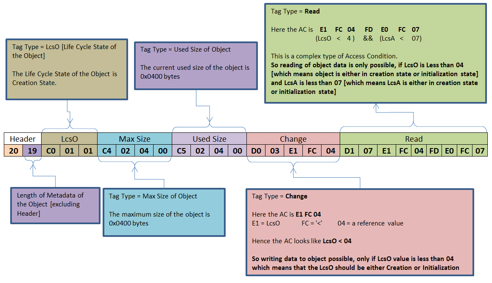 |

Figure 33 - Metadata sample

|                                  |
| -------------------------------- |
| 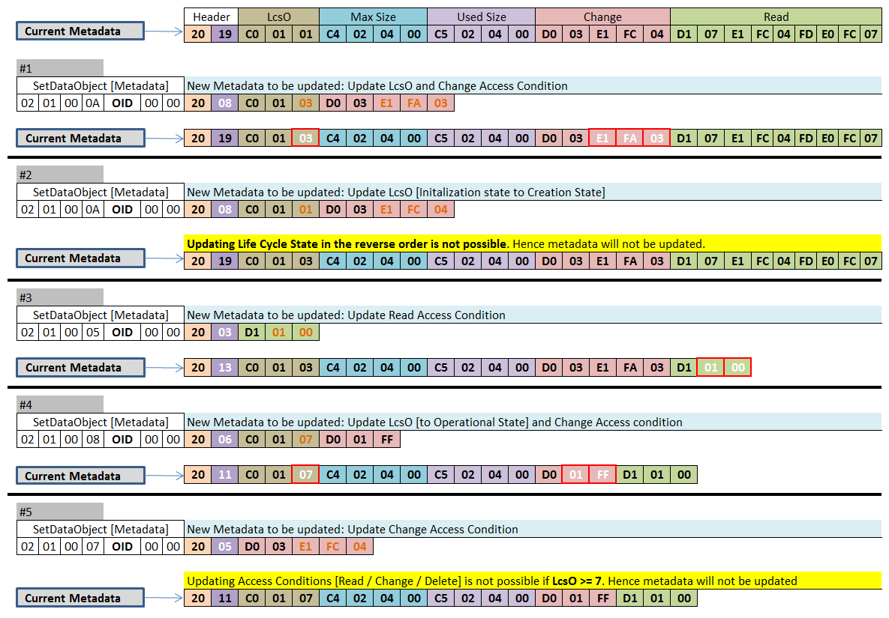 |

Figure 34 - SetDataObject (Metadata) examples

*Note: The values specified in above example figures are in
hex*

## Common data structures

Table
'[Common data structures](#link24b48059_db81_40f5_8b65_7afca4918ab1)'
lists all common data structures defined for the OPTIGA™.

51. > Common data structures

<table>
<thead>
<tr class="header">
<th><strong>Data element</strong></th>
<th><strong>Coding</strong></th>
<th><strong>Length (Bytes)</strong></th>
<th><strong>Description</strong></th>
</tr>
</thead>
<tbody>
<tr class="odd">
<td><a href="#linkd03deed7_76d5_4480_8236_b3cdd1f08e94">Coprocessor UID OPTIGA™ Trust Family</a></td>
<td></td>
<td>27</td>
<td>Unique ID of the OPTIGA™.</td>
</tr>
<tr class="even">
<td>Life Cycle State (refer to Table '<a href="#link05d4c12a_5c94_4a05_a05d_102c53684d3d"><em>Life Cycle Status</em></a>')</td>
<td>BinaryNumber8</td>
<td>1</td>
<td>The LCS is implemented in a way that the four primary states only progress in one direction from a lower value to a higher value (e.g. initialization (in) =&gt; operational (op) state, but not vice versa). The application-specific states, if used at all, are managed by the particular application.</td>
</tr>
<tr class="odd">
<td>Security State (refer to Table '<a href="#link39ce19b0_b776_48c9_a896_bb241accb588"><em>Security Status</em></a>')</td>
<td>BinaryNumber8</td>
<td>1</td>
<td>The device and each application may have a security status associated. The device security status is further referenced to by “Global security status” and the application specific status by “Application-specific security status”.</td>
</tr>
<tr class="even">
<td>Last Error Code (refer to Table '<a href="#linkfdae84dd_f5e6_44d4_8ef9_c72596bb14e2"><em>Error Codes</em></a>')</td>
<td>BinaryNumber8</td>
<td>1</td>
<td>The Last Error Code stores the most recent error code generated since the data object was last cleared. The availability of a Last Error Code is indicated by the (GENERAL) ERROR (refer to Table '<a href="#link353e17d3_7b2c_4c46_b2e6_9bfd63ff799d"><em>Response Status Codes</em></a>'), returned from a failed command execution. The error code is cleared (set to 0x00 = “no error”) after it is read or in case the MSB bit is set in the Cmd field of a Command APDU (ref to Table <em>'<a href="#link545fc126_9458_4808_8513_3a502bdb4c75">Command Codes</a></em>'). The possible error codes are listed in Table '<a href="#linkfdae84dd_f5e6_44d4_8ef9_c72596bb14e2"><em>Error Codes</em></a>'. If multiple commands happen to produce subsequent errors then only the highest-numbered error code is stored.</td>
</tr>
<tr class="odd">
<td>Sleep Mode Activation Delay in ms</td>
<td>BinaryNumber8</td>
<td>1</td>
<td>The Sleep Mode Activation Delay holds the delay time in milliseconds starting from the last communication until the device enters its power saving sleep mode. The allowed values are 20-255 (ms). Its default content is 20.</td>
</tr>
<tr class="even">
<td>Current limitation in mA</td>
<td>BinaryNumber8</td>
<td>1</td>
<td>
The Current limitation holds the maximum value of current allowed to be consumed by the OPTIGA™ across all operating conditions. The allowed values are 6-15 (mA). This register resides in Non-Volatile Memory (NVM) and will be restored upon power up or reset. Its default content is 6mA.

<strong>Note:</strong> <em>15mA will cause best case performance. 9 mA will cause roughly 60% of the best case performance.</em> Even the maximum communication speed might be degraded by Current limitation (How the max. possible communication speed gets indicated to the I2C master, please refer to <a href="#linkdc0f79b5_99c7_4adf_93f5_635fd8a124f4">[IFX_I2C]</a>).
</td>
</tr>
<tr class="odd">
<td>Buffer size in number of bytes</td>
<td>BinaryNumber16</td>
<td>2</td>
<td>
The Maximum Com Buffer Size holds the maximum size of APDUs transferred through the communication buffer.

<em>Note: In case higher data volumes need to be transferred, command chaining must be applied.</em>
</td>
</tr>
<tr class="even">
<td>Security Event Counter (SEC)</td>
<td>0x00 - 0xFF</td>
<td>1</td>
<td>The SEC holds the current value of the Security Event Counter as described in chapter Security Monitor.</td>
</tr>
<tr class="odd">
<td>Public Key Certificate</td>
<td>x.509</td>
<td>1728 (max.)</td>
<td>
The Public Key Certificate data object holds one or multiple of X.509 Certificate (refer to <a href="#link361825e0_14e3_4707_afbb_202d64985d2a">[RFC5280]</a>). The certificate was issued by IFX or a Customer. An external Entity (host, server) utilizes it as device identity to authenticate the OPTIGA™ within the regarded PKI domain (IFX or Customer).

Tags to differentiate the Public Key certificate chain format:

<ul>
<li>
<strong>Single X.509 certificate:</strong> 
Certificate DER coded 
The first byte of the DER encoded certificate is <strong>0x30</strong> and is <strong>used as Tag</strong> to differentiate from other Public Key Certificate formats defined below.
</li>
<li>
<strong>TLS Identity</strong>: 
<strong>Tag</strong> = 0xC0 
<strong>Length</strong> = Value length (2 Bytes) 
<strong>Value</strong> = TLS Certificate Chain[103]
</li>
<li>
<strong>USB Type-C Identity:</strong> 
<strong>Tag</strong> = 0xC2 
<strong>Length</strong> = Value length (2 Bytes) 
<strong>Value</strong> = USB Type-C Certificate Chain<a href="#references">[USB Auth]</a>[104]
</li>
</ul></td>
</tr>
<tr class="even">
<td>Root CA Public Key Certificate aka &quot;Trust Anchor&quot;</td>
<td>x.509 (maybe self-signed certificate)</td>
<td>1200 (max.)</td>
<td>The Root CA Public Key Certificate data object holds the X.509 Public Key Certificate of the IFX or Customer Root or Intermediate Certification Authority. It is used as &quot;Trust Anchor&quot; to authenticate external entities (e.g. verify server signature).</td>
</tr>
<tr class="odd">
<td>Platform Binding Secret</td>
<td>BinaryNumber8</td>
<td>64</td>
<td>The Platform Binding Secret data object holds the shared secret used during the handshake key agreement as part of the OPTIGA™ Shielded Connection protocol. It shall be 64 bytes and LcsO set to operational (op) and access condition set to CHA = NEV and RD = NEV.</td>
</tr>
<tr class="even">
<td>Counter</td>
<td>BinaryNumber64</td>
<td>8</td>
<td>The Counter is a data object consisting of the concatenated counter value (offset 0-3) and the regarded threshold (offset 4-7). The fixed length is 8 Byte. There are two types of monotonic counter the Up-counter and the Down-counter. The Up-counter is only allowed to increase and the Down-counter is only allowed to decrease. The 1 byte value provided gets added or respective subtracted from the counter value (offset 0-3). As soon as the counter reaches or exceeds the threshold, the counter gets set to the threshold value and frozen and returns an error upon attempting to further count.</td>
</tr>
</tbody>
</table>

Table
'[Life Cycle Status](#link05d4c12a_5c94_4a05_a05d_102c53684d3d)' lists
all coding of the Life Cycle Status defined for the OPTIGA™.

52. > Life Cycle Status

| Bit 8-5 | Bit 4-1 | Description                                  |
| ------- | ------- | -------------------------------------------- |
| 0 0 0 0 | 0 0 0 1 | Creation state (abbreviation = cr)           |
| 0 0 0 0 | 0 0 1 1 | Initialization state (abbreviation = in)     |
| 0 0 0 0 | 0 1 1 1 | Operational state (abbreviation = op)        |
| 0 0 0 0 | 1 1 1 1 | Termination state (abbreviation = te)\[105\] |

Table
'[Security Status](#link39ce19b0_b776_48c9_a896_bb241accb588)' shows the
security status defined for the device either global or
application-specific. The default is set after reset for the global and
after [OpenApplication](#openapplication) for the application-specific
[Security Status](#link39ce19b0_b776_48c9_a896_bb241accb588)\[106\]
\[107\].

53. > Security
    > Status

| Bit 8-7 | Bit 6-1      | Description                                                                                                                                                                                                                                                                                                                                                    |
| ------- | ------------ | -------------------------------------------------------------------------------------------------------------------------------------------------------------------------------------------------------------------------------------------------------------------------------------------------------------------------------------------------------------- |
| x x     | \_ x x x x x | The [*Security Status*](#link39ce19b0_b776_48c9_a896_bb241accb588) flag Boot is set=1 by default after reset for both global and application specific. As soon as the boot phase specific permissions should be terminated the boot flag could be reset by writing 0b1101 1111 to the regarded [*Security Status*](#link39ce19b0_b776_48c9_a896_bb241accb588). |

Table '[Coprocessor UID OPTIGA™ Trust
Family](#linkd03deed7_76d5_4480_8236_b3cdd1f08e94)' shows UID definition
for the OPTIGA™.

54. > Coprocessor UID OPTIGA™ Trust
Family

| Offset | Data Type | Name                 | Description                          |
| ------ | --------- | -------------------- | ------------------------------------ |
| 0      | uint8\_t  | bCimIdentifier       | CIM Identifier                       |
| 1      | uint8\_t  | bPlatformIdentifier  | Platform Identifier                  |
| 2      | uint8\_t  | bModelIdentifier     | Model identifier                     |
| 3      | uint16\_t | wROMCode             | ID of ROM mask                       |
| 5      | uint8\_t  | rgbChipType \[6\]    | Chip type                            |
| 11     | uint8\_t  | rgbBatchNumber \[6\] | Batch number                         |
| 17     | uint16\_t | wChipPositionX       | Chip position on wafer: X-coordinate |
| 19     | uint16\_t | wChipPositionY       | Chip position on wafer: Y-coordinate |
| 21     | uint32\_t | dwFirmwareIdentifier | Firmware Identifier                  |
| 25     | uint8\_t  | rgbESWBuild \[2\]    | ESW build number, BCD coded          |

Table
'[Security Monitor
Configurations](#link7f56e886_b92e_4abe_a5ef_e282eb2b24c2)' shows the
possible configurations w.r.t. Security Monitor.

55. > Security Monitor Configurations

<table>
<thead>
<tr class="header">
<th>Offset</th>
<th>Name</th>
<th>Data Type</th>
<th>Notes</th>
</tr>
</thead>
<tbody>
<tr class="odd">
<td>0</td>
<td>tmax configuration</td>
<td>uint8_t</td>
<td>
= Required Tmax in milliseconds / 100.

E.g. if the required tmax is 4 seconds (4000 milliseconds), this will be configured as 40.

Default value = 50.
</td>
</tr>
<tr class="even">
<td>1</td>
<td>RFU[1]</td>
<td>uint8_t</td>
<td>Default is 0x00.</td>
</tr>
<tr class="odd">
<td>2</td>
<td>
SECCREDIT Maximum value

(SECCREDIT_MAX)
</td>
<td>uint8_t</td>
<td>
The maximum value of SECCREDIT that can be achieved.

Default is 5.
</td>
</tr>
<tr class="even">
<td>3</td>
<td>Delayed SEC Decrement Sync count</td>
<td>uint8_t</td>
<td>The SEC is as well maintained in RAM in addition to the NVM (Security Event Counter (SEC)) and the synchronization (writing to data object in NVM) of decrement event (e.g. Tmax elapsed) can be delayed by configuring this value greater than 1. Default is 1.</td>
</tr>
<tr class="odd">
<td>4</td>
<td>RFU[4]</td>
<td>uint8_t</td>
<td>Default is 00 00 00 00.</td>
</tr>
</tbody>
</table>

## Application-specific data structures

Table
'[Data Structure Unique Application
Identifier](#linkf65a36fd_978a_4bff_9c93_a782e1359574)' shows unique
identifier for the OPTIGA™ application which gets used with the
[OpenApplication](#openapplication) command.

56. > Data Structure Unique Application
Identifier

| Data Element | Value                                  | Coding     | Length (in bytes) |
| ------------ | -------------------------------------- | ---------- | ----------------- |
| RID          | 0xD276000004\[108\]                    | HexNumber5 | 5                 |
| PIX          | 'GenAuthAppl' 0x47656E417574684170706C | Ascii11    | 11                |

Table
'[Data Structure Arbitrary data
object](#linkad7de86b_f284_4143_b60c_f98d9ba42353)' lists the supported
types of arbitrary data objects.

57. > Data Structure Arbitrary data
object

| Data Element                 | Value       | Coding               | Length (in bytes) |
| ---------------------------- | ----------- | -------------------- | ----------------- |
| Arbitrary Data object Type 2 | 0x00 - 0xFF | application-specific | 1500              |
| Arbitrary Data object Type 3 | 0x00 - 0xFF | application-specific | 140               |

# Appendix

## Command Coding Examples

  - **GetDataObject**

For Example, The GetDataObject command to read 5 bytes of Coprocessor
UID data object starting from offset 2 is as shown below.

|                                  |
| -------------------------------- |
| 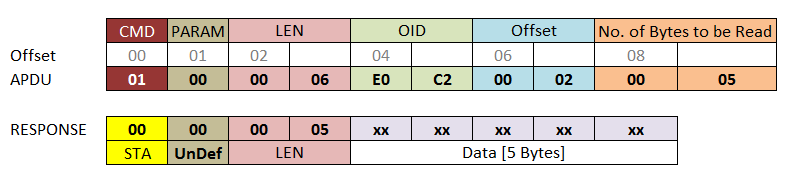 |

Figure 35 - GetDataObject \[Read data\] example

*Note: The values specified in* Figure 35 *are in HEX format.*

  - **SetDataObject**

For Example, The SetDataObject command to write 8 bytes of data to
arbitrary data object 0xF1D0 starting from offset 9 is as shown below.

|                                  |
| -------------------------------- |
| 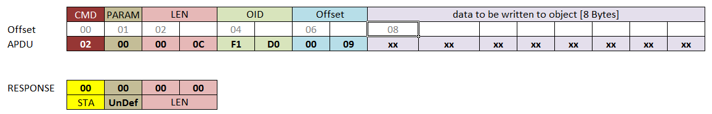 |

Figure 36 - GetDataObject \[Read data\] example

*Note: The values specified in* ***Error\! Reference source not found.**
are in HEX format.*

## Data encoding format examples

This section provides the examples for the encoding format of Asymmetric
key pairs and Signature used across the Enabler APIs.

### ECC Private Key

The examples for format of ECC Private Key exported as part of Generate
Key Pair are given below.

  - Example for ECC NIST P-256 Private Key \[Values are in hex\]

> // DER OCTET String Tag (Private Key)
> 
> 04
> 
> // Length of Tag
> 
> 20
> 
> // Private Key
> 
> 20 DC 58 98 CF 51 31 44 22 EA 01 D4 0B 23 B2 45
> 
> 7C 42 DF 3C FB 0D 33 10 B8 49 B7 AA 0A 85 DE E7

  - Example for ECC NIST P-384 Private Key \[Values are in hex\]

> // DER OCTET String Tag (Private Key)
> 
> 04
> 
> // Length of Tag
> 
> 30
> 
> // Private Key
> 
> 53 94 F7 97 3E A8 68 C5 2B F3 FF 8D 8C EE B4 DB
> 
> 90 A6 83 65 3B 12 48 5D 5F 62 7C 3C E5 AB D8 97
> 
> 8F C9 67 3D 14 A7 1D 92 57 47 93 16 62 49 3C 37

### ECC Public Key

The examples for the format of ECC Public Key (referred by Generate Key
Pair, Verify signature and ECDH operations) are given below.

  - Example for ECC NIST P-256 Public Key \[Values are in hex\]

> // Bit String tag
> 
> 03
> 
> // Length of Bit string tag
> 
> 42
> 
> // Unused bits
> 
> 00
> 
> // Compression format. Supports only 04 \[uncompressed\]
> 
> 04
> 
> // Public Key (e.g. ECC NIST P-256, 0x40 Bytes)
> 
> // Qx - 0x20 Bytes
> 
> 8B 88 9C 1D D6 07 58 2E D6 F8 2C C2 D9 BE D0 FE
> 
> 6D F3 24 5E 94 7D 54 CD 20 DC 58 98 CF 51 31 44
> 
> // Qy - 0x20 Bytes
> 
> 22 EA 01 D4 0B 23 B2 45 7C 42 DF 3C FB 0D 33 10
> 
> B8 49 B7 AA 0A 85 DE E7 6A F1 AC 31 31 1E 8C 4B

  - Example for ECC NIST P-384 Public Key \[Values are in hex\]

> // Bit String tag
> 
> 03
> 
> // Length of Bit string tag
> 
> 62
> 
> // Unused bits
> 
> 00
> 
> // Compression format. Supports only 04 \[uncompressed\]
> 
> 04
> 
> // Public Key (e.g. ECC NIST P-384, 0x60 Bytes)
> 
> // Qx - 0x30 Bytes

1F 94 EB 6F 43 9A 38 06 F8 05 4D D7 91 24 84 7D

13 8D 14 D4 F5 2B AC 93 B0 42 F2 EE 3C DB 7D C9

E0 99 25 C2 A5 FE E7 0D 4C E0 8C 61 E3 B1 91 60

> // Qy - 0x30 Bytes

1C 4F D1 11 F6 E3 33 03 06 94 21 DE B3 1E 87 31

26 BE 35 EE B4 36 FE 20 34 85 6A 3E D1 E8 97 F2

6C 84 6E E3 23 3C D1 62 40 98 9A 79 90 C1 9D 8C

### ECDSA Signature

The examples for format of ECDSA Signature (referred by Signature
generation and verification operations) are given below.

  - Example for signature in case of ECC NIST P-256 key \[Values are in
    hex\]

> // Integer tag for R component
> 
> 02
> 
> // Length
> 
> 20
> 
> // R Component
> 
> 2B 82 6F 5D 44 E2 D0 B6 DE 53 1A D9 6B 51 E8 F0
> 
> C5 6F DF EA D3 C2 36 89 2E 4D 84 EA CF C3 B7 5C
> 
> // Integer tag for S component
> 
> 02
> 
> // Length
> 
> 21
> 
> // S Component
> 
> 00
> 
> A2 24 8B 62 C0 3D B3 5A 7C D6 3E 8A 12 0A 35 21
> 
> A8 9D 3D 2F 61 FF 99 03 5A 21 48 AE 32 E3 A2 48

  - Example for signature in case of ECC NIST P-384 key \[Values are in
    hex\]

> //Integer tag for R component
> 
> 02
> 
> // Length
> 
> 31
> 
> //R Component
> 
> 00
> 
> C3 6E 5F 0D 3D E7 14 11 E6 E5 19 F6 3E 0F 56 CF
> 
> F4 32 33 0A 04 FE FE F2 99 3F DB 56 34 3E 49 F2
> 
> F7 DB 5F CA B7 72 8A CC 1E 33 D4 69 25 53 C0 2E
> 
> //Integer tag for S component
> 
> 02
> 
> // Length
> 
> 30
> 
> //S Component
> 
> 0D 40 64 39 9D 58 CD 77 1A B9 42 0D 43 87 57 F5
> 
> 93 6C 38 08 E9 70 81 E4 57 BC 86 2A 0C 90 52 95
> 
> DC A6 0E E9 4F 45 37 59 1C 6C 7D 21 74 53 90 9B

Notes:

  - The size of R and S components is based on the key size chosen.
    (e.g. in case of ECC NIST P256, size is 32 bytes and for ECC NIST
    P384, size is 48 bytes)

  - If the first byte of R or S component is greater than 0x7F (negative
    integer), then the respective component gets prepended with 0x00.

  - The caller must consider the length of buffer for signature
    accordingly considering the additional encoding information.

### RSA Private Key

The examples for the format of RSA Private key (Private Exponent)
exported as part of optiga\_crypt\_rsa\_generate\_keypair (export
private key = True) are given below.

For RSA 1024, the length of the Private exponent is 128 bytes.

For RSA 2048, the length of the Private exponent is 256 bytes.

  - Example for RSA 1024 exponential - Private Key (Private Exponent)
    \[Values are in hex\]

> // DER OCTET String Tag (Private Exponent)
> 
> 04
> 
> // Length of Tag
> 
> 81 80
> 
> // Private Exponent (0x80 Bytes)
> 
> 53 33 9C FD B7 9F C8 46 6A 65 5C 73 16 AC A8 5C
> 
> 55 FD 8F 6D D8 98 FD AF 11 95 17 EF 4F 52 E8 FD
> 
> 8E 25 8D F9 3F EE 18 0F A0 E4 AB 29 69 3C D8 3B
> 
> 15 2A 55 3D 4A C4 D1 81 2B 8B 9F A5 AF 0E 7F 55
> 
> FE 73 04 DF 41 57 09 26 F3 31 1F 15 C4 D6 5A 73
> 
> 2C 48 31 16 EE 3D 3D 2D 0A F3 54 9A D9 BF 7C BF
> 
> B7 8A D8 84 F8 4D 5B EB 04 72 4D C7 36 9B 31 DE
> 
> F3 7D 0C F5 39 E9 CF CD D3 DE 65 37 29 EA D5 D1

  - Example for RSA 2048 exponential - Private key (Private Exponent)
    \[Values are in hex\]

> // DER OCTET String Tag (Private Exponent)
> 
> 04
> 
> // Length of Tag
> 
> 82 01 00
> 
> // Private Exponent (0x100 Bytes)
> 
> 21 95 08 51 CD F2 53 20 31 8B 30 5A FA 0F 37 1F
> 
> 07 AE 5A 44 B3 14 EB D7 29 F5 DC B1 5D A7 FA 39
> 
> 47 AC DD 91 5D AE D5 74 BD 16 DF 88 BF 85 F6 10
> 
> 60 B3 87 17 2F AE 6E 01 26 2B 38 64 C2 D3 C2 2F
> 
> 94 E0 4A 81 59 42 2B 4E D2 79 C4 8A 4C 9D 76 7D
> 
> 49 66 07 1A 5B BF 5D 04 3E 16 FF 46 EC 1B A0 71
> 
> 6F 00 BB C9 7B FF 5D 56 93 E2 14 E9 9C 97 21 F1
> 
> 2B 3E C6 28 2A E2 A4 85 72 1B 96 DD CF 74 03 FA
> 
> 03 7D 0C 57 AB 46 3C 44 8D E5 CC 12 26 5A DD 88
> 
> 6D 31 1E A8 D8 A5 90 3F A5 6C 5F 1C 9C F2 EB 11
> 
> CB 65 7A 1A 7D 3E 41 35 2D C3 E6 86 89 8C 4C E4
> 
> 30 5E 8B 63 8E 1B 08 A2 A8 6C C9 EB 98 66 F3 49
> 
> 9A C7 7B 61 36 B8 1C B2 76 D6 14 CF EB 7B 6E D3
> 
> F3 BC 77 5E 46 C0 00 66 EB EE E2 CF F7 16 6B 57
> 
> 52 05 98 94 7F F6 21 03 20 B2 88 FB 4F 2C 3F 8F
> 
> E9 7B 27 94 14 EB F7 20 30 00 A1 9F C0 42 48 75

### RSA Public Key

The examples for the format of RSA Public Key (referred by generate key
pair, verify signature and asymmetric encryption operations) are given
below.

  - Example for RSA 1024 exponential public key (modulus and public
    exponent) \[Values are in hex\]

> // Bit string tag
> 
> 03
> 
> // Bit String tag Length
> 
> 81 8E
> 
> // Unused Bits
> 
> 00
> 
> // SEQUENCE
> 
> 30
> 
> // Length
> 
> 81 8A
> 
> // Integer tag (Modulus)
> 
> 02
> 
> // Length of Modulus
> 
> 81 81
> 
> // Modulus
> 
> 00
> 
> A1 D4 6F BA 23 18 F8 DC EF 16 C2 80 94 8B 1C F2
> 
> 79 66 B9 B4 72 25 ED 29 89 F8 D7 4B 45 BD 36 04
> 
> 9C 0A AB 5A D0 FF 00 35 53 BA 84 3C 8E 12 78 2F
> 
> C5 87 3B B8 9A 3D C8 4B 88 3D 25 66 6C D2 2B F3
> 
> AC D5 B6 75 96 9F 8B EB FB CA C9 3F DD 92 7C 74
> 
> 42 B1 78 B1 0D 1D FF 93 98 E5 23 16 AA E0 AF 74
> 
> E5 94 65 0B DC 3C 67 02 41 D4 18 68 45 93 CD A1
> 
> A7 B9 DC 4F 20 D2 FD C6 F6 63 44 07 40 03 E2 11
> 
> // Integer tag for Public Exponent
> 
> 02
> 
> // Length of Public Exponent
> 
> 04
> 
> // Public Exponent
> 
> 00 01 00 01

Notes:

  - The size of Modulus component is based on the key size chosen. (e.g.
    in case of RSA 1024, size is 128 bytes and for RSA 2048, size is 256
    bytes)

  - If the first byte of Modulus is greater than 0x7F (negative
    integer), then 0x00 gets prepended while coding as it is in Integer
    format.

### RSA Signature

The example for format of RSA Signature (referred by RSA Signature
generation and verification operations) is given below.

There is no additional encoding (format) considered for RSA signature.
The length of the signature is based on the key length chosen.

For RSA 1024, the length of the signature is 128 bytes.

For RSA 2048, the length of the signature is 256 bytes.

  - Example for RSA signature in case of RSA 1024-Exp key \[Values are
    in hex\]

> 5B DE 46 E4 35 48 F4 81 45 7C 72 31 54 55 E8 9F
> 
> 1D D0 5D 9D EC 40 E6 6B 89 F3 BC 52 68 B1 D8 70
> 
> 35 05 FC 98 F6 36 99 24 53 F0 17 B8 9B D4 A0 5F
> 
> 12 04 8A A1 A7 96 E6 33 CA 48 84 D9 00 E4 A3 8E
> 
> 2F 6F 3F 6D E0 1D F8 EA E0 95 BA 63 15 ED 7B 6A
> 
> B6 6E 20 17 B5 64 DE 49 64 97 CA 5E 4D 84 63 A0
> 
> F1 00 6C EE 70 89 D5 6E C5 05 31 0D AA B7 BA A0
> 
> AA BF 98 E8 39 93 70 07 2D FF 42 F9 A4 6F 1B 00

## Limitations

### Memory Constraints

  - Maximum command InData length is 1553. Any attempt to exceed these
    limit will lead to "[Invalid length
    field](#linkc51ea4bd_e916_4526_aba3_bb34212a6b7b)" error.

  - Maximum response OutData length is 1553. Any attempt to exceed these
    limit will lead to "[Insufficient buffer/
    memory](#link4a67e945_e91a_453e_b82f_83dc1b40b40f)" error.

## Certificate Parser Details

### Parameter Validation

Following are the basic parameter checks performed while parsing the
certificate,

  - X.509 DER coding and length checks

  - Must be v3 only

  - Serial number

  - > The length must be 1 to 20 byes

  - Public Key

  - > Only uncompressed Format is supported

  - > ECC Curves supported

  - > ECC NIST P 256/384/521

  - > ECC Brainpool P256r1/ P384r1 / P512r1

> *Note: OPTIGA™ Trust M V1 doesn’t support ECC Brainpool and ECC NIST P
> 521.*

  - > RSA 1024/2048 Exponential

  - > The public key must be aligned to the key length. In case the
    > public key size is less than the respective key size, then the
    > respective component must be prepended with zeroes before
    > generating the certificate.

  - The signature algorithm identifier must not contain the parameters
    (not even as NULL) in case of ECDSA. (section 2.2.3 in
    [\[RFC3279\]](#link045729d1_1020_42ee_b7c6_65b41dd13c21))

> AlgorithmIdentifier ::= SEQUENCE {
> 
> algorithm OBJECT IDENTIFIER,
> 
> parameters ANY DEFINED BY algorithm OPTIONAL }

  - Issuer DN must not be Empty.

  - Basic Constraints

  - > CA - Flag to indicate CA certificate (TRUE/asserted for CA)

  - > Path Length Constraint

  - > Exists only for CA certificate (if CA flag is TRUE)

  - The signature algorithm identifier in tbscertificate and signature
    tags must be same.

[\[RFC5280\]](#link361825e0_14e3_4707_afbb_202d64985d2a) specifies a
number of fields (specified as MUST/SHOULD etc.). All of these will not
be validated for correct formation and correctness of data. The fields
verified for correctness are explicitly mentioned above.

## Security Guidance

The security guidance provides useful information how to use and
configure the customer solution in a reasonable manner.

### Use Case: Mutual Authentication -toolbox-

Server trust anchor which is stored in a data object can be modified by
an attacker. Doing that the attacker can mimic the legitimate server and
misuse the services provided or consumed by the nodes.

  - After installing the trust anchor, the regarded **data object access
    conditions CHA** shall be configured with **never allowed** (NEV)
    and the **lifecycle state** of the data object (LcsO) shall be **set
    to operational** (op) to prevent changes to the access conditions.

### Use Case: Host Firmware Update -toolbox-

The shared secret size shall be at least 32 bytes to render a brute
force useless.

Firmware update Shared secret, which is stored in one of data objects
could be modified and read out by an attacker. By reading the global
shared secret, the attacker can create faulty image containing malicious
code which could be multicast installed to all nodes of the same type.
By writing the global shared secret, the attacker can create faulty
image containing malicious code which could be installed on the modified
node.

  - After setting the shared secret, the respective **data object access
    conditions RD and CHA** shall be configured with **never allowed**
    (NEV) and the **lifecycle state** of the data object (LcsO) shall be
    **set to operational** (op) to prevent changes to the access
    conditions.

Platform integrity trust anchor which is stored in a data object can be
modified by an attacker. By doing that the attacker can create new
metadata which will be accepted by the modified node. This might be used
to undermine the rollback prevention of the solution and could lead to
installing known security flaws.

After installing the trust anchor, the respective **data object access
conditions CHA** shall be configured with **never allowed** (NEV) and
the **lifecycle state** of the data object (LcsO) shall be **set to
operational** (op) to prevent changes to the access conditions.

[\[RFC4108\]](#link302cbc10_ad82_4da1_b546_9a793671a2f5) Security
considerations (chapter 6) shall be reviewed and taken as a guideline
with regards to:

  - Private signature key protection

  - Firmware decryption key protection

  - Cryptographic algorithms become weaker with time

  - Randomly generated keys

  - Stale firmware version number

### Key usage associated to toolbox functionality

Key usage which is stored in a key object metadata can be modified by an
attacker. Doing that the attacker can misuse the key in not intended
schemes, which could enable crypto analysis or brute force attacks.

  - The respective **key object usage** shall be configured with the
    **least usage profile** (in most cases just one) as required by the
    target host application

  - The shielded connection shall be enforced in the respective key
    object EXE access condition to enable the restricted usage (only
    with the respective host).

  - After setting the key usage, the **lifecycle state** of the key
    object (LcsO) shall be **set to operational** (op) to prevent
    changes to the key usage.

### Key pair generation associated to toolbox functionality

The generated key pair and the associated public key certificate are
stored in key object and public key certificate data object. The
attacker attempts to re-generate the key pair. Doing that the attacker
is dropping the identity which was associated to that key pair and could
be considered as DoS attack.

Note: A similar result could be achieved in case only the certificate
data object gets corrupted.

  - After installing the identity, the respective **key object and
    public key certificate access conditions CHA** shall be configured
    with **never allowed** (NEV) or allow just protected update with
    **integrity and confidentiality protection** and the **lifecycle
    state** of the key and data object (LcsO) shall be **set to
    operational** (op) to prevent changes to the access conditions.

### Static key generation associated to toolbox functionality

The generated static keys are stored in key objects. The attacker
attempts to re-generate a key. Doing that the attacker is dropping the
static key for encryption / decryption and could be considered as DoS
attack.

  - After generating the key, the regarded **key object access
    conditions CHA** shall be configured with **never allowed** (NEV) or
    allow just protected update with **integrity and confidentiality
    protection** and the **lifecycle state** of the key object (LcsO)
    shall be **set to operational** (op) to prevent changes to the
    access
conditions.

### Shared secret for key derivation or MAC generation associated to toolbox and protected update functionalities

  - A shared secret (could be pre-shared secret or Authorization
    reference which gets fed in a key derivation or MAC generation
    and/or verification (e.g. hmac with sha256) operations, either from
    the session context or from a data object shall be at least of a
    size of 16 bytes.

  - Restrict the maximum usage of the secret using the monotonic
    counters to 2048 times is recommended

  - EXE access condition tied with Platform Binding shared secret (CONF
    E140), enforces the shielded connection for the usage of pre-shared
    secret in OPTIGA™ during the respective critical operations (e.g.
    key derivation or MAC generation) which doesn’t allow the usage with
    unknown Hosts.

  - If the shared secret gets updated on field either by protected
    update (integrity and confidentiality) or shielded connection, the
    regarded usage counter must be updated accordingly to allow the
    usage of shared secret further for the required number of times.

### Auto states

  - The AUTO state achieved using the respective pre-shared secret
    (Authorization reference) data object need to be cleared manually as
    when the respective use case sequence is complete. This can be done
    using
    [optiga\_crypt\_clear\_auto\_state](#hmac-key-derivation-based-operations).

### Shielded Connection

  - The security level of the Shielded connection is as high as typical
    microcontroller/Host side hardware security level.

  - The recommended length of Platform binding shared secret is 32 bytes
    or more.

  - Updating the Platform Binding shared secret during run-time using
    the shielded connection is recommended as shown in Figure 14 - Use
    Case: Update Platform Binding Secret during runtime (Pre-Shared
    Secret based).

> \- Update the Platform Binding secret and followed by re-establishing
> the shielded connection, can also be used by host to validate (to
> ensure freshness in shielded connection session) when required. But
> this procedure would lead to NVM write operations (e.g. writing to
> platform binding secret data object, security events due to the usage
> of shared secrets in performing the shielded connection). Hence the
> endurance of the data object and overall endurance as specified in
> Overview Data and Key Store must be considered accordingly.  
> \- Enable the monotonic counter and reduce the max number of usages to
> XYZ using monotonic counter and update the secret on chip
> periodically.  
> \- To enforce this, the write access conditions for the Platform
> binding data object must be set accordingly.

  - Secure binding (using the Platform binding shared secret) and usage
    restriction using the Monotonic counters enables additional usage
    restriction for the critical asset (e.g. RSA keys, AES keys and
    shared secrets) if assets are not intended to use extremely.

  - It is recommended to use the shielded connection for
    [EncryptAsym](#encryptasym) (which uses a session context)
    command-based operations, which enforces the usage of session
    context.

  - Host can validate OPTIGA™ using the sequence specified in section
    6.6.3 Host authenticates OPTIGA™ to ensure the freshness.

### Algorithm usage

  - The recommendation is to use RSA 2048 against RSA 1024.

## Shielded Connection V1 Guidance

The OPTIGA™ Shielded Connection enables a protected (Integrity and
Confidentiality) communication between the OPTIGA™ and a corresponding
Host platform as depicted in figure below.

|  |
|  |
|  |

Figure 37 - Overview OPTIGA™ Shielded Connection

This section provides information regarding the set up and usage of
Shielded Connection in the target device application.

The OPTIGA™ supports the Shielded Connection using a pre-shared secret
(Platform Binding Secret) between the OPTIGA™ and a corresponding host
platform. [\[IFX\_I2C\]](#linkdc0f79b5_99c7_4adf_93f5_635fd8a124f4)
explains internal details of establishing the shielded connection; e.g.,
negotiation and crypto algorithms used for the protection in the section
Presentation Layer.

6.  The Shielded connection doesn’t provide an option to add random
    challenge/nonce from host to ensure the freshness of established
    shielded connection. This can be achieved with few more additional
    steps as described in Host authenticates OPTIGA™.

### Setup

Preconditions to establish the Shielded Connection is to pair the
OPTIGA™ with a host. The pre-shared secret is established during first
boot/initialization sequence. The [Use Case: Pair OPTIGA™ with Host
(Pre-Shared Secret
based)](#use-case-pair-optiga-with-host-pre-shared-secret-based) depicts
the pairing process.

The pal\_os\_datastore\_read and pal\_os\_datastore\_write are the
abstracted APIs for reading and writing the platform binding secret at
host platform. These APIs are to be adapted to the particular host
platform needs.

During the Shielded Connection establishment, the
optiga\_comms\_ifx\_i2c module invokes
[pal\_os\_datastore\_read](#linke6c0a28e_865d_460b_ac81_1a8cb6188822)
function.

### Usage

In the OPTIGA™ Host Library, the Shielded Connection feature can be
enabled/disabled using the macro (OPTIGA\_COMMS\_SHIELDED\_CONNECTION in
optiga\_lib\_config.h) with the required default protection level
(OPTIGA\_COMMS\_DEFAULT\_PROTECTION\_LEVEL in optiga\_lib\_config.h).

For the protected communication (Shielded Connection) between a host and
the OPTIGA™, an instance of [optiga\_util](#optiga_util) or
[optiga\_crypt](#optiga_crypt) needs to be updated with the required
protection level before invoking the operations provided by
[optiga\_util](#optiga_util) or [optiga\_crypt](#optiga_crypt) using
OPTIGA\_UTIL\_SET\_COMMS\_PROTECTION\_LEVEL and
OPTIGA\_CRYPT\_SET\_COMMS\_PROTECTION\_LEVEL respectively.

For example, to enable a full: i.e. command and response, protection for
deriving the decryption keys in FW update use case using the pre-shared
secret from OPTIGA™

  - Invoke OPTIGA\_CRYPT\_SET\_COMMS\_PROTECTION\_LEVEL (me\_crypt,
    OPTIGA\_COMMS\_FULL\_PROTECTION)

  - Invoke
    [optiga\_crypt\_tls\_prf\_sha256](#hmac-key-derivation-based-operations)
    (me\_crypt, shard\_secret\_oid, …)

In case of re-establishing the Shielded Connection periodically, the
protection\_level |OPTIGA\_COMMS\_RE\_ESTABLISH can be set to the
instance using above specified. The access layer will take care of
rescheduling the shielded connection internally.

For example, to enable re-establishing the shielded connection with
response protection for the data object read data operation

  - Invoke OPTIGA\_UTIL\_SET\_COMMS\_PROTECTION\_LEVEL (me\_util,
    OPTIGA\_COMMS\_RESPONSE\_PROTECTION | OPTIGA\_COMMS\_RE\_ESTABLISH)

  - Invoke [optiga\_util\_read\_data](#read-and-write-operations)
    (me\_util, oid, …)

Based on the above settings, the access layer activates the Shielded
Connection between a host and the OPTIGA™. These settings reset
automatically to the default protection level; i.e.
OPTIGA\_COMMS\_DEFAULT\_PROTECTION\_LEVEL once after the operation is
invoked.

The [Use Case: Update Platform Binding Secret during runtime (Pre-Shared
Secret
based)](#use-case-update-platform-binding-secret-during-runtime-pre-shared-secret-based)
depicts a process of updating the platform binding secret periodically
using the shielded connection at runtime.

### Host authenticates OPTIGA™

After shielded connection established, if host intends to
validate/authenticate OPTIGA™ (random challenge driven by Host) or to
ensure the freshness in the established shielded connection, one of the
below specified mechanisms can be performed by local\_host\_application.
This must be performed once (at least), after the shielded connection is
established and/or whenever required.

#### Write and read nonce to/from a data object

The local\_host\_application writes generated nonce to OPTIGA™ and reads
the same data object to authenticate OPTIGA™ and to ensure the freshness
(at host side) in shielded connection.

7.  The write operation shown below leads to writing to NVM at OPTIGA™.
    Hence the endurance of the data object and overall endurance as
    specified in Overview Data and Key Store must be considered
    accordingly.

**Pre-condition:**

  - The OPTIGA™ application is already launched and the shielded
    connection between host and OPTIGA™ is established

  - The optiga\_util APIs shown in below diagram must be invoked with
    command and response protection using shielded connection.

**Post-condition:**

  - The local\_host\_application considers the OPTIGA™ as an authentic
    member of the target platform.

|                                  |
| -------------------------------- |
|  |

Figure 38 - Write and read nonce to/from a data object

#### Derive keys using nonce during run time 

The local\_host\_application establishes session with intermediate
secrets at OPTIGA™ using respective operations. And host further uses
this intermediate secret in session to ensure the freshness (at host
side) in shielded connection.

8.  With this way, there are no additional NVM writes during the
    respective operations.

**Pre-condition:**

  - The OPTIGA™ application is already launched and the shielded
    connection between host and OPTIGA™ is established.

  - The optiga\_crypt APIs shown in the below diagram must be invoked
    with command and response protection using shielded connection.

**Post-condition:**

  - The local\_host\_application considers the OPTIGA™ as an authentic
    member of the target platform.

|                                  |
| -------------------------------- |
|  |

Figure 39 - Derive keys using nonce during run time

#### Derive keys using nonce and a static (additional) pre-shared secret

The local\_host\_application uses additional pre-shared secret (stored
at both sides in NVM) which is already exchanged by
local\_host\_application and OPTIGA™. The local\_host\_application
generates a secret nonce and followed by key derivation using respective
operations and uses the same to authenticate OPTIGA™ and to ensure the
freshness (at host side) in shielded connection.

9.  The key derivation using static shared secret (from a data object)
    leads to a security event at OPTIGA™, which leads to NVM write
    operations (if SECCREDIT = 0) at OPTIGA™. Hence the
    endurance of the SEC data object and overall endurance as specified
    in section Overview Data and Key Store must be considered
    accordingly.

**Pre-condition:**

  - The local\_host\_application and OPTIGA™ holds an additional static
    pre-shared secret and the access conditions (e.g. read disabled) of
    pre-shared secret at OPTIGA™ are set accordingly.

  - The OPTIGA™ application is already launched and the shielded
    connection between host and OPTIGA™ is established.

  - The optiga\_crypt APIs shown in the below diagram must be invoked
    with command and response protection using shielded connection.

**Post-condition:**

  - The local\_host\_application considers the OPTIGA™ as an authentic
    member of the target platform.

|                                  |
| -------------------------------- |
|  |

Figure 40 - Derive keys using nonce and a static (additional) pre-shared
secret

## Protected Update

This section provides the definition and some useful information of
update data sets for data and key objects which are used to update those
in a secure/protected way.

The figure below shows the high level structure of the update data set
for data or key objects. It consists of a manifest and the connected
binary data.

|                                  |
| -------------------------------- |
|  |

Figure 41 – Protected update – high level structure

The coding of the structure is according to
[\[CBOR\]](#link217b5bb9_8b11_483e_a23e_d03293824a03). The
[\[CDDL\]](#link0d63c956_1933_4628_8023_8ddf79ce4e0d) format for the
manifest and signature structures are provided in the package.

The **Manifest** is a top level construct that ties all other structures
together and is signed by an authorized entity whose identity is
represented by a trust anchor installed at the OPTIGA™. The trust anchor
is addressed by its unique ID (OID), which is contained in the metadata
of the manifest. Manifest consists of the metadata in plain text, the
payload binding and the signature over metadata and payload binding.

The **Metadata** provide information enabling interpretation and manage
the update data set by the OPTIGA™. It contains:

  - Version number

  - Unique identifier (OID) of the trust anchor to be used for verifying
    the metadata signature.

  - Unique identifier (OID) of the object to be updated

  - Cipher suite specifying all cryptographic algorithms (signature,
    encryption, hash, key derivation, ...) used during executing the
    update.

  - In case of encrypted object data, OID of the shared secret to be
    used for derivation of the decryption key.

  - In case of encrypted object data, Additional data used in key
    derivation

  - Offset within the target object and length of the object data.

The **Integrity Protection** of the object data is based on the hash
value of the first block of object data which is protected by the
successful verification of the signature over the metadata. Each block
of object data, except the last block, carries the hash value of the
next block of object data.

The **Confidentiality Protection** is based on a shared secret installed
at OPTIGA™, and additional data used to derive the object data
decryption key. The session key gets applied as soon as the integrity of
the current block of the object data is successfully verified.

10. OPTIGA™ Trust M V1 doesn’t support confidentiality protection and
    update of keys & metadata.

### Payload Confidentiality

As part of protected update, the confidentiality is optional which can
be enabled or disabled based on necessity of payload confidentiality
requirement. The confidentiality is achieved using the pre-shared secret
(protected update secret). The payload encryption key is derived for the
respective protected update data set using the “protected update
secret”.

Note: The reference details required for the key derivation and
encryption algorithm details are specified in the manifest.

**Key Derivation**

The below figure depicts the derivation of encryption key.

|  |
|  |
|  |

Figure 42 – Protected Update - Derivation for Payload Encryption Key

The key derivation uses the “protected update secret” as input secret
and derives the payload encryption key and nonce. The size of the
derived encryption key and secret nonce is based on the encryption
algorithm chosen.

**Encryption & Decryption**

The below figure depicts the components (input and output) involved as
part of encryption

|  |
|  |
|  |

Figure 43 – Protected Update - Payload Encryption

The below figure depicts the components (input and output) involved as
part of decryption

|  |
|  |
|  |

Figure 44 – Protected Update - Payload Decryption

  - The fragment number is represented in two bytes in octet string
    format (e.g. 0x02 is represented as “0x00 0x02”). This is used as
    part of nonce which gets concatenated with the secret nonce derived
    using key derivation algorithm.

  - AES-CCM-16-64-128 from \[COSE\], the nonce length to be used is 13
    bytes. Hence, we derive 11 bytes secret nonce and concatenate with 2
    bytes of fragment number.

  - The size of the MAC is based on the encryption algorithm.

  - The format of association data is as shown below.
    
    Associated data = (Payload Version \[2\] ||
    
    Offset of payload in fragment \[3\] ||
    
    Total payload length \[3\])

> The above data is represented in octet string with the respective
> specified lengths. E.g. the total payload length of 0x0568 bytes are
> represented as “0x00 0x05 0x68”.
> 
> Here the offset of payload is based on the size of the payload
> considered in the respective fragment. For example, if the total
> payload to be encrypted is 1500 bytes and encryption is based on
> AES-CCM-16-64-128 and fragment digest algorithm is SHA256 then the
> offset values are 0, 600, 1200 in the fragments 1, 2 and 3
> respectively as the size of payload in each fragment is about 600
> bytes.

The size of the payload (in the respective fragment) to be encrypted
based on the encryption (which defines the size of MAC) and digest
algorithms chosen.

### Format of keys in Payload

As part of protected update data set, the keys (e.g. ECC, RSA, AES,
etc.) are provided in specific format as part of payload based on the
key type as given below.

|  |
|  |
|  |

Figure 45 – Protected Update – Encoding of keys in Payload

Here Length = 0x120, this will be represented as “01 20”.

#### ECC

  - The private key and public key are provided as part of payload with
    the respective tag.
    
      - If the target OPTIGA™ doesn’t store the public key, then the
        public key is optional. If provided, the target OPTIGA™ ignores
        the provided public key.
    
      - If the target OPTIGA™ stores the public key, then the public key
        is must.

  - As part of the payload, the length of the key is based on curve type
    specified in the manifest. For example, in case of ECC NIST P 256,
    the private key size must be 32 bytes and public key size must be 64
    bytes (public key).
    
      - If the private key or components of public key (x or y) are less
        than key length of the respective curve type, then the
        respective component must be prepended with 0x00’s to make it
        aligned with respective key length.

  - The encoding format of keys in the payload is given below. The tags
    could be in any order in the payload.

The value for private key tag is 0x01.

The value for the public key tag is 0x02.

E.g. The ECC NIST P 256 keys are as given below \[value shown below are
in hex format\].

> \<01\> \< *00 20\>* \<*29 2E FD 39 …. 4C 74 BC C8*\>
> 
> \<02\> \< *00 40\>* \<*91 8A 12 34 …. 8A 98 1A 52 ||* 1A *1B 1C 1D ….
> 2A 2B 2C 2D*\>
> 
> E.g. The ECC NIST P 256 keys are as given below with padding if the
> respective component size less than key size \[value shown below are
> in hex format\].
> 
> \<01\> \< *00 20\>* \<*00 00 FD 39 …. 4C 74 BC C8*\>
> 
> \<02\> \< *00 40\>* \<*00 8A 12 34 …. 8A 98 1A 52 ||* 1A *1B 1C 1D ….
> 2A 2B 2C 2D*\>

#### RSA

  - In case of RSA, the private exponent, modulus and public exponent
    must be provided as part of payload with the respective tag.

  - The length of the private exponent and modulus must be strictly
    aligned to the respective key type/algorithm specified in the
    manifest and the public exponent is always 4 bytes.
    
      - If any of these components is of lesser size, then the component
        must be prepended with 0x00’s to align it with the respective
        length.

  - The tag value for the components as specified below. The tags could
    be in any order in the payload.

The tag value for private exponent is 0x01.

The tag value for the modulus is 0x02.

The tag value for the public exponent is 0x03.

E.g. RSA 1024 keys are as given below \[value shown below are in hex
format\].

> Private exponent: \<01\> \<*00 80\>* \<data = 1A 2F 3D 37 …. 5A 4B E5
> F0\>
> 
> Modulus: \<02\> \<*00 80\>* \<data = 29 2E FD 39 …. 4C 74 BC C8\>
> 
> Public exponent: \<03\> \<*00 04\>* \<data = 00 10 00 01 \>

#### AES

  - Only the symmetric key is provided as part of payload.

  - The length of the symmetric key must be strictly aligned to the
    respective key type/algorithm specified in the manifest.

  - The tag value for the components as specified below.

The tag value for symmetric key is 0x01.

E.g., the AES 128 key is as specified below \[value shown below are in
hex format\].

> Symmetric Key: \<01\> \<*00 10\>* \<data = 79 28 49 62 …. 12 58 37
> 61\>

### Metadata update

  - The payload contains the metadata to be updated in target OPTIGA™
    OID metadata.

The following metadata tags must not be part of payload.

  - Version \[0xC1\]

  - Maximum size of the data object \[0xC4\]

  - Used size of the data object \[0xC5\]

  - Algorithm associated with key container \[0xE0\]

<!-- end list -->

  - The format of metadata in the payload is as same as in GetDataObject
    command.

0x20, 0x0B, // TL metadata TLV-Object  
0xC0, 0x01, 0x03, // TLV LcsO = in  
0xD1, 0x01, 0x00, // TLV Read = ALW  
0xD0, 0x03, 0xE1, 0xFC, 0x07 // TLV Change = LcsO \< op

  - At OPTIGA™,
    
      - The reset type (F0) tag must be available in metadata of the
        Target OPTIGA™ OID to be updated and the metadata update
        descriptor are verified whether to allow the protected update or
        not.
    
      - If the new metadata (in payload) contains the LcsO tag, then the
        LcsO in the target OPTIGA™ OID metadata gets with this value and
        the LcsO value specified in the metadata update Identifier is
        ignored.
    
      - If the new metadata (in payload) does not contain the LcsO tag,
        then the LcsO in the target OPTIGA™ OID current metadata gets
        updated with the value specified in the metadata update
        Identifier of the current metadata.
    
      - The payload version specified in the manifest gets updated in
        the target OPTIGA™ OID metadata.
    
      - The tags which are specified in the new metadata (in payload),
        gets replaced in the target OPTIGA™ OID metadata and the
        remaining tags in target OPTIGA™ OID metadata still remain
        unchanged.
    
      - If the new metadata (in payload) does not contain any tags (e.g.
        0x20 0x00), then the rules as per the metadata update identifier
        in the current metadata are applied.
    
      - The protected metadata update allows setting the LcsO of
        respective data/key object to Termination state. Once the
        data/key object is set to Termination state, the target OID is
        not allowed to be used in any read / execute operations.

### CDDL Tool

The details of CDDL tool are provided as part of
[\[CDDL\]](#link0d63c956_1933_4628_8023_8ddf79ce4e0d) Appendix.

Additionally, the protected update data set generation tool is available
as part of package.

## Glossary

The Glossary provides a consistent set of definitions to help avoid
misunderstandings. It is particular important to **Developers**, who
make use of the terms in the Glossary when designing and implementing,
and **Analysts**, who use the Glossary to capture project-specific
terms, and to ensure that all kind of specifications make correct and
consistent use of those terms**.**

58. > Terms of OPTIGA™
Vocabulary

| Term                                                                                             | Description                                                                                                                                                                                                                                                                                                                                                                                                                                                                                                                                                                                                                                                                                       | Abbreviation |
| ------------------------------------------------------------------------------------------------ | ------------------------------------------------------------------------------------------------------------------------------------------------------------------------------------------------------------------------------------------------------------------------------------------------------------------------------------------------------------------------------------------------------------------------------------------------------------------------------------------------------------------------------------------------------------------------------------------------------------------------------------------------------------------------------------------------- | ------------ |
| Class                  | is a fundamental concept of object-oriented programming. It contains basically the implementation of methods. Upon instantiation the particular context is created and makes up an object of that type of class.                                                                                                                                                                                                                                                                                                                                                                                                                                                                                  |              |
| computer data storage  | [computer data storage](#linkf96a6d79_ee97_4370_9adf_73f99452f311), often called storage or memory, is a technology consisting of computer components and recording media used to retain digital data. It is a core function and fundamental component of computers.                                                                                                                                                                                                                                                                                                                                                                                                                              |              |
| Datagram Transport Layer Security                                                                | **D**atagram **T**ransport **L**ayer **S**ecurity (DTLS) protocol provides communications privacy for datagram protocols. The protocol allows client/server applications to communicate in a way that is designed to prevent eavesdropping, tampering or message forgery. The DTLS protocol is based on Transport Layer Security (TLS) protocol and provides equivalent security guarantees. [\[RFC6347\]](#linka5ca45b9_81e3_4a0a_ab5c_0aafc0f6ac84)                                                                                                                                                                                                                                             | DTLS         |
| deadline               | In Real-Time concepts a [deadline](#link865fa2ac_86d5_4d80_b049_76f6d443188c) is the time after action initiation by which the action must be completed.                                                                                                                                                                                                                                                                                                                                                                                                                                                                                                                                          |              |
| Denial of Service                                                                                | In computing, a denial-of-service attack (DoS attack) is a cyber-attack in which the perpetrator seeks to make a machine or network resource unavailable to its intended users by temporarily or indefinitely disrupting service of a host or network.                                                                                                                                                                                                                                                                                                                                                                                                                                            | DoS          |
| designed for re-use    | [*designed for re-use*](#link6e75752b_cc6f_4fd5_8be6_b6fb86476f61) is synonym for designing / developing reusable components.                                                                                                                                                                                                                                                                                                                                                                                                                                                                                                                                                                     |              |
| embedded system        | An [*embedded system*](#linkc53fb8b2_8a63_4387_a8a8_540f0ad7ee32) is a computer system with a dedicated function within a larger mechanical or electrical system, often with real-time computing constraints                                                                                                                                                                                                                                                                                                                                                                                                                                                                                      |              |
| hot spot               | in [*Non-Volatile Memory*](#linkf23fe06b_85e9_479f_b23c_23070afba80f) technologies a [*hot spot*](#link5ca4a3be_96d9_4e5e_861a_778fc622be89) is a very often written data object                                                                                                                                                                                                                                                                                                                                                                                                                                                                                                                  |              |
| latency                | In Real-Time concepts [*latency*](#link8ee01330_a1ee_4ed9_9e44_6be8ef136fc4) is a time interval between the stimulation (interrupt, event ...) and response, or, from a more general point of view, as a time delay between the cause and the effect of some physical change in the system being observed.                                                                                                                                                                                                                                                                                                                                                                                        |              |
| Microcontroller        | [*Microcontroller*](#link210b6d30_fc53_4197_bfae_2d816ad8debf) is a small computer on a single integrated circuit containing a processor core, memory, and programmable input/output peripherals.                                                                                                                                                                                                                                                                                                                                                                                                                                                                                                 | µC / MCU     |
| Non-Volatile Memory    | [Non-Volatile Memory](#linkf23fe06b_85e9_479f_b23c_23070afba80f), NVM or non-volatile storage is a [computer data storage](#linkf96a6d79_ee97_4370_9adf_73f99452f311) that can get back stored information even when not powered. Examples of non-volatile memory include read-only memory (ROM), electrical erasable programmable read-only memory (EEPROM), **flash memory** (the most popular for [Secure Microcontroller](#link37cf2bec_86aa_416a_a8d6_ccef4a5caa6b)), ferroelectric RAM (F-RAM), most types of magnetic computer storage devices (e.g. hard disks , floppy disks, and magnetic tape, optical discs, and early computer storage methods such as paper tape and punched cards. | NVM          |
| object                 | in object oriented programming an [*object*](#linke8489f04_8c0d_45d5_a68b_d9d319f476cf) is an instance of a [*Class*](#link876c172e_2c4e_4478_a1ec_fb3f8dbc2b57).                                                                                                                                                                                                                                                                                                                                                                                                                                                                                                                                 |              |
| programming NVM        | [*programming NVM*](#link699a7f84_99ae_4f3c_b131_fe8ca5f2a23b) comprises of erase followed by write to the [*Non-Volatile Memory*](#linkf23fe06b_85e9_479f_b23c_23070afba80f)                                                                                                                                                                                                                                                                                                                                                                                                                                                                                                                     |              |
| Random-Access Memory   | [*Random-Access Memory*](#link6a0d50de_a929_4c32_8023_a26b692af513) is a form of a [*computer data storage*](#linkf96a6d79_ee97_4370_9adf_73f99452f311). A [*Random-Access Memory*](#link6a0d50de_a929_4c32_8023_a26b692af513) device allows data items to be read and written in roughly the same amount of time regardless of the order in which data items are accessed.                                                                                                                                                                                                                                                                                                                       | RAM          |
| Secure Microcontroller | [*Secure Microcontroller*](#link37cf2bec_86aa_416a_a8d6_ccef4a5caa6b) is a [*Microcontroller*](#link210b6d30_fc53_4197_bfae_2d816ad8debf) particular designed for embedded security applications and is hardened against a huge variety of attacks which threaten the contained assets.                                                                                                                                                                                                                                                                                                                                                                                                           | SecMC        |
| System                                                                                           | A system is a set of interacting or interdependent components forming an integrated whole. Every system is circumscribed by its spatial and temporal boundaries, surrounded and influenced by its environment, described by its structure and purpose and expressed in its functioning.                                                                                                                                                                                                                                                                                                                                                                                                           |              |
| Transport Layer Security                                                                         | **T**ransport **L**ayer **S**ecurity (TLS) protocol provides communications privacy for IP based (e.g. TCP/IP) protocols. The protocol allows client/server applications to communicate in a way that is designed to prevent eavesdropping, tampering or message forgery.                                                                                                                                                                                                                                                                                                                                                                                                                         | TLS          |
| Trust Anchor           | A [Trust Anchor](#link30b70dde_b68d_4fec_b8ca_a3ecfdf9b86f) represents an authoritative entity via a public key and associated data. The public key is used to verify digital signatures, and the associated data is used to constrain the types of information for which the trust anchor is authoritative.                                                                                                                                                                                                                                                                                                                                                                                      |              |
| Trust Anchor Store     | A [Trust Anchor Store](#link4497d001_0646_442b_b5d9_0a96dea78978) is a set of one or more trust anchors stored in a device. A device may have more than one trust anchor in the store, each of which may be used by one or more applications.                                                                                                                                                                                                                                                                                                                                                                                                                                                     |              |

# Revision history

<table>
<thead>
<tr class="header">
<th>Version</th>
<th>Date</th>
<th>Description</th>
</tr>
</thead>
<tbody>
<tr class="odd">
<td>3.30</td>
<td>2021-09-23</td>
<td><ul>
<li>
Updated data and key store endurance related details
</li>
<li>
Editorial updates
</li>
</ul></td>
</tr>
<tr class="even">
<td>3.15</td>
<td>2020-09-22</td>
<td><ul>
<li>
Editorial updates
</li>
</ul></td>
</tr>
<tr class="odd">
<td>3.10</td>
<td>2020-09-18</td>
<td><ul>
<li>
Updated guidance w.r.t shielded connection (Section 6.5.8 and 6.6)
</li>
<li>
Editorial updates
</li>
</ul></td>
</tr>
<tr class="even">
<td>3.00</td>
<td>2020-06-30</td>
<td><ul>
<li>
Release version
</li>
</ul></td>
</tr>
</tbody>
</table>

1.  All references regarding the OPTIGA™ Trust M version 1 (V1) and version 3 (V3) are given generically without indicating the dedicated version

2.  The default setting is 400 KHz

3.  In case the most significant bit of Cmd is set to '1', the Last
    Error Code gets flushed implicitly. This feature might be used to
    avoid an explicit read (with flush) of the Last Error Code. This
    feature has priority over any further command evaluation

4.  In case of 0xF0 the Last Error Code gets flushed

5.  In case of 0xF1 the Last Error Code gets flushed

6.  Saving the context is only possible when the current Security Event
    Counter (SEC) value is zero, otherwise it returns an error "Command
    out of sequence" to the application

7.  In case of 0x81 the Last Error Code gets flushed

8.  considering the offset and used data length

9.  In case of 0x82 the Last Error Code gets flushed

10. In this case, the offset must be 0x0000 and the constructed metadata
    is provided in the Data field. However, only those metadata tags,
    which are going to be changed must be contained

11. The offset given in InData must be ignored

12. The counter value gets counted by the provided value (offset 4 in
    InData). As soon as the counter reaches the threshold (either exact
    or beyond) the counter gets set to the threshold value and any
    further count attempts will return an error. The change (CHA) access
    condition allows writing the counter and threshold values like a
    Byte String type data object.

13. The execute (EXE) access condition is considered for counting

14. In case of 0x83 the Last Error Code gets flushed

15. Start will terminate and clear any not completed sequence (final not
    executed)

16. the length must be 640 bytes

17. The length must be in a range of 1 to 640 bytes

18. In case of 0x8C the Last Error Code gets flushed

19. The DRNG mode gets used to generate the random value

20. The pre-pending optional data length plus the requested length of
    the random value shall not exceed 66 bytes (in case of OPTIGA™ Trust
    M V1, shall not exceed 48 bytes)

21. Length could be 0x0000

22. In case of 0x94 the Last Error Code gets flushed

23. Maximum length of InData is 640 bytes.

24. \[for continue and final\] The provided OID gets ignored

25. Length must be \> 0

26. \[for start and continue\] For block ciphers (e.g. AES) length must
    be algorithm block size aligned

27. \[for start\&final and final\] For block ciphers (e.g. AES) length
    must be algorithm block size aligned and padded in case the "Modes
    of operation" doesn't define default padding

28. \[for start, start\&final, continue, final\] For hash-based modes
    (e.g. HMAC) length need not be algorithm block size aligned. Just
    byte alignment is sufficient

29. might be present at start and start\&final with CCM mode

30. might be present at start and start\&final with CBC/CCM mode

31. present at start and start\&final with CCM mode

32. In case of 0x95 the Last Error Code gets flushed

33. Not applicable for MAC modes except HMAC

34. Maximum length of InData is 640 bytes.

35. \[for continue and final\] The provided OID gets ignored

36. Length must be \> 0

37. \[for start and continue\] For block ciphers (e.g. AES) length must
    be algorithm block size aligned

38. \[for start\&final and final\] For block ciphers (e.g. AES) length
    must be algorithm block size aligned and padded in case the "Modes
    of operation" doesn't define default padding

39. \[for start\&final\] For hash-based modes (e.g. HMAC) length need
    not be algorithm block size aligned. Just byte alignment is
    sufficient

40. In case of verification the structure is (session OID || (optional
    data || random) stored in the respective session || arbitrary data)
    and only Start\&Final is applicable. The random expires once used or
    by any verification failure avoiding replay attacks.

41. might be present at start and start\&final with CCM mode

42. might be present at start and start\&final with CBC/CCM mode

43. present at start and start\&final with CCM mode

44. The length is defined by the output size of the used hash algorithm

45. present at start\&final with HMAC mode

46. including padding in case the "Modes of operation" doesn't define
    default padding.

47. In case of 0x9E the Last Error Code gets flushed

48. The length of the message must be up to the key size minus the
    minimum size of the applied padding scheme

49. Must be a single certificate (DER coded) with the key usage as
    encryption according \[RFC5280\]. The first byte of the object must
    be 0x30 (which is the start byte of a DER encoded certificate)

50. The key usage in certificate must be either KeyEncipherment
    (encrypting data from session or data from externa interface) or
    DataEncipherment(encrypting data from external interface)

51. Public Key is encoded as two DER INTEGER (Modulus || Public
    Exponent) contained in a DER "BIT STRING"

52. In case of 0x9F the Last Error Code gets flushed

53. The length of the message must match the key size

54. The addressed decryption key shall be RSA private key

55. the length of the decrypted data shall not exceed 66 bytes (in case
    of OPTIGA™ Trust M V1, shall not exceed 48 bytes) and the usage is
    limited as input shared secret in DeriveKey command

56. In case of 0xB0 the Last Error Code gets flushed

57. Length can be 0 in case of y= 0 or 2 or 3 or 5; else it must be \> 0

58. keeping the current Intermediate hash context valid and return the
    hash

59. The OID might vary throughout the hash chaining (start to final)

60. Offset + Length must not exceed the used length of the data object
    addressed by OID

61. In case of 0xB1 the Last Error Code gets flushed

62. For ECC shall be 10 bytes up to the length of the addressed
    signature key; RSA case: must be exactly equal to the output length
    of the hash algorithm used

63. The addressed signing key shall be a private key

64. ECC case: The signature pair (r,s) is encoded as two DER "INTEGER";
    RSA case: The signature encoding is OCTET STRING

65. In case of 0xB2 the Last Error Code gets flushed

66. ECC case:The length of the digest must be up to the key size used
    for the signature (e.g. ECC256 = 32) and its max. length is 64
    bytes; RSA case: must be exactly equal to the output length of the
    hash algorithm used

67. The length is limited to max. 520 bytes

68. ECC case: The signature pair (r,s) is encoded as two DER "INTEGER";
    RSA case: The signature encoding is OCTET STRING

69. Must be a single certificate (DER coded) with the key usage either
    digitalSignature or keyCertSign according \[RFC5280\]. The first
    byte of the object must be 0x30 (which is the start byte of a DER
    encoded certificate)

70. PubKey is encoded as DER "BIT STRING"

71. In case of 0xB8 the Last Error Code gets flushed

72. Private Key can either be a non-volatile Device Private Key OR a
    Session Context (volatile), in which case the generated Key has to
    be stored in the respective Session Context and can be addressed
    later.

73. PrivKey is encoded as DER "OCTET STRING"

74. PubKey is encoded as DER "BIT STRING"

75. PrivKey is encoded as DER "OCTET STRING"

76. PubKey is encoded as two DER INTEGER (Modulus || Public Exponent)
    contained in a DER "BIT STRING"

77. In case of 0xB8 the Last Error Code gets flushed

78. Secret Key can be a non-volatile Device Symmetric Key

79. SecKey is encoded as octet string. The length is determined by the
    regarded algorithm (see Param)

80. In case of 0xB3 the Last Error Code gets flushed

81. Public Key is encoded as DER "BIT STRING"

82. Indicates exporting the shared secret via the external interface

83. The shared secret becomes part of the session context and can be
    addressed until the session context gets flushed

84. The shared secret is encoded as OCTET STRING

85. In case of 0xB4 the Last Error Code gets flushed

86. The source of the shared secret could be a session context or data
    object. The used size of the data object must be maximum 64 bytes.

87. In case of HKDF this tag is optional and thus the length could be 0
    to 1024 byte or in all other cases 8 to 1024 byte

88. Minimum Length = 16 byte; maximum length = 66 bytes (in case of
    OPTIGA™ Trust M V1, = 48 bytes) in case of session reference;
    maximum length = 256 byte in case of returned secret

89. Applicable only for HKDF, max. length = 256 bytes

90. Indicates exporting the derived key via the external interface

91. The key becomes part of the session context and can be addressed as
    shared secret until the session context gets flushed

92. Execution of the entire sequence, except the External World timings,
    with I2C@400KHz & current limitation max. value

93. In case of OPTIGA™ Trust M V1, The CalcHash performance is \~12
    Kbytes.

94. It is only possible to reset an achieved security status

95. By default, Infineon issued device certificate is programmed. This
    slot can be reused to provision customer specific certificate.

96. due to its size the certificate is not written in an atomic way.
    With other words in case the write gets terminated by a tearing
    event like power lost or reset, the write might be incomplete - the
    certificate is just partly written

97. due to its size the certificate is not written in an atomic way.
    With other words in case the write gets terminated by a tearing
    event like power lost or reset, the write might be incomplete - the
    certificate is just partly written

98. due to its size the public key or certificate is not written in an
    atomic way. With other words in case the write gets terminated by a
    tearing event like power lost or reset, the write might be
    incomplete - the certificate is just partly written.

99. due to its size the public key or certificate is not written in an
    atomic way. With other words in case the write gets terminated by a
    tearing event like power lost or reset, the write might be
    incomplete - the certificate is just partly written.

100. It is only possible to reset an achieved security status

101. cleared on read

102. As part of the key generation this tag will be updated
     automatically

103. Format of a "Certificate Structure Message" used in TLS Handshake

104. Format as defined in Section 3.2 of the USB Type-C Authentication
     Specification.

105. this state is not applicable for the LcsA

106. bit = 0 status not satisfied

107. bit = 1 status satisfied

108. RID of former Siemens HL will be reused for IFX
